# <span style="color: #e03e2d;">System Dependency and Miniconda3 installation</span>
```bash
# Install all essential packages in one command
 sudo apt install -y build-essential git git-lfs curl wget unzip htop tree python3-dev python3-venv python3-pip libssl-dev libffi-dev libhdf5-dev pkg-config cmake ca-certificates gnupg
```
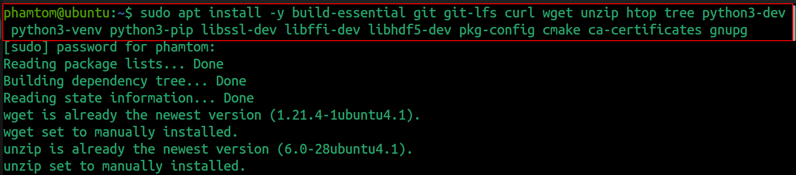
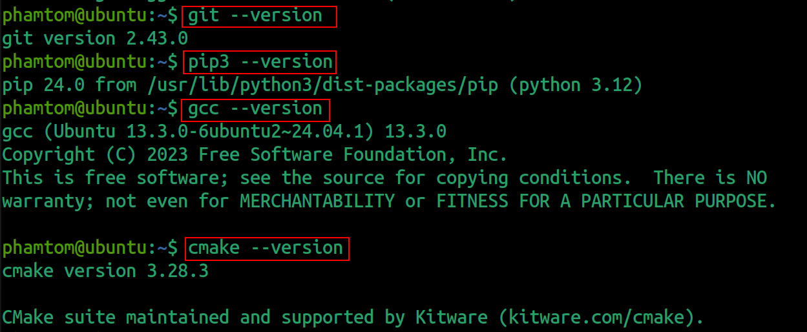
* * *
## CPU path verification
```bash
# Verify cores count
 nproc
# Verify CPU model
 lscpu | grep "Model name"
# Verify the Free memory
 free -h | grep "Mem:"
```
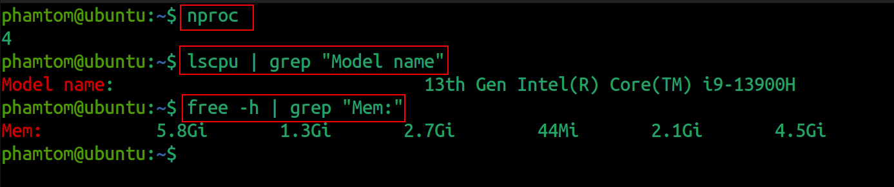
* * *
## Download and Install Miniconda3
```
# Download the latest Miniconda installer for Linux 64-bit
 wget https://repo.anaconda.com/miniconda/Miniconda3-latest-Linux-x86_64.sh -O miniconda_installer.sh
```
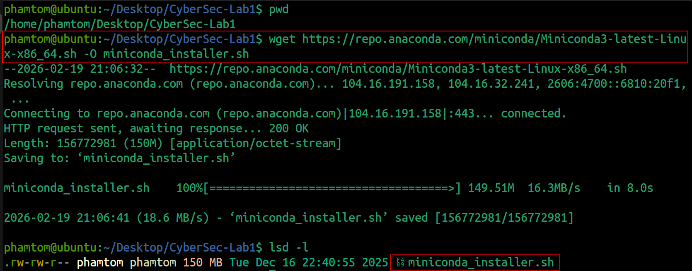
```bash
# Make executable and run the installer
 bash miniconda_installer.sh
```
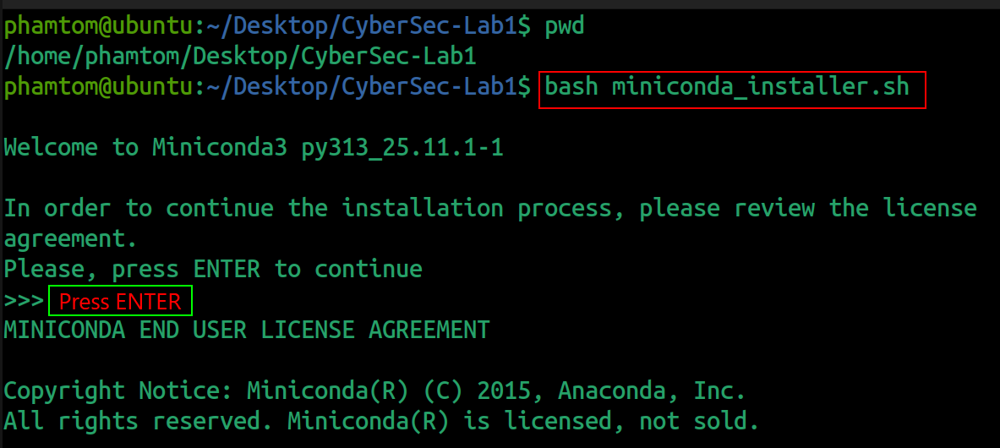
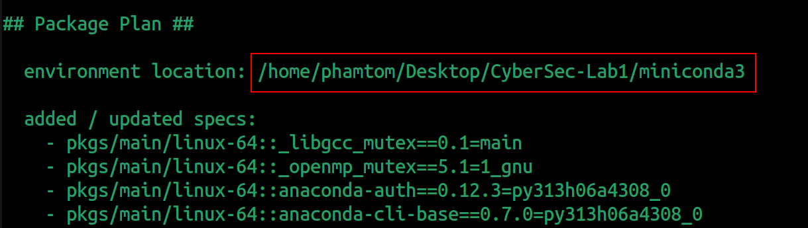
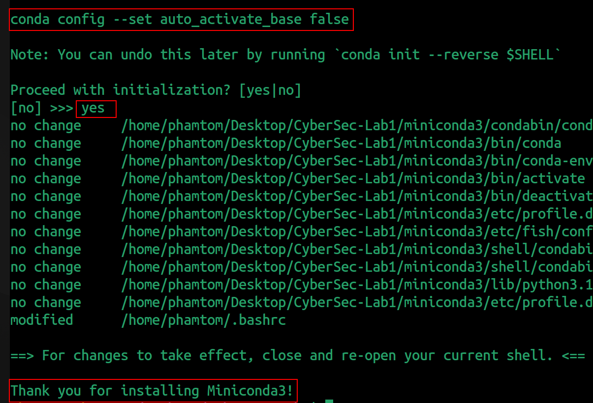
* * *
## Post Installation steps
```bash
# Reload your shell so conda command becomes available
source ~/.bashrc
```
```
# Verify conda installed correctly
conda --version
```
```
#Accpet the Term of Services of Repo
cond tos accept --override-channels --channel "Repo"
```
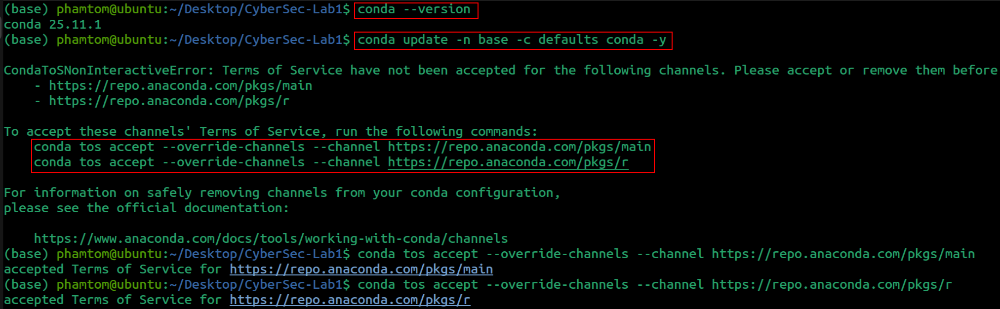
* * *
```bash
# Update conda to the absolute latest version
conda update -n base -c defaults conda -y
```
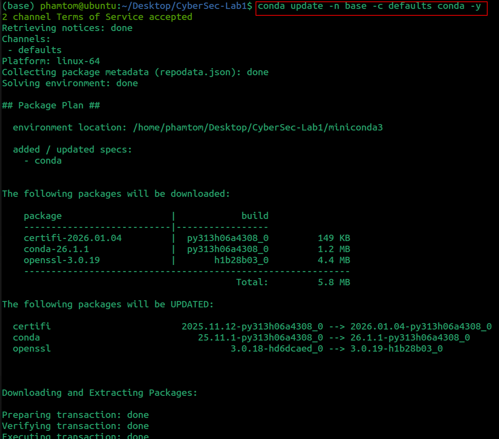
* * *
```bash
# Configure conda to be faster: use libmamba solver
 conda install -n base conda-libmamba-solver -y
 conda config --set solver libmamba
```
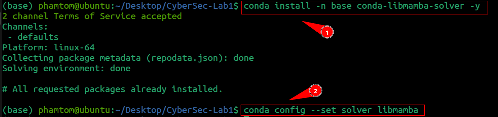
* * *
```
# Disable auto-activation of base environment on new terminals
 conda config --set auto_activate_base false
```
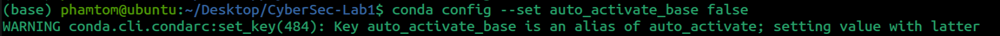
* * *
```
# Remove installer file — no longer needed
 rm miniconda_installer.sh
```
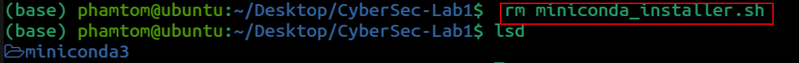
* * *
```bash
# See your conda configuration
 conda config --show | grep -E "solver|auto_activate"
```
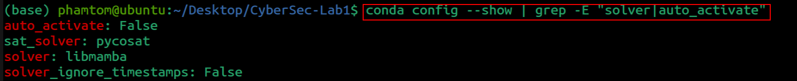
* * *
```bash
# Environment Activation adn Deactivation
 conda activate
 conda deactivate
```
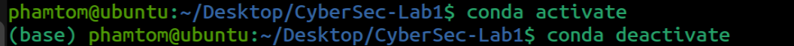
##
# <span style="color: #e03e2d;">Create the Project Virtual Environment</span>
```bash
# Create environment with Python 3.11
 conda create -n fl_security python=3.11 -y
```
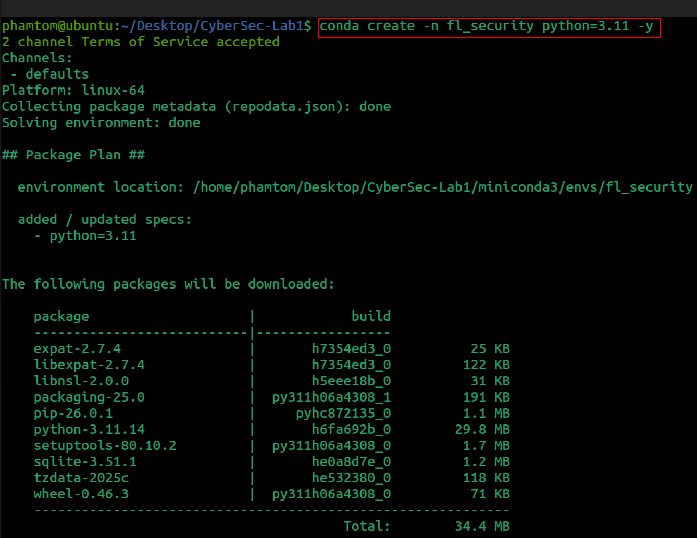
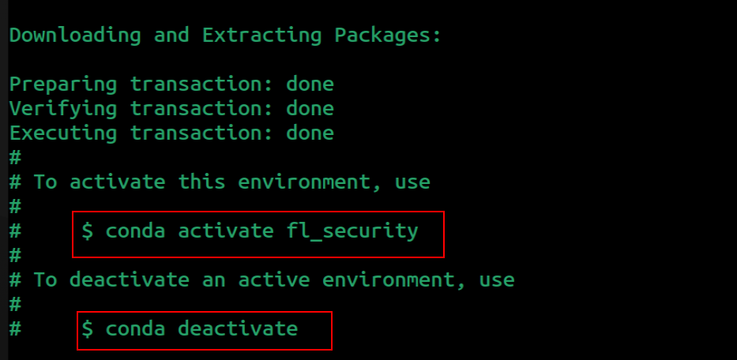
```bash
# Activate the environment (⚠ You MUST do this every new terminal session before working on this project)
 conda activate fl_security
```
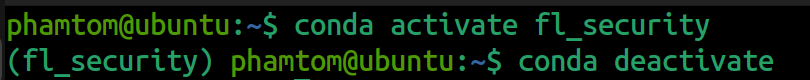
* * *
```bash
# Confirm which Python is being used
 which python
 python --version
```
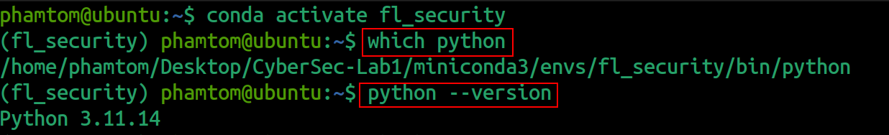
```bash
# Confirm and Upgrade pip inside the environment
 which pip
 pip install --upgrade pip setuptools wheel
```
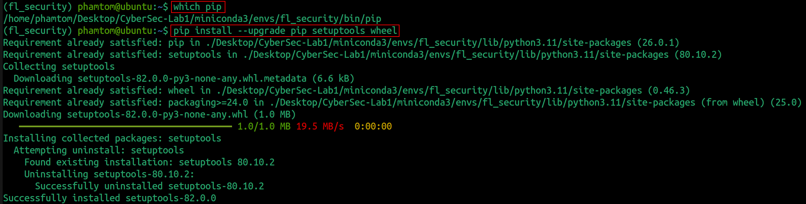
```
# Add convenient aliases to your bash config
cat >> ~/.bashrc << 'EOF'
# FL Security Lab shortcuts
alias flsec='conda activate fl_security'
alias fldir='cd ~/fl-security-lab && conda activate fl_security'
EOF
```
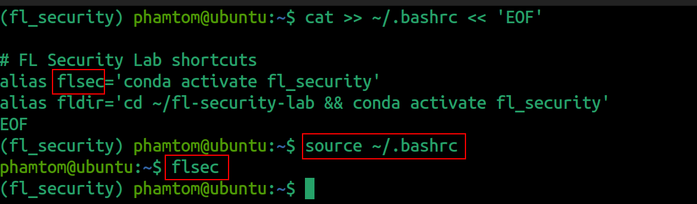
## 
##
#  <span style="color: #e03e2d;">All Required Packages Installation</span>
```bash
# Install PyTorch 2.3 (CPU-only) — official command from pytorch.org
 pip install torch torchvision torchaudio --index-url https://download.pytorch.org/whl/cpu
```
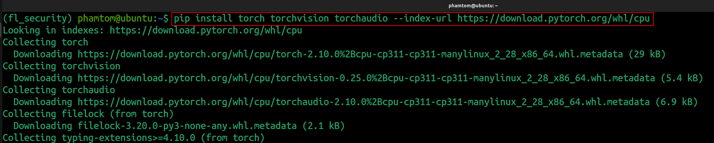
```bash
# Verify PyTorch installed correctly
 python -c "import torch; print('PyTorch version:', torch.__version__); print('CUDA available:', torch.cuda.is_available())"
```
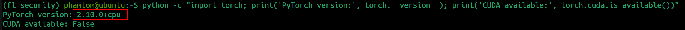
##
##
# <span style="color: #e03e2d;">Flower (Federated Learning Framework)</span>
```bash
# flwr[simulation] includes Ray for multi-client parallel simulation
 pip install "flwr[simulation]>=1.8.0"
```
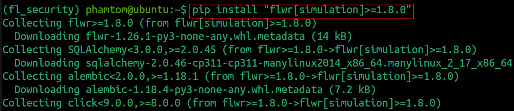
```bash
# Verify Flower installation
 python -c "import flwr; print('Flower version:', flwr.__version__)"
```
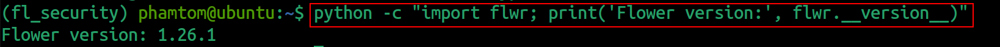
```bash
# Check what Flower provides
 python -c "import flwr as fl; print(dir(fl))"
```
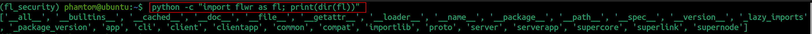
* * *
## Remaining Package Installation
```bash
# Install all data science, visualization, and utility packages
pip install numpy scipy scikit-learn pandas matplotlib seaborn tqdm tensorboard jupyter jupyterlab ipywidgets notebook loguru pyyaml rich pytest pytest-cov black isort ipykernel
```
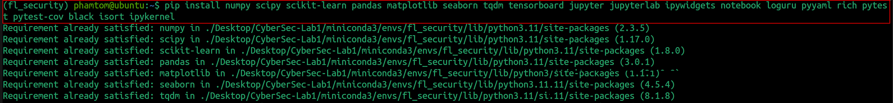
```bash
# Install all data science, visualization, and utility packages
python -c "
import numpy as np
import sklearn
import pandas as pd
import matplotlib
import seaborn
import scipy
print('numpy:', np.__version__)
print('scikit-learn:', sklearn.__version__)
print('pandas:', pd.__version__)
print('matplotlib:', matplotlib.__version__)
print('scipy:', scipy.__version__)"
```
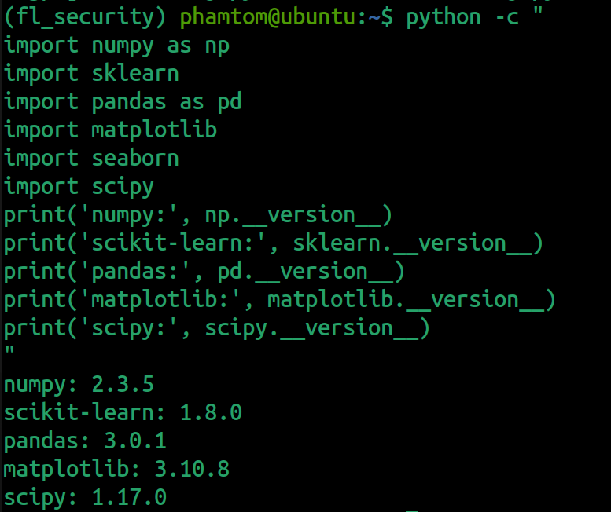
* * *
## Exporting Requirments and Backup yml
```
# Save Libraries to requirments file
 pip freeze > ~/requirements.txt
```
```
# Checking the file content 
 cat ~/requirements.txt | grep -E "torch|flwr|numpy|scikit|pandas|flower|scipy"
```
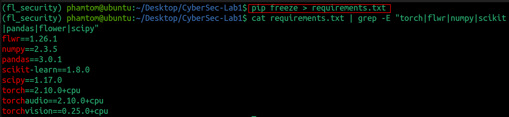
```
# Also export conda environment spec (more reproducible)
 conda env export > ~/fl_security_env.yml
```
```
# How to recreate environment from scratch on another machine:
# conda env create -f fl_security_env.yml
```
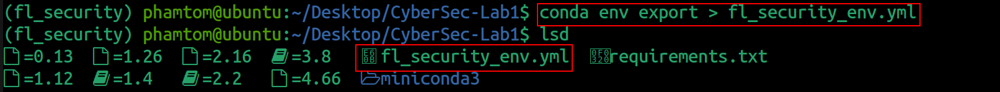
##
##
# <span style="color: #e03e2d;">Jupyter Kernel Configuration Deployment</span>
```bash
# This means when you open Jupyter, you can select "FL Security Lab" as the kernel
 python -m ipykernel install --user --name fl_security --display-name "FL Security Lab (Python 3.11)"
```
```bash
# List all available kernels to confirm registration
jupyter kernelspec list
```
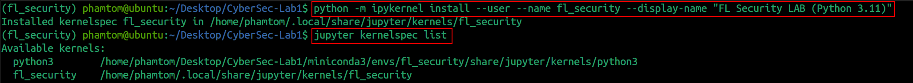
```bash
# Launch Jupyter Lab (Ctrl+C to stop it when done)
 jupyter lab
```
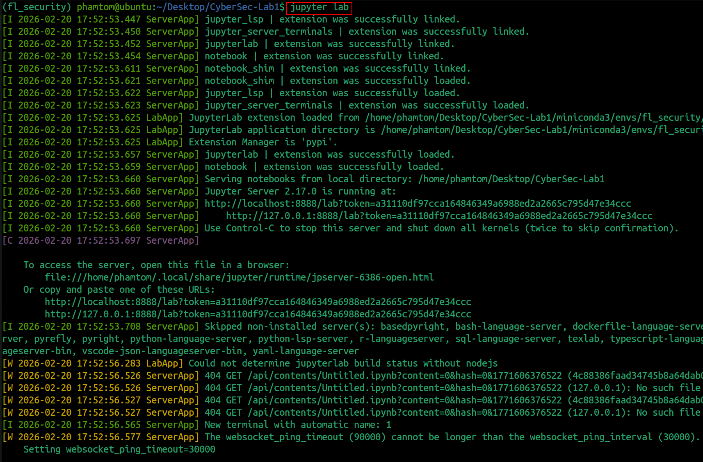
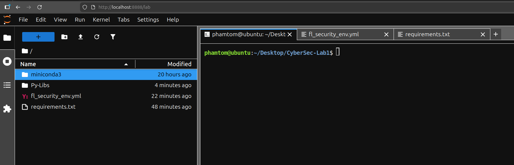
##
##
# <span style="color: #e03e2d;">VsCode IDE Setup Installation</span>
```bash
# VsCode deb package repository installation
 wget -qO- https://packages.microsoft.com/keys/microsoft.asc | gpg --dearmor > microsoft.gpg
 sudo install -D -o root -g root -m 644 microsoft.gpg /usr/share/keyrings/microsoft.gpg
```
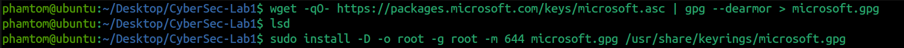
```
# Adding the Microsoft Repo-Pack to local source.list and Vscode installation
 echo "deb [arch=amd64 signed-by=/usr/share/keyrings/microsoft.gpg] https://packages.microsoft.com/repos/code stable main" | sudo tee /etc/apt/sources.list.d/vscode.list
 sudo apt update && sudo apt install -y code
```
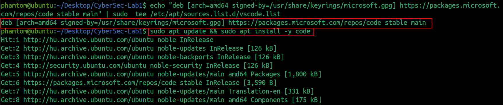
```bash
# Install essential VS Code extensions from terminal
 code --install-extension ms-python.python
 code --install-extension ms-python.vscode-pylance
 code --install-extension ms-toolsai.jupyter
 code --install-extension ms-python.black-formatter
 code --install-extension eamodio.gitlens
 code --install-extension pkief.material-icon-theme
```
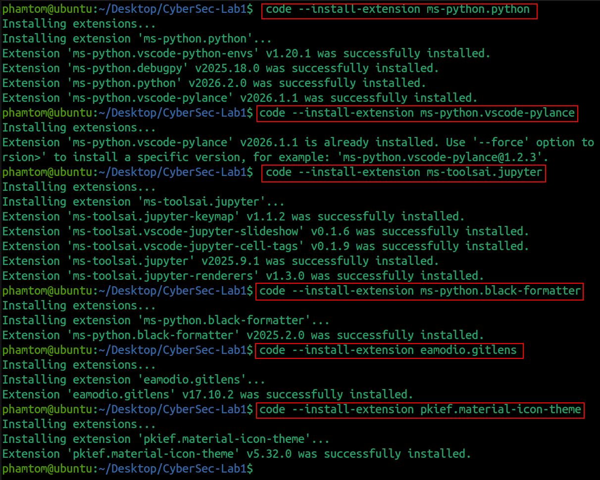
```bash
# Open VS Code in your project directory
 code Project-directory
```
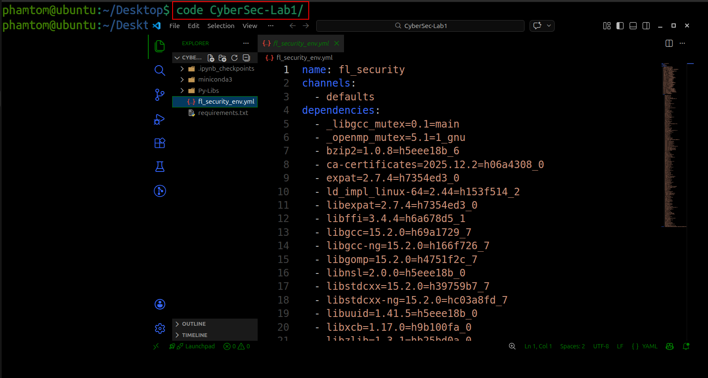
##
##
# <span style="color: #e03e2d;">Verification script for entire Setup</span>
```bash
# Create the verification script
 nano verify_setup.py
```
```
# Activate Conda Environment
 conda activate fl_security #OR flsec
```
```python
#!/usr/bin/env python3
"""
FL Security Lab — Environment Verification Script
Run with: python verify_setup.py
All checks should show ✓ GREEN
"""

import sys
import importlib

print("=" * 60)
print("FL SECURITY LAB — ENVIRONMENT VERIFICATION")
print(f"Python: {sys.version}")
print("=" * 60)

checks = [
    # (import_name, display_name, version_attr)
    ("torch",        "PyTorch",       "__version__"),
    ("torchvision",  "TorchVision",   "__version__"),
    ("flwr",         "Flower (flwr)", "__version__"),
    ("numpy",        "NumPy",         "__version__"),
    ("scipy",        "SciPy",         "__version__"),
    ("sklearn",      "Scikit-learn",  "__version__"),
    ("pandas",       "Pandas",        "__version__"),
    ("matplotlib",   "Matplotlib",    "__version__"),
    ("seaborn",      "Seaborn",       "__version__"),
    ("tqdm",         "tqdm",          "__version__"),
    ("tensorboard",  "TensorBoard",   "__version__"),
    ("jupyter",      "Jupyter",       "__version__"),
    ("loguru",       "Loguru",        "__version__"),
    ("yaml",         "PyYAML",        "__version__"),
    ("rich",         "Rich",          "__version__"),
    ("pytest",       "Pytest",        "__version__"),
]

all_ok = True
for mod_name, display, ver_attr in checks:
    try:
        mod = importlib.import_module(mod_name)
        version = getattr(mod, ver_attr, "ok")
        print(f"  \033[92m✓\033[0m  {display:<20} {version}")
    except ImportError as e:
        print(f"  \033[91m✗\033[0m  {display:<20} MISSING — {e}")
        all_ok = False

print("\n" + "─" * 60)

# PyTorch specific checks
import torch
print(f"\n  PyTorch device check:")
print(f"    CUDA available : {torch.cuda.is_available()}")
if torch.cuda.is_available():
    print(f"    GPU name       : {torch.cuda.get_device_name(0)}")
    print(f"    CUDA version   : {torch.version.cuda}")
else:
    print(f"    Running on     : CPU (normal if no NVIDIA GPU)")

# Simple tensor test
t = torch.tensor([1.0, 2.0, 3.0])
assert t.sum().item() == 6.0, "Tensor math failed!"
print(f"    Tensor math    : ✓ OK")

# NumPy integration test
import numpy as np
arr = np.array([1, 2, 3])
t2 = torch.from_numpy(arr)
assert t2.sum().item() == 6, "NumPy<->Torch bridge failed!"
print(f"    NumPy bridge   : ✓ OK")

# Flower import test
import flwr as fl
print(f"\n  Flower simulation: ✓ OK ({fl.__version__})")

# Dataset download test (MNIST — small, 11MB)
print(f"\n  Testing MNIST dataset download...")
from torchvision import datasets, transforms
try:
    datasets.MNIST('./data', download=True,
                   transform=transforms.ToTensor())
    print(f"    MNIST dataset  : ✓ Downloaded to ./data/")
except Exception as e:
    print(f"    MNIST dataset  : ✗ Failed — {e}")

print("\n" + "=" * 60)
if all_ok:
    print("  \033[92m ALL CHECKS PASSED — Environment ready!\033[0m")
else:
    print("  \033[91m⚠ Some packages are missing. Rerun pip install commands.\033[0m")
print("=" * 60)
```
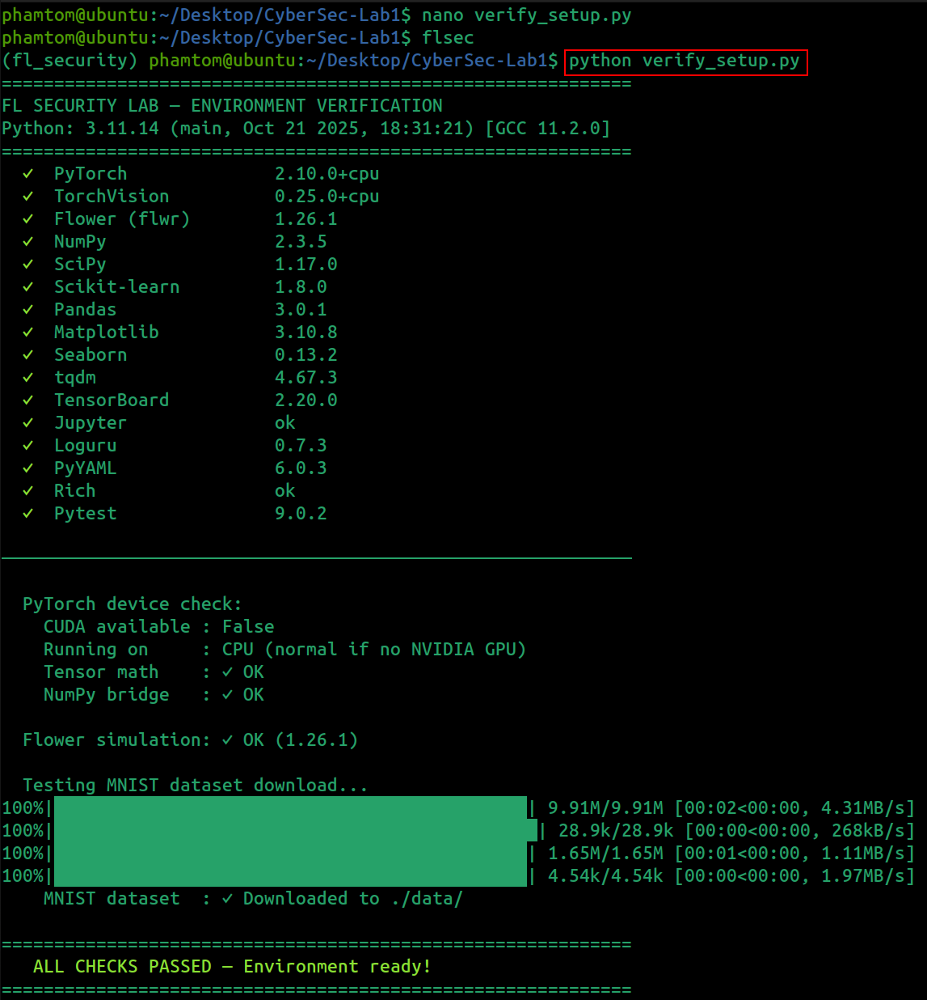
##
##
# <span style="color: #e03e2d;">Git and Github configuration</span>
```bash
# Configure git with your github user-name and Email
 git config --global user.name "Your Full Name"
 git config --global user.email "your.email@university.edu"
```
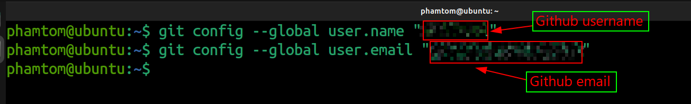
```bash
# Set default branch name to "main" (modern standard)
 git config --global init.defaultBranch main
```
```bash
# Set VS Code as the default git editor
 git config --global core.editor "code --wait"
```
```bash
# Enable colored git output (easier to read)
git config --global color.ui auto
```
```bash
# Configure git to store credentials in memory for 8 hours
 git config --global credential.helper "cache --timeout=28800"
```
```bash
# Verify all settings
git config --global --list
```
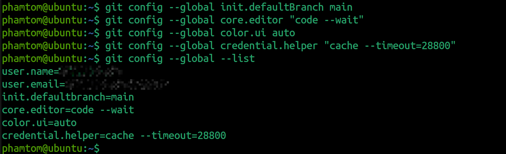
* * *
## Github SSH key configuration
```bash
# Generate a new SSH key pair (Ed25519 is the current best practice)
 ssh-keygen -t ed25519 -C "Github email" -f ~/.ssh/id_ed25519_github
# passphrase: GitKey_Alpha!
```
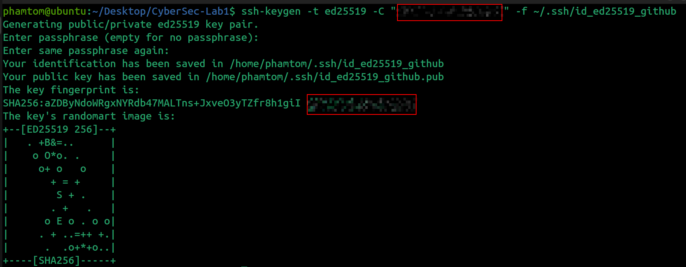
```bash
# Start the SSH agent (manages your keys in background)
 eval "$(ssh-agent -s)"
```
```bash
# Add your private key to the agent
 ssh-add ~/.ssh/id_ed25519_github
```
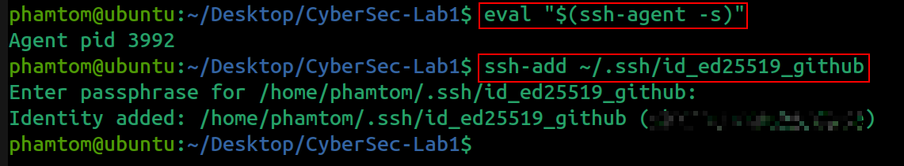
```
# Create SSH config file so git always uses this key for GitHub
cat >> ~/.ssh/config << 'EOF'
Host github.com
  HostName github.com
  User git
  IdentityFile ~/.ssh/id_ed25519_github
  AddKeysToAgent yes
EOF
```
```
# Give the Required Perimissions to the config file
chmod 600 ~/.ssh/config
```
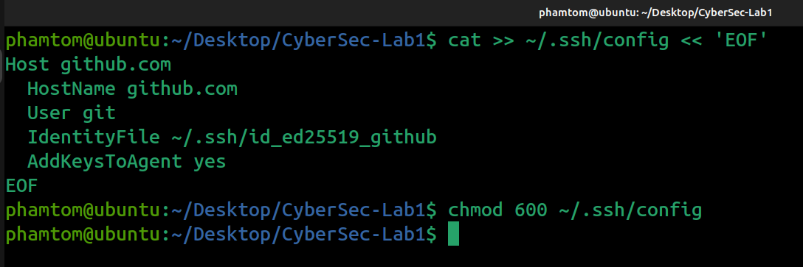
* * *
## Add SSH Key to GitHub
```md
1. Go to github.com → Settings → SSH and GPG keys → New SSH key
2. Title: FL Security Lab Ubuntu 24.04
3. Key type: Authentication Key
4. Paste the output of 'cat ~/.ssh/id_ed25519_github.pub'
5. Click 'Add SSH key'
```
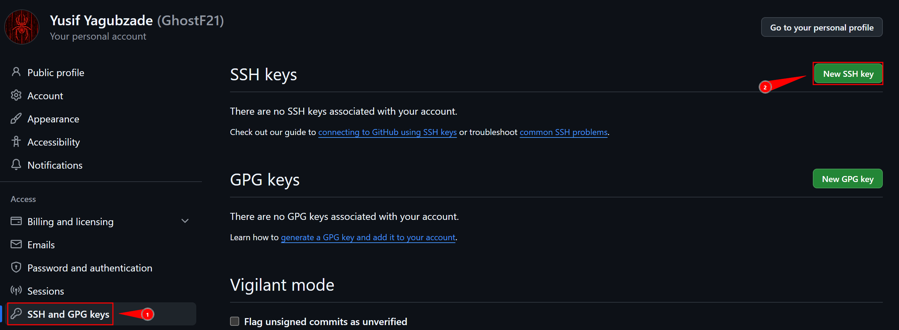
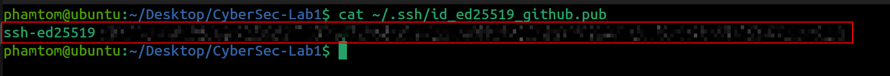
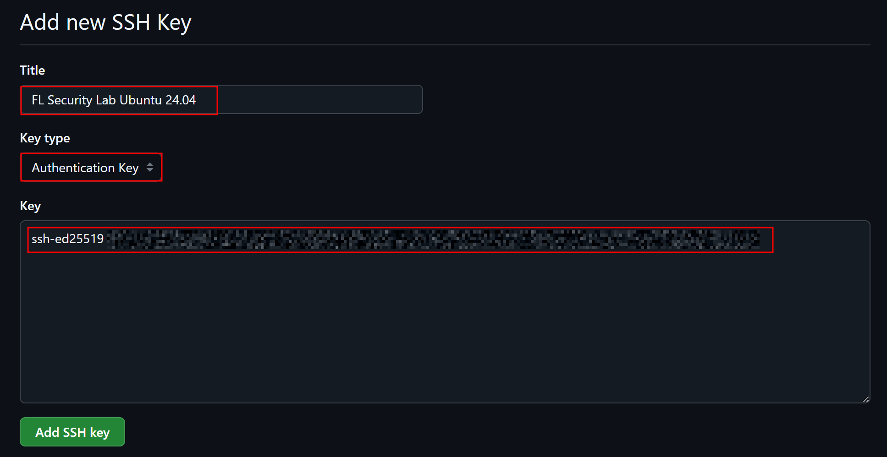
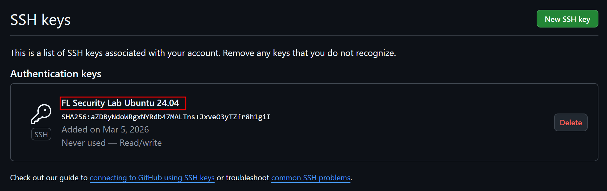
```
# Test that your SSH connection to GitHub works
 ssh -T git@github.com
```
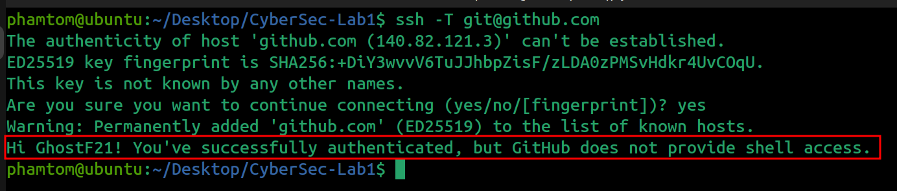
* * *
## Create the Repository on GitHub.com 
```md 
1. Go to github.com → click the → New repository
2. Repository name: FL-Security-Lab
3. Description: AI-Security: Malicious Clients in Federated Learning Security
4. Visibility: Private 
5. Initialize with README: ✓ check this
6. .gitignore: select Python
7. License: MIT
```
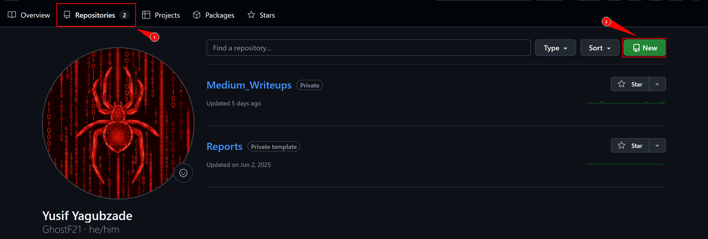
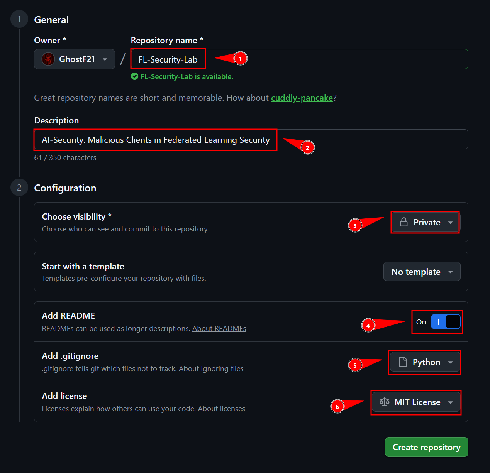
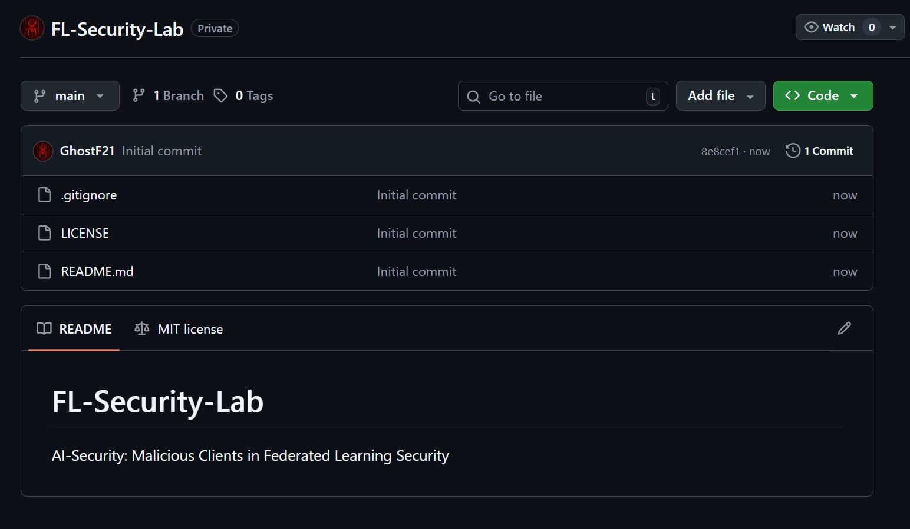
* * *
## Clone and verify the Repository

```bash
# Clone via SSH (not HTTPS — requires no password each time)
 git clone git@github.com:YourUsername/FL-Security-Lab.git
```

```bash
# Confirm you are inside the Github repo
 git status
# Expected: On branch main — nothing to commit, working tree clean
```
```bash
# Check the remote URL
 git remote -v
```

##
# <span style="color: #e03e2d;">Complete Project Folder Structure</span>
```
# Create the complete directory tree for all 15 weeks
mkdir -p \
  src/fl_core \
  src/attacks \
  src/defenses \
  src/detection \
  src/utils \
  data/raw \
  data/processed \
  notebooks/week01_setup \
  notebooks/week03_baseline \
  notebooks/week04_attacks \
  notebooks/week06_defenses \
  notebooks/week09_detection \
  notebooks/demo \
  experiments/configs \
  experiments/results \
  experiments/logs \
  experiments/checkpoints \
  report/sections \
  report/figures \
  report/references \
  tests \
  scripts
```

```
# Create __init__.py files to make src directories into Python packages
# This allows: from src.attacks.label_flip import LabelFlipAttack
touch \
  src/__init__.py \
  src/fl_core/__init__.py \
  src/attacks/__init__.py \
  src/defenses/__init__.py \
  src/detection/__init__.py \
  src/utils/__init__.py \
  tests/__init__.py
```

```
# Add .gitkeep to empty folders so Git tracks them
find . -type d -empty -not -path "./.git/*" -exec touch {}/.gitkeep \;
```

```
# Verify the structure looks right
tree -L 3 --dirsfirst
```

```
# Move requirements.txt from home to project root
cp ~/requirements.txt ~/FL-Security-Lab/requirements.txt
cp ~/fl_security_env.yml ~/FL-Security-Lab/environment.yml
```

```bash
# Stage all new files
 git add -A
```
```bash
# Check what's staged
 git status
```

```
# Make the first meaningful commit
git commit -m "feat: Week 1 — project scaffolding, requirements, folder structure

- Created src/ package structure with fl_core, attacks, defenses, detection, utils
- Added experiment folders: configs, results, logs, checkpoints
- Added notebooks/ structure for all phases
- Added report/ structure for LaTeX writing
- Added .gitignore for Python/Jupyter/data files
- Added requirements.txt and conda environment.yml"
```

```bash
# Push to GitHub
 git push origin main
```


##
# <span style="color: #e03e2d;">Config Files and Experiment Setup</span>
```bash
#Create Base Experiment config file.
nano experiments/configs/base_config.yaml 
```
```yaml
federated:
  num_clients: 10
  num_rounds: 20
  fraction_fit: 1.0
  fraction_eval: 1.0
data:
  dataset: mnist
  data_dir: ./data/raw
  iid: false
  dirichlet_alpha: 0.5
model:
  architecture: SimpleCNN
  input_channels: 1
  num_classes: 10
training:
  local_epochs: 2
  batch_size: 32
  learning_rate: 0.01
  device: auto
attack:
  enabled: false
  type: null
  malicious_fraction: 0.0
  target_class: null
defense:
  aggregation: fedavg
  krum_num_to_select: 7
  trim_fraction: 0.1
detection:
  enabled: false
  method: null
  threshold_sigma: 2.0
logging:
  results_dir: experiments/results
  figures_dir: report/figures
  log_dir: experiments/logs
```

```bash
# Add config file in github
git add experiments/configs/base_config.yaml
```
```bash
# Commit config file
git commit -m "config: add base experiment configuration YAML"
```
```bash
# Push to GitHub
git push origin main
```


##
# <span style="color: #e03e2d;">Download Datasets & Test Non-IID Partitioner</span>
```bash
# Create the dataset download script
nano scripts/download_datasets.py
```
```python
"""Download MNIST and CIFAR-10 into data/raw/ directory."""
import torchvision
import os

RAW_DIR = "data/raw"
os.makedirs(RAW_DIR, exist_ok=True)

print("Downloading MNIST...")
mnist = torchvision.datasets.MNIST(root=RAW_DIR, train=True, download=True)
mnist_test = torchvision.datasets.MNIST(root=RAW_DIR, train=False, download=True)
print(f"  MNIST train: {len(mnist)} samples")
print(f"  MNIST test:  {len(mnist_test)} samples")
print(f"  Classes: {mnist.classes}")

print("Downloading CIFAR-10...")
cifar = torchvision.datasets.CIFAR10(root=RAW_DIR, train=True, download=True)
cifar_test = torchvision.datasets.CIFAR10(root=RAW_DIR, train=False, download=True)
print(f"  CIFAR-10 train: {len(cifar)} samples")
print(f"  CIFAR-10 test:  {len(cifar_test)} samples")

print("All datasets downloaded successfully!")
```

* * *
```bash
# Active conda environment
conda activate fl_security #OR flsec
```
```
# Run the download script (Active Environment)
python scripts/download_datasets.py
```

* * *
## Create & Test the Non-IID Dirichlet Partitioner
```md
# NOTE! - Why Non-IID?
In real federated learning, each client (e.g., hospital, mobile device) has a different data distribution.
The Dirichlet distribution with parameter α models this heterogeneity.
α=0.5 is moderate non-IID; α=0.1 is extreme.
Non-IID makes attacks harder to detect because malicious gradients can look like regular heterogeneous updates.
```
```bash
# Create the Partition script
nano src/utils/data_partition.py
```
```python
"""Non-IID Dirichlet partitioner for FL experiments."""
import numpy as np
from torch.utils.data import Subset

def dirichlet_partition(dataset, num_clients: int, alpha: float = 0.5,
                         seed: int = 42):
    """
    Partition a dataset into num_clients non-IID subsets using
    a Dirichlet(alpha) distribution over classes.

    Args:
        dataset: PyTorch dataset with .targets attribute
        num_clients: number of FL clients
        alpha: concentration parameter (smaller = more heterogeneous)
        seed: random seed for reproducibility

    Returns:
        List of num_clients Subset objects
    """
    np.random.seed(seed)
    targets = np.array(dataset.targets)
    num_classes = len(np.unique(targets))
    client_indices = [[] for _ in range(num_clients)]

    # For each class, distribute samples to clients using Dirichlet
    for class_id in range(num_classes):
        class_idx = np.where(targets == class_id)[0]
        np.random.shuffle(class_idx)
        # Sample proportions from Dirichlet distribution
        proportions = np.random.dirichlet(np.repeat(alpha, num_clients))
        # Compute split points
        proportions = (np.cumsum(proportions) * len(class_idx)).astype(int)[:-1]
        splits = np.split(class_idx, proportions)
        for client_id, split in enumerate(splits):
            client_indices[client_id].extend(split.tolist())

    return [Subset(dataset, indices) for indices in client_indices]


if __name__ == "__main__":
    # Quick test
    import torchvision
    mnist = torchvision.datasets.MNIST("data/raw", train=True, download=False)
    partitions = dirichlet_partition(mnist, num_clients=10, alpha=0.5)
    print("Partition sizes:", [len(p) for p in partitions])
	# Expected: approximately similar sizes, but class distributions differ
    print("Sum:", sum(len(p) for p in partitions), "(should equal 60000)")
```

```
# Test the partitioner (Active Conda environment)
 python src/utils/data_partition.py
```

```bash
#Git LFS Configuration (For Large File storage)
git lfs install
```
```bash
#Add the file type track in LFS
git lfs track "*.tar.gz"
```
```bash
#Add the .gitattributes file LFS creates
git add .gitattributes
```

```bash
# Stage all new files
git add .
```
```
# Commit with a descriptive message
git commit -m "feat(data): download script + Dirichlet non-IID partitioner"
```
```bash
# Push to GitHub
git push origin main
```


##
# <span style="color: #e03e2d;">Secure Aggregation (SecAgg+)</span>
```bash
# Clone only the SecAgg+ example from the Flower monorepo
# --depth=1 downloads only the latest commit (faster, less disk)
git clone --depth=1 https://github.com/adap/flower.git _tmp_flower && cp -r _tmp_flower/examples/flower-secure-aggregation ./experiments/secagg_example && rm -rf _tmp_flower
```
```bash
# Confirm what the folder Structure
tree experiments/secagg_example/
```

```bash
# Install the example as an editable package
# -e means "editable" — changes to the code take effect immediately
cd experiments/secagg_example/
pip install -e .
```
```bash
# Verify Flower CLI is available
flwr --version
```


* * *
## TroubleShooting №1: (Dependency Failed to finish installation)
```bash
#Clean pip cache
pip cache purge
```
```
#Clean apt cache
sudo apt-get clean
sudo apt-get autoremove -y
```
```bash
#Clean conda cache
conda clean --all -y
```

## TroubleShooting №2 (Torchaudio incompatiblity)
```
#Fix: Align torchaudio with your new torch version (CPU only)
pip uninstall torch torchvision torchaudio -y
pip install torch==2.8.0 torchvision==0.23.0 torchaudio==2.8.0 --index-url https://download.pytorch.org/whl/cpu
```

* * *
## Run the SecAgg+ Example (Demo Mode)
```
# Run with simulation engine (default) — demo mode shows every SecAgg+ step
# is-demo=true means SecAggPlusWorkflowWithLogs is used → you see all protocol steps
cd ~/fl-security-lab/experiments/secagg_example
flwr run . --stream
```

```
# Run 5 rounds with custom learning rate
flwr run . --run-config "num-server-rounds=5 learning-rate=0.25"
```

* * *
## Run the SecAgg+ Example (Non-Demo Mode)
```bash
# Run in practical (non-demo) mode — no step-by-step logging
# Adjust num-shares and reconstruction-threshold for your federation size
flwr run . --run-config "is-demo=false num-server-rounds=10" --stream
```


```bash
# Understand the key SecAgg+ parameters from pyproject.toml
cat pyproject.toml | grep -A 20 "\[tool.flwr"
```

##
# <span style="color: #e03e2d;">SecAgg+ Research Notes.</span>
```bash
#Save secagg notes to report
nano report/sections/secagg_notes.md
```
```md
# Secure Aggregation (SecAgg+) Notes

## What is SecAgg+?
Flower's SecAgg+ implements the SecAgg+ protocol from:
> Keith Bonawitz et al., "Practical Secure Aggregation for Privacy-Preserving Machine Learning"
> ACM CCS 2017. https://dl.acm.org/doi/10.1145/3133956.3133982

## Protocol Steps (Bonawitz et al. 2017)
1. **Setup**: Server generates pairwise shared secrets between clients
2. **Share Keys**: Clients exchange Diffie-Hellman public keys
3. **Masked Gradients**: Each client adds random masks summing to zero
4. **Server Aggregation**: Server sums masked gradients — masks cancel out
5. **Reconstruction**: If clients drop out, Shamir secret sharing reconstructs

## Key Parameters in Flower
- `num_shares`: How many shares each secret is split into
- `reconstruction_threshold`: Minimum shares needed to reconstruct

## Privacy-Security Trade-off
| Property | FedAvg (no SecAgg) | With SecAgg+ |
|----------|-------------------|--------------|
| Individual gradient visible | YES | NO |
| Norm-threshold detection | Works | DISABLED |
| Cosine clustering detection | Works | DISABLED |
| Privacy from server | Weak | Strong |
| Byzantine resilience (Krum) | Works | Works |

## Research Tension
SecAgg+ provides privacy but removes our ability to perform anomaly detection.
This is a fundamental trade-off in privacy-preserving FL security.
Must be discussed in Expected Outcomes and Limitations sections.
```

```bash
# Add the Markdown and Project demo folder to Github
git add experiments/secagg_example/ report/sections/secagg_notes.md
git commit -m "feat(secagg): SecAgg+ demo running + research notes"
git push origin main
```


##
# <span style="color: #e03e2d;">Literature Notes.</span>
```
# Create a notes file for all 6 papers
nano report/sections/literature_notes.md
```
```md
# Literature Review Notes
## [1] McMahan et al. 2017 — FedAvg

**Key contribution:** Introduced Federated Learning as a practical paradigm for training deep neural networks on decentralized, privacy-sensitive data. Proposed the FedAvg algorithm, which dramatically reduces communication rounds compared to naive distributed SGD by having each client perform multiple local SGD steps before syncing. Demonstrated effectiveness across five model architectures and four datasets (AISTATS 2017).
**Algorithm 1 formula: Global model update via weighted average:** w_{t+1} = Σ_k (n_k / n) · w_k^{t+1}
where w_k^{t+1} is client k's locally-trained model after E epochs of local SGD, n_k is client k's dataset size, and n = Σ n_k is the total number of data points. The server broadcasts w_t, clients train locally, then the server aggregates.
**Why relevant to this project:** FedAvg is the baseline protocol we implement and evaluate in Week 3. All attack and defense experiments run on top of it. Understanding its weighted-average aggregation step is essential because it is precisely this step that malicious clients can exploit — the server has no visibility into how client models were trained, creating the attack surface for both data poisoning (Week 4) and model replacement attacks (Week 5).
* * *

## [2] Blanchard et al. 2017 — Krum

**Key contribution:** Proved that no linear aggregation rule (including simple averaging) can tolerate even a single Byzantine worker. Proposed Krum, the first provably Byzantine-resilient aggregation rule for distributed SGD. Krum selects the single gradient vector whose summed squared distances to its n - f - 2 nearest neighbors is minimal, effectively choosing the update most "surrounded" by other updates and farthest from outliers (NeurIPS 2017).
**Byzantine requirement:** Requires 2f + 2 < n, meaning the number of Byzantine workers f must be strictly less than (n - 2) / 2. For our 10-client setup this means the system can tolerate at most 3–4 Byzantine clients. Time complexity is O(n² · d), linear in gradient dimension d.
**Why relevant:** Krum is the primary Byzantine-robust defense we implement in Week 6 (Bi-Weekly Report 2). It gives us a theoretically-grounded baseline defense against both label-flip and model-replacement attacks. Its strict 2f + 2 < n requirement is also a limitation we will test — above the threshold, Krum's guarantees break down, which we will demonstrate experimentally.
* * *

## [3] Yin et al. 2018 — Trimmed Mean

**Key contribution:** Developed two distributed gradient descent algorithms — one based on coordinate-wise median and one on coordinate-wise trimmed mean — that are provably robust against Byzantine failures and achieve order-optimal statistical error rates for strongly convex, non-strongly convex, and smooth non-convex loss functions. Proved matching lower bounds showing these rates are statistically optimal (ICML 2018).
**Trimming mechanism:** For each coordinate j of the gradient vector, sort the m worker values for that coordinate, remove the top β fraction and the bottom β fraction (where β is the known Byzantine fraction), then average the remaining (1 - 2β) · m values. Applied independently per coordinate. Requires β < 1/2. In practice β = 0.05 (5%) is typical for moderate attack scenarios.
**Why relevant:** Trimmed Mean serves as a complementary defense to Krum in Week 6. Unlike Krum (which selects a single client's full gradient), Trimmed Mean aggregates information from all clients but clips extremes per-coordinate. This makes it more statistically efficient under moderate attack rates and is directly comparable to Krum in our Week 6 defense evaluation. The coordinate-wise operation also makes it computationally cheap and easy to implement.
* * *

## [4] Bagdasaryan et al. 2020 — Backdoor in FL

**Key contribution:** Demonstrated that model poisoning via model replacement is a far more powerful attack than data poisoning alone. Any single selected participant can inject a persistent backdoor into the global model — achieving 100% backdoor task accuracy in a single round — by scaling up their malicious model update before submission. Also introduced the constrain-and-scale technique to evade anomaly-detection defenses by incorporating evasion into the attacker's training objective (AISTATS 2020).
**Model replacement** technique: The attacker trains a backdoored local model M_mal that performs well on both the main task and the backdoor task. Before submission, the attacker scales the update by factor γ = n / η (where n is the number of clients and η is the server's learning rate / aggregation weight) to ensure the global model G_{t+1} is effectively replaced by M_mal after weighted averaging. A scaling factor of ~100 is sufficient to dominate aggregation. The constrain-and-scale variant further bounds weight norms to evade detection.
**Why relevant:** This paper is the theoretical foundation for our Week 4–5 backdoor attack implementation. Our backdoor.py implements a simplified version of this — injecting a pixel-pattern trigger and relabeling samples. In Week 5 we add the scaling factor (γ) to implement the full model replacement attack, directly replicating Bagdasaryan's core finding. SecAgg+ (Paper [6]) is explicitly mentioned in this paper as a barrier to anomaly detection, creating a direct link to our Week 1 SecAgg+ analysis.
* * *

## [5] Fung et al. 2018 — FoolsGold

**Key contribution:** Identified sybil-based poisoning (multiple colluding malicious clients sharing a common objective) as a distinct and underaddressed threat to federated learning. Proposed FoolsGold, a defense that identifies sybils by tracking the diversity of gradient update history per client and adaptively reducing the learning rate contribution of clients whose accumulated gradients are highly similar to other clients' (arXiv 2018, journal version 2020).
**Detection signal:** FoolsGold uses cosine similarity between clients' cumulative historical gradient vectors as its detection signal. Honest clients, training on unique non-IID data, contribute gradients pointing in diverse directions. Sybils, sharing a poisoning objective, contribute gradients that are directionally similar (high cosine similarity). FoolsGold computes pairwise cosine similarities between all clients' historical gradient sums, then reduces the per-round learning rate α_i of clients with high maximum similarity to any other client, down to near zero. A pardoning mechanism prevents penalizing honest clients that incidentally look similar due to SGD variance.
**Why relevant:** FoolsGold is our detection mechanism for Week 9 and a defense we compare against Krum in the multi-client attack scenario. It is particularly relevant because, unlike Krum, FoolsGold makes no assumption about the minority proportion of attackers — it can theoretically detect sybils even when they dominate the federation. This is critical to our Week 4 experiments with 30% malicious fraction (3 out of 10 clients), which exceeds Krum's 2f+2 < n threshold.
* * *

## [6] Bonawitz et al. 2017 — SecAgg+

**Key contribution:** Designed the first practical, communication-efficient, failure-robust Secure Aggregation protocol for federated learning (SecAgg / SecAgg+), presented at ACM CCS 2017. The protocol allows a server to compute only the sum of client model updates without learning any individual client's contribution, even if some clients drop out mid-protocol. Proved security in both honest-but-curious and active adversary settings.
Protocol steps (4 rounds):

**AdvertiseKeys:** Each client generates and broadcasts a Diffie-Hellman public key and a secret-sharing public key to the server, which distributes the full key directory to all clients.
**ShareKeys:** Each client pair (u, v) computes a shared pairwise seed via Diffie-Hellman key agreement. Each client secret-shares its private key among all other clients using t-out-of-n Shamir Secret Sharing, enabling dropout recovery.
**MaskedInputCollection:** Each client masks its gradient vector x_u with canceling pairwise pseudorandom masks p_{u,v} (generated from shared seeds via PRG) and a private self-mask p_u, then uploads the masked vector y_u = x_u + Σ_v p_{u,v} + p_u.
**Unmasking:** Surviving clients send Shamir shares of dropped-out clients' private keys. The server reconstructs masks for dropouts and cancels all masks from the sum, recovering Σ_u x_u.
**Privacy-security tension:** SecAgg+ guarantees that the server learns only the aggregate sum of updates not individual gradients — which is essential for user privacy. However, this same property directly conflicts with Byzantine robustness and backdoor defense: the server cannot inspect individual updates to detect anomalies, outliers, or poisoned models. Defenses like Krum, Trimmed Mean, and FoolsGold all require access to individual client gradients, which SecAgg+ is specifically designed to hide. This fundamental tension is a core theme of our project we analyze it in the SecAgg+ notes (Week 1) and revisit it in our final report when evaluating whether defenses remain viable under cryptographic aggregation constraints.
```

```
# Add the Markdown Report file to Github
git add report/sections/literature_notes.md
git commit -m "docs: add literature notes template for Week 1"
git push origin main
```


##
##
# # <span style="color: #e03e2d;">Proposal Notes.</span>
```
# Create Proposal Markdown
nano report/sections/proposal_draft.md
```
```md
# AI-2: Federated Learning Security Lab
## Project Proposal
### Topic: Malicious Clients in Federated Learning
*Yusif Yagubzade — NeptuinID: SW92BP*

*Week 2 — Submitted: February 28, 2026*

---

## 1. Problem Statement

Federated Learning (FL) is a distributed machine learning paradigm in which a central server coordinates model training across a large population of clients without ever collecting their raw data. Instead, each client trains on its local dataset and transmits only model updates — gradients or weight deltas — back to the server, which aggregates them into an updated global model. This architecture is privacy-preserving by design: the server observes aggregated statistics rather than individual records, which makes FL attractive for applications in healthcare, finance, and mobile computing.

However, this decentralized architecture introduces a critical security vulnerability: the server cannot inspect, audit, or verify how any individual client produced its update. A malicious participant — whether a compromised device, a dishonest data owner, or an adversarial actor — can submit deliberately crafted updates designed to corrupt the global model. Two principal attack strategies have been identified in the literature. First, **data poisoning attacks** manipulate a client's local training data — for example, by flipping class labels or embedding hidden trigger patterns — causing the model to learn incorrect associations that degrade accuracy or introduce backdoor behaviors. Second, **model manipulation (model replacement) attacks** bypass data-level corruption entirely: the adversary directly crafts a poisoned model update and scales it up so that, after server aggregation, the global model is effectively replaced by the attacker's version, achieving near-perfect backdoor success in a single round.

The problem is compounded by the non-IID (non-independently and identically distributed) nature of real federated data. Because each client holds a private, heterogeneous local dataset, honest client updates are already highly variable. This variability provides natural camouflage for malicious updates, making anomaly-based detection substantially harder than in homogeneous settings.

This project investigates both attack families and evaluates two classes of countermeasures: **Byzantine-robust aggregation defenses** (Krum, Trimmed Mean) that replace naive averaging with outlier-resistant rules, and **gradient-anomaly detection** methods (FoolsGold, statistical fingerprinting) that identify suspicious contributors before aggregation. A further dimension of the problem is the interaction between these defenses and Secure Aggregation (SecAgg+): the cryptographic protocol used in production FL systems to guarantee that the server sees only the sum of client updates, not individual contributions. This privacy guarantee directly disables anomaly-based defenses, creating a fundamental tension between privacy and security that this project will analyze and document.

---

## 2. Background and Context

The foundations of Federated Learning were established by McMahan et al. [1], who introduced the FedAvg algorithm. FedAvg operates in rounds: the server broadcasts the current global model to a subset of clients; each client performs *E* epochs of local stochastic gradient descent on its private data; and the server aggregates the resulting model weights via a weighted average proportional to local dataset sizes:

$$w_{t+1} = \sum_k \frac{n_k}{n} \cdot w_k^{t+1}$$

McMahan et al. demonstrated that this approach reduces communication rounds by 10–100× compared to minibatch SGD while maintaining competitive accuracy across diverse models and datasets. FedAvg forms the baseline protocol in this project and is the direct target of all attack implementations.

The Byzantine robustness problem — the question of how to aggregate updates reliably when an unknown fraction of participants are adversarial — was studied theoretically by Blanchard et al. [2], who proved that no linear aggregation rule (including weighted averaging) can tolerate even a single Byzantine worker, and proposed Krum as the first provably Byzantine-resilient alternative. Krum selects the single gradient vector whose cumulative squared distance to its *n − f − 2* nearest neighbors is minimized, where *f* is the known number of Byzantine workers. The method requires `2f + 2 < n`, meaning for our 10-client federation, up to three malicious clients can be tolerated. Yin et al. [3] complemented this with coordinate-wise Trimmed Mean, an aggregation rule that removes the top and bottom *β* fraction of values for each gradient dimension independently before averaging, achieving order-optimal statistical convergence rates under Byzantine failures for strongly convex, non-convex, and smooth objectives.

On the attack side, Bagdasaryan et al. [4] demonstrated that model replacement is substantially more powerful than data poisoning. The attacker trains a backdoored local model *M_mal* that achieves high accuracy on both the primary task and a secret backdoor task (e.g., classifying images with a trigger pattern as a chosen target class). The update is then scaled by a factor *γ = n / η* — large enough to dominate the weighted average — such that the global model converges to *M_mal* after a single aggregation round. The constrain-and-scale variant additionally bounds weight norms to evade distance-based outlier detection. This paper establishes the theoretical basis for the Week 5 model manipulation experiments in this project.

Fung et al. [5] proposed FoolsGold, a defense specifically designed for the sybil threat model in which multiple colluding malicious clients share a common poisoning objective. The key insight is that sybil clients, optimizing toward the same backdoor target, submit gradient updates with high pairwise cosine similarity. Honest clients, drawing from unique non-IID data distributions, contribute directionally diverse updates. FoolsGold exploits this divergence: it tracks the cumulative gradient history of each client, computes pairwise similarities, and multiplicatively reduces the learning rate contribution of clients whose historical gradients are suspiciously similar to others. Critically, FoolsGold imposes no assumption on the fraction of malicious clients, making it applicable even when adversaries constitute a majority of participants. This property is directly relevant to our 30% attack fraction experiments.

Finally, Bonawitz et al. [6] developed SecAgg+, a practical Secure Aggregation protocol for FL presented at ACM CCS 2017. SecAgg+ operates in four rounds:

1. **AdvertiseKeys** — clients broadcast Diffie-Hellman public keys to the server, which distributes the full key directory to all participants.
2. **ShareKeys** — clients use *t*-out-of-*n* Shamir Secret Sharing to distribute their private keys among peers, enabling dropout recovery in later rounds.
3. **MaskedInputCollection** — each client masks its gradient vector with canceling pairwise pseudorandom vectors derived from shared DH seeds, then submits the masked update `y_u = x_u + Σ_v p_{u,v} + p_u`.
4. **Unmasking** — surviving clients reveal Shamir shares; the server reconstructs and cancels all masks, recovering the exact aggregate `Σ_u x_u`.

While SecAgg+ is essential for user privacy in production FL, it directly prevents the server from inspecting individual gradients — disabling the defenses of Krum, Trimmed Mean, and FoolsGold. Analyzing this privacy–security tension is a core contribution of this project.

---

## 3. Plan of Work

The project is organized into five sequential phases spanning 15 weeks, with bi-weekly reports, a mid-term report, an end-term report, and a final presentation as formal deliverables. All experiments will use Python 3.11 with PyTorch and the Flower (`flwr ≥ 1.8`) simulation framework. The primary dataset is MNIST (60,000 train / 10,000 test, 10 classes), with CIFAR-10 used for cross-dataset validation in Phase 3. Data is partitioned across 10 clients using a Dirichlet distribution with concentration parameter *α = 0.5*, which produces moderate non-IID heterogeneity representative of real federated settings. All code is version-controlled in a private GitHub repository.

### Phase 1 — Setup & Proposal (Weeks 1–2, Feb 16 – Mar 1)

Configure Ubuntu 24.04 environment with Miniconda, PyTorch (CPU/GPU), Flower, and all scientific Python dependencies. Establish GitHub project structure with modular source packages (`fl_core`, `attacks`, `defenses`, `detection`, `utils`). Download and partition MNIST and CIFAR-10 datasets. Run and analyze the official Flower SecAgg+ simulation example. Read all six foundational papers and complete literature notes. Submit this proposal.

**Deliverable:** Project Proposal (due Feb 28).

### Phase 2 — Attacks (Weeks 3–4, Mar 2 – Mar 13)

Implement the FedAvg baseline (SimpleCNN, FLClient, FedAvg strategy) and establish clean accuracy on MNIST non-IID (~97%). Implement two data poisoning attacks: (a) label-flipping (source class 1 → target class 7) and (b) pixel-trigger backdoor injection (3×3 white-pixel pattern, 50% poison rate). Run 6 experiments across attack types × malicious client fractions {10%, 20%, 30%}. Record main-task accuracy and backdoor attack success rate (ASR) for each configuration.

**Deliverable:** Bi-Weekly Report 1 (due Mar 13).

### Phase 3 — Defenses (Weeks 5–8, Mar 14 – Apr 13)

Implement model manipulation (gradient scaling with factor *γ = n/η*) in Week 5, then implement Krum aggregation (Weeks 6–7) and coordinate-wise Trimmed Mean (*β = 0.05*) as Byzantine-robust defenses. Evaluate each defense against each attack variant across all malicious fractions. Validate all results on CIFAR-10 in Week 8 to confirm dataset generalization. Produce accuracy recovery curves and defense comparison tables.

**Deliverable:** Bi-Weekly Report 2 (due Mar 27).

### Phase 4 — Detection (Weeks 9–11, Apr 14 – May 8)

Implement three anomaly detection methods: (a) FoolsGold cosine-similarity-based contribution reweighting, (b) gradient norm monitoring with configurable alert thresholds, and (c) principal-component-based anomaly scoring. Evaluate detection precision, recall, and F1 score for each method under all attack configurations. Run full ablation studies varying malicious fraction and attack intensity. Analyze the interaction between each detection method and SecAgg+, documenting which defenses remain viable under cryptographic aggregation constraints.

**Deliverables:** Bi-Weekly Report 3 (due Apr 17), Mid-Term Report (due Apr 27), Bi-Weekly Report 4 (due May 4).

### Phase 5 — Report & Presentation (Weeks 12–15, May 9 – Jun 16)

Write the full end-term report (~15 pages) covering all five phases: introduction, related work, methodology, results, and conclusion. Produce all final figures and tables. Build a 12-slide presentation deck and rehearse a 10-minute talk with a 5-minute live demo. Finalize the GitHub repository with a complete README, demo Jupyter notebook (`notebooks/demo/fl_security_demo.ipynb`), `requirements.txt`, and `environment.yml`.

**Deliverables:** Bi-Weekly Report 5 (due May 22), End-Term Report (due Jun 5), Final Presentation + Source Code (due Jun 16).

---

## 4. Expected Outcomes

This project will produce the following concrete research artifacts and empirical findings.

### 4.1 Code Library

A modular, well-documented Python library implementing: the FedAvg baseline with configurable federation parameters; label-flip and backdoor data poisoning attacks; gradient-scaling model replacement attacks; Krum and Trimmed Mean Byzantine-robust aggregation defenses; and FoolsGold, gradient-norm, and PCA-based anomaly detectors. All modules will be fully tested and reproducible via a single configuration file. The library will be published on GitHub with a comprehensive README and a demo notebook.

### 4.2 Empirical Results

Quantitative results across the full attack–defense–detection evaluation matrix. Specifically, we expect to demonstrate that:

- The FedAvg baseline achieves ~97% accuracy on MNIST non-IID before any attack.
- Label-flipping with 30% malicious clients reduces main-task accuracy to ~65–75%.
- Backdoor attacks with 30% malicious clients achieve an ASR of ~85–95% while preserving near-baseline main-task accuracy.
- Model replacement attacks achieve 100% ASR in a single round.
- Krum fully recovers main-task accuracy when the malicious fraction is below the `2f+2 < n` threshold (i.e., ≤30% of 10 clients), but fails above it.
- Trimmed Mean with *β = 0.05* provides partial recovery at higher attack fractions.
- FoolsGold achieves F1 > 0.85 for sybil detection under standard attack conditions, with degradation at very low malicious fractions where gradient diversity is insufficient.

### 4.3 Formal Deliverables

| Deliverable | Due Date |
|---|---|
| Bi-Weekly Report 1 | Mar 13, 2026 |
| Bi-Weekly Report 2 | Mar 27, 2026 |
| Bi-Weekly Report 3 | Apr 17, 2026 |
| Mid-Term Report | Apr 27, 2026 |
| Bi-Weekly Report 4 | May 4, 2026 |
| Bi-Weekly Report 5 | May 22, 2026 |
| End-Term Report (~15 pages) | Jun 5, 2026 |
| Final Presentation + Source Code | Jun 16, 2026 |

### 4.4 SecAgg+ Privacy–Security Analysis

A dedicated analysis section in the end-term report will examine the fundamental tension between SecAgg+ and Byzantine-robust defenses. Because SecAgg+ guarantees the server observes only the aggregate sum of client updates, it structurally prevents the inspection of individual gradients required by Krum, Trimmed Mean, and FoolsGold. We will quantify this trade-off by comparing attack success rates under standard FL versus SecAgg+-protected FL, and will evaluate proposed hybrid approaches (e.g., verifiable aggregation with zero-knowledge proofs, or trusted execution environments as partial mitigations). This analysis will serve as the project's primary conceptual contribution beyond the experimental evaluation, addressing an open research question with direct implications for deploying FL in adversarial settings without sacrificing user privacy.

---

## References

[1] H. B. McMahan, E. Moore, D. Ramage, S. Hampson, and B. A. y Arcas, "Communication-Efficient Learning of Deep Networks from Decentralized Data," in *Proc. AISTATS*, 2017, pp. 1273–1282.

[2] P. Blanchard, E. M. El Mhamdi, R. Guerraoui, and J. Stainer, "Machine Learning with Adversaries: Byzantine Tolerant Gradient Descent," in *Proc. NeurIPS*, 2017, pp. 119–129.

[3] D. Yin, Y. Chen, K. Ramchandran, and P. Bartlett, "Byzantine-Robust Distributed Learning: Towards Optimal Statistical Rates," in *Proc. ICML*, 2018, pp. 5650–5659.

[4] E. Bagdasaryan, A. Veit, Y. Hua, D. Estrin, and V. Shmatikov, "How to Backdoor Federated Learning," in *Proc. AISTATS*, 2020, pp. 2938–2948.

[5] C. Fung, C. J. M. Yoon, and I. Beschastnikh, "Mitigating Sybils in Federated Learning Poisoning," arXiv preprint arXiv:1808.04866, 2018.

[6] K. Bonawitz, V. Ivanov, B. Kreuter, A. Marcedone, H. B. McMahan, S. Patel, D. Ramage, A. Talwar, and K. Rush, "Practical Secure Aggregation for Privacy-Preserving Machine Learning," in *Proc. ACM CCS*, 2017, pp. 1175–1191.
```

```
# Add the Markdown Report file to Github
git add report/sections/proposal_draft.md
git commit -m "docs: Week 2 — Proposal Notes"
git push origin main
```


##
##
# <span style="color: #e03e2d;">FedAvg Baseline</span>

## Build the SimpleCNN Model
```bash
# Activate Conda Environment
 conda active fl_security #OR flsec
```
```bash
# Create src/fl_core/model.py Script
 code src/fl_core/model.py
```
```python
"""
FL Security Lab — SimpleCNN model for MNIST / CIFAR-10.
Used as the global model throughout the entire 15-week project.
"""
import torch
import torch.nn as nn
import torch.nn.functional as F
from typing import Tuple

class SimpleCNN(nn.Module):
    """
    Lightweight CNN suitable for MNIST (1-channel) and CIFAR-10 (3-channel).
    
    Architecture:
        Conv1(in_ch→32, 3×3) → ReLU → MaxPool(2×2)
        Conv2(32→64, 3×3)    → ReLU → MaxPool(2×2)
        Flatten → FC(64*d*d → 128) → ReLU → Dropout(0.5)
        FC(128 → num_classes)

    Args:
        in_channels  : 1 for MNIST (grayscale), 3 for CIFAR-10 (RGB)
        num_classes  : 10 for both MNIST and CIFAR-10
    """
    def __init__(self, in_channels: int = 1, num_classes: int = 10):
        super(SimpleCNN, self).__init__()
        self.in_channels = in_channels
        self.num_classes = num_classes

        # ── Convolutional layers ──────────────────────────
        self.conv1 = nn.Conv2d(in_channels, 32, kernel_size=3, padding=1)
        self.conv2 = nn.Conv2d(32, 64, kernel_size=3, padding=1)
        self.pool  = nn.MaxPool2d(2, 2)

        # ── Fully connected layers ────────────────────────
        # MNIST (28×28) → after 2×pool(2) → 7×7
        # CIFAR-10 (32×32) → after 2×pool(2) → 8×8
        fc_input = 64 * 7 * 7 if in_channels == 1 else 64 * 8 * 8
        self.fc1     = nn.Linear(fc_input, 128)
        self.fc2     = nn.Linear(128, num_classes)
        self.dropout = nn.Dropout(0.5)

    def forward(self, x: torch.Tensor) -> torch.Tensor:
        x = self.pool(F.relu(self.conv1(x)))   # → (B, 32, 14, 14) for MNIST
        x = self.pool(F.relu(self.conv2(x)))   # → (B, 64,  7,  7) for MNIST
        x = x.view(x.size(0), -1)              # flatten
        x = F.relu(self.fc1(x))
        x = self.dropout(x)
        return self.fc2(x)                     # logits (no softmax — CrossEntropyLoss handles it)


def get_model(dataset: str = "mnist") -> SimpleCNN:
    """Factory: return correct model for dataset name."""
    if dataset.lower() in ("mnist", "fashionmnist"):
        return SimpleCNN(in_channels=1, num_classes=10)
    elif dataset.lower() == "cifar10":
        return SimpleCNN(in_channels=3, num_classes=10)
    else:
        raise ValueError(f"Unknown dataset: {dataset}")


def count_parameters(model: nn.Module) -> int:
    """Return total trainable parameter count."""
    return sum(p.numel() for p in model.parameters() if p.requires_grad)


if __name__ == "__main__":
    # Quick sanity check
    m = get_model("mnist")
    print(f"SimpleCNN (MNIST): {count_parameters(m):,} parameters")
    x = torch.randn(4, 1, 28, 28)  # batch of 4 MNIST images
    out = m(x)
    print(f"Input shape : {x.shape}")
    print(f"Output shape: {out.shape}  (should be [4, 10])")
    assert out.shape == (4, 10), "Output shape mismatch!"
    print("✓ Model check passed")
```
```
# Verify the Model script (Active environment)
python src/fl_core/model.py
```


* * *
## Build the Flower FL Client
```md
#How Flower clients work
1. Your client subclasses fl.client.NumPyClient. 
2. Flower calls three methods: get_parameters() to read model weights, set_parameters() to load new weights from server, and fit() to run local training. 
3. We add an attack_fn parameter so malicious clients can corrupt their data
```
```
```bash
# Create src/fl_core/client.py Script
 code src/fl_core/client.py
```
```python
"""
FL Security Lab — Flower FL Client.
Supports honest training and malicious (attacked) training via attack_fn.
"""
import numpy as np
import torch
import torch.nn as nn
from torch.utils.data import DataLoader, Subset
from typing import Callable, Dict, List, Optional, Tuple

import flwr as fl
from src.fl_core.model import SimpleCNN


class FLClient(fl.client.NumPyClient):
    """
    A Flower NumPyClient that trains a SimpleCNN on a local data partition.

    Args:
        client_id    : Integer ID — used for logging and attack identification.
        dataset      : Full training dataset (will be subsetted by indices).
        indices      : List of sample indices assigned to this client.
        model        : SimpleCNN instance (shared architecture, separate weights).
        local_epochs : Number of local SGD epochs per round (default: 2).
        batch_size   : Local mini-batch size (default: 32).
        lr           : SGD learning rate (default: 0.01).
        device       : 'cpu' or 'cuda'.
        attack_fn    : Optional callable that modifies the dataset before training.
                       Signature: attack_fn(dataset, indices) → modified_dataset, new_indices
                       Pass None for honest clients.
    """

    def __init__(
        self,
        client_id: int,
        dataset,
        indices: List[int],
        model: SimpleCNN,
        local_epochs: int = 2,
        batch_size: int = 32,
        lr: float = 0.01,
        device: str = "cpu",
        attack_fn: Optional[Callable] = None,
    ):
        self.client_id    = client_id
        self.dataset      = dataset
        self.indices      = indices
        self.model        = model.to(device)
        self.local_epochs = local_epochs
        self.batch_size   = batch_size
        self.lr           = lr
        self.device       = device
        self.attack_fn    = attack_fn
        self.criterion    = nn.CrossEntropyLoss()

    # ── Parameter I/O ─────────────────────────────────────
    def get_parameters(self, config: Dict) -> List[np.ndarray]:
        """Return current model weights as list of numpy arrays."""
        return [val.cpu().numpy() for _, val in self.model.state_dict().items()]

    def set_parameters(self, parameters: List[np.ndarray]) -> None:
        """Load server-provided weights into local model."""
        params_dict = zip(self.model.state_dict().keys(), parameters)
        state_dict = {k: torch.tensor(v) for k, v in params_dict}
        self.model.load_state_dict(state_dict, strict=True)

    # ── Local Training ─────────────────────────────────────
    def fit(
        self, parameters: List[np.ndarray], config: Dict
    ) -> Tuple[List[np.ndarray], int, Dict]:
        """
        1. Load global model weights.
        2. Optionally apply attack to local data.
        3. Run local_epochs of SGD.
        4. Return updated weights + dataset size + metrics.
        """
        self.set_parameters(parameters)

        # Apply attack to local data if this is a malicious client
        if self.attack_fn is not None:
            dataset, indices = self.attack_fn(self.dataset, self.indices)
        else:
            dataset, indices = self.dataset, self.indices

        local_data   = Subset(dataset, indices)
        train_loader = DataLoader(
            local_data, batch_size=self.batch_size, shuffle=True, num_workers=0
        )

        optimizer = torch.optim.SGD(
            self.model.parameters(), lr=self.lr, momentum=0.9, weight_decay=1e-4
        )
        self.model.train()

        total_loss = 0.0
        for epoch in range(self.local_epochs):
            for images, labels in train_loader:
                images, labels = images.to(self.device), labels.to(self.device)
                optimizer.zero_grad()
                outputs = self.model(images)
                loss    = self.criterion(outputs, labels)
                loss.backward()
                optimizer.step()
                total_loss += loss.item()

        avg_loss = total_loss / (self.local_epochs * len(train_loader))
        return self.get_parameters(config={}), len(indices), {"loss": avg_loss}

    # ── Local Evaluation ──────────────────────────────────
    def evaluate(
        self, parameters: List[np.ndarray], config: Dict
    ) -> Tuple[float, int, Dict]:
        """Evaluate current global model on this client's local data."""
        self.set_parameters(parameters)
        local_data   = Subset(self.dataset, self.indices)
        eval_loader  = DataLoader(local_data, batch_size=64, shuffle=False, num_workers=0)

        self.model.eval()
        total_loss, correct = 0.0, 0
        with torch.no_grad():
            for images, labels in eval_loader:
                images, labels = images.to(self.device), labels.to(self.device)
                outputs = self.model(images)
                loss    = self.criterion(outputs, labels)
                total_loss += loss.item() * images.size(0)
                correct    += (outputs.argmax(dim=1) == labels).sum().item()

        n    = len(self.indices)
        loss = total_loss / n
        acc  = correct / n
        return loss, n, {"accuracy": acc}
```

* * *
## Build the FedAvg Server & Simulation Runner
```bash
# Create src/fl_core/server.py Script
 code src/fl_core/server.py
```
```python
"""
FL Security Lab — FedAvg Server / Simulation Runner.
Builds the Flower simulation, logs per-round accuracy & loss to CSV.
"""
import csv
import os
from pathlib import Path
from typing import Callable, Dict, List, Optional, Tuple

import numpy as np
import torch
import flwr as fl
from flwr.common import Metrics
from flwr.server.strategy import FedAvg
from torch.utils.data import DataLoader

from src.fl_core.model import SimpleCNN, get_model
from src.fl_core.client import FLClient
from src.utils.data_partition import dirichlet_partition
# ══════════════════════════════════════════════════════════
# Metric aggregation helpers (required by Flower)
# ══════════════════════════════════════════════════════════
def weighted_average(metrics: List[Tuple[int, Metrics]]) -> Metrics:
    """Weighted average of accuracy across clients (weighted by dataset size)."""
    total_examples = sum(num for num, _ in metrics)
    accuracies     = [num * m.get("accuracy", 0) for num, m in metrics]
    return {"accuracy": sum(accuracies) / total_examples}


# ══════════════════════════════════════════════════════════
# Server-side global evaluation
# ══════════════════════════════════════════════════════════
def make_evaluate_fn(model: SimpleCNN, test_loader: DataLoader, device: str = "cpu"):
    """
    Returns a Flower evaluate_fn that tests the global model on the clean test set.
    Called by the server after each aggregation round.
    """
    criterion = torch.nn.CrossEntropyLoss()

    def evaluate(server_round: int, parameters: fl.common.NDArrays, config: Dict):
        # Load aggregated weights into evaluation model
        params_dict = zip(model.state_dict().keys(), parameters)
        state_dict  = {k: torch.tensor(v) for k, v in params_dict}
        model.load_state_dict(state_dict, strict=True)
        model.to(device).eval()

        total_loss, correct, n = 0.0, 0, 0
        with torch.no_grad():
            for images, labels in test_loader:
                images, labels = images.to(device), labels.to(device)
                outputs = model(images)
                total_loss += criterion(outputs, labels).item() * images.size(0)
                correct    += (outputs.argmax(dim=1) == labels).sum().item()
                n          += images.size(0)
        return total_loss / n, {"accuracy": correct / n}

    return evaluate


# ══════════════════════════════════════════════════════════
# Main simulation runner
# ══════════════════════════════════════════════════════════
def run_simulation(
    train_dataset,
    test_dataset,
    num_clients:       int   = 10,
    num_rounds:        int   = 20,
    fraction_fit:      float = 1.0,
    local_epochs:      int   = 2,
    batch_size:        int   = 32,
    lr:                float = 0.01,
    alpha:             float = 0.5,
    malicious_fraction: float = 0.0,
    attack_fn:         Optional[Callable] = None,
    dataset_name:      str   = "mnist",
    results_path:      str   = "experiments/results/baseline_mnist.csv",
    seed:              int   = 42,
) -> List[Dict]:
    """
    Run a complete FL simulation.

    Args:
        train_dataset      : Full torchvision training dataset.
        test_dataset       : Full torchvision test dataset.
        malicious_fraction : Fraction of clients that are malicious (0.0 = clean run).
        attack_fn          : Function applied to malicious client data.
        results_path       : CSV file path for logging per-round results.

    Returns:
        List of per-round result dicts: {round, accuracy, loss}
    """
    torch.manual_seed(seed)
    np.random.seed(seed)

    device = "cuda" if torch.cuda.is_available() else "cpu"
    print(f"\n{'='*55}")
    print(f"  FL Simulation | {num_clients} clients | {num_rounds} rounds")
    print(f"  Dataset: {dataset_name} | α={alpha} | device={device}")
    print(f"  Malicious fraction: {malicious_fraction:.0%} | Attack: {attack_fn.__class__.__name__ if attack_fn else 'None'}")
    print(f"{'='*55}\n")

    # ── Partition data (non-IID Dirichlet) ──────────────
    client_subsets = dirichlet_partition(
        train_dataset, num_clients=num_clients, alpha=alpha, seed=seed
    )

    # ── Determine which clients are malicious ───────────
    num_malicious = int(num_clients * malicious_fraction)
    malicious_ids = set(range(num_malicious))  # first M clients are malicious

    # ── Build test DataLoader for server evaluation ─────
    test_loader = DataLoader(test_dataset, batch_size=256, shuffle=False, num_workers=0)

    # ── Global model for server-side evaluation ─────────
    eval_model = get_model(dataset_name)

    # ── Results storage ──────────────────────────────────
    round_results = []
    os.makedirs(os.path.dirname(results_path), exist_ok=True)

    # ── Flower client_fn factory ─────────────────────────
    def client_fn(cid: str) -> FLClient:
        client_id = int(cid)
        is_malicious = client_id in malicious_ids
        client_model = get_model(dataset_name)
        return FLClient(
            client_id    = client_id,
            dataset      = train_dataset,
            indices      = list(client_subsets[client_id].indices),
            model        = client_model,
            local_epochs = local_epochs,
            batch_size   = batch_size,
            lr           = lr,
            device       = device,
            attack_fn    = attack_fn if is_malicious else None,
        )

    # ── Evaluation callback (stores results) ─────────────
    evaluate_fn = make_evaluate_fn(eval_model, test_loader, device)

    def evaluate_with_log(server_round, parameters, config):
        loss, metrics = evaluate_fn(server_round, parameters, config)
        acc = metrics["accuracy"]
        result = {"round": server_round, "accuracy": acc, "loss": loss}
        round_results.append(result)
        print(f"  Round {server_round:2d} | Acc: {acc:.4f} ({acc*100:.2f}%) | Loss: {loss:.4f}")
        return loss, metrics

    # ── Strategy: standard FedAvg ────────────────────────
    strategy = FedAvg(
        fraction_fit        = fraction_fit,
        fraction_evaluate   = 0.0,           # skip client-side eval (server handles it)
        min_fit_clients     = num_clients,
        min_available_clients = num_clients,
        evaluate_fn         = evaluate_with_log,
        fit_metrics_aggregation_fn = weighted_average,
    )

    # ── Launch simulation ─────────────────────────────────
    fl.simulation.start_simulation(
        client_fn   = client_fn,
        num_clients = num_clients,
        config      = fl.server.ServerConfig(num_rounds=num_rounds),
        strategy    = strategy,
        ray_init_args = {"num_cpus": os.cpu_count(), "include_dashboard": False},
    )

    # ── Save to CSV ───────────────────────────────────────
    with open(results_path, "w", newline="") as f:
        writer = csv.DictWriter(f, fieldnames=["round", "accuracy", "loss"])
        writer.writeheader()
        writer.writerows(round_results)
    print(f"\n  ✓ Results saved → {results_path}")
    print(f"  Final accuracy: {round_results[-1]['accuracy']*100:.2f}%\n")

    return round_results
```

* * *
## Run the Baseline & Generate Figure 1
```bash
# Create scripts/run_baseline.py Script
 code scripts/run_baseline.py
```
```python
"""
Run clean FedAvg baseline — no attacks, no defenses.
Saves results to experiments/results/baseline_mnist.csv
Saves plot to report/figures/fig1_baseline.png
"""
import sys
import os
sys.path.insert(0, os.path.join(os.path.dirname(__file__), ".."))

from torchvision import datasets, transforms
from src.fl_core.server import run_simulation

# ── Dataset ────────────────────────────────────────────
transform = transforms.Compose([
    transforms.ToTensor(),
    transforms.Normalize((0.1307,), (0.3081,))   # MNIST mean/std
])

train_ds = datasets.MNIST("./data/raw", train=True,  download=True, transform=transform)
test_ds  = datasets.MNIST("./data/raw", train=False, download=True, transform=transform)

# ── Run clean simulation ────────────────────────────────
results = run_simulation(
    train_dataset      = train_ds,
    test_dataset       = test_ds,
    num_clients        = 10,
    num_rounds         = 20,
    fraction_fit       = 1.0,
    local_epochs       = 2,
    batch_size         = 32,
    lr                 = 0.01,
    alpha              = 0.5,        # non-IID Dirichlet
    malicious_fraction = 0.0,        # 0% malicious = clean run
    attack_fn          = None,
    dataset_name       = "mnist",
    results_path       = "experiments/results/baseline_mnist.csv",
    seed               = 42,
)

# ── Plot Figure 1 ───────────────────────────────────────
import matplotlib.pyplot as plt
import matplotlib
matplotlib.use("Agg")   # no display needed — saves to file

rounds    = [r["round"]    for r in results]
accuracies = [r["accuracy"] * 100 for r in results]

fig, ax = plt.subplots(figsize=(8, 4.5))
ax.plot(rounds, accuracies, color="#1a6b3a", linewidth=2.5, marker="o", markersize=4, label="FedAvg (clean)")
ax.axhline(y=max(accuracies), color="#c0392b", linestyle="--", linewidth=1, alpha=0.6,
           label=f"Peak: {max(accuracies):.2f}%")

ax.set_xlabel("Communication Round", fontsize=12)
ax.set_ylabel("Test Accuracy (%)", fontsize=12)
ax.set_title("FedAvg Baseline — Clean Training\n(10 clients, MNIST non-IID α=0.5, 20 rounds)", fontsize=13)
ax.set_ylim(0, 100)
ax.set_xlim(0, 21)
ax.legend(fontsize=11)
ax.grid(True, alpha=0.3)

os.makedirs("report/figures", exist_ok=True)
plt.tight_layout()
plt.savefig("report/figures/fig1_baseline.png", dpi=150, bbox_inches="tight")
print(f"✓ Figure saved → report/figures/fig1_baseline.png")
print(f"✓ Final baseline accuracy: {accuracies[-1]:.2f}%")
```
```
# Run the baseline simulation (takes ~3–10 minutes depending on hardware)
 python scripts/run_baseline.py
```


```
# Verify the output files exist
ls experiments/results/baseline_mnist.csv
ls report/figures/fig1_baseline.png
```
```
# View the CSV to confirm results look reasonable
python -c "import pandas as pd; df=pd.read_csv('experiments/results/baseline_mnist.csv'); print(df.tail())"
```
```bash
# View the Png to confirm result with Graph
open report/figures/fig1_baseline.png
```

* * *
```bash
# Commit everything to Github Repository
git add src/fl_core/model.py src/fl_core/client.py src/fl_core/server.py scripts/run_baseline.py report/figures/fig1_baseline.png experiments/results/baseline_mnist.csv
```
```bash
# Add git Commit line
git commit -m "feat(baseline): FedAvg implementation — non-IID MNIST 20-round convergence ~97%"
````
```bash
# Push the Files in the repo
git push origin main
```


##
##
# <span style="color: #e03e2d;">Data Poisoning Attacks</span>
## Label Flipping Attack
```bash
#Create src/attacks/label_flip.py script
code src/attacks/label_flip.py
```
```python
"""
FL Security Lab — Label-Flip Attack.
Used by malicious FL clients to poison their local training data.
"""
import copy
import numpy as np
import torch
from torch.utils.data import Dataset
from typing import List, Optional, Tuple


class PoisonedDataset(Dataset):
    """
    Wraps a dataset and replaces labels according to a flip_map.
    Does NOT modify the original dataset — creates a poisoned copy.
    """
    def __init__(self, dataset, indices: List[int], flip_map: dict):
        self.dataset   = dataset
        self.indices   = indices
        self.flip_map  = flip_map

    def __len__(self):
        return len(self.indices)

    def __getitem__(self, idx):
        real_idx = self.indices[idx]
        image, label = self.dataset[real_idx]
        # Flip label if in the map
        label = self.flip_map.get(label, label)
        return image, label


class LabelFlipAttack:
    """
    Label-flipping attack for malicious FL clients.

    Modes:
        targeted  : Flip a specific source_class → target_class.
                    E.g., all 3s become 8s. Use this for the report.
        random    : Randomly reassign labels from a random permutation.
                    More disruptive but harder to analyze.

    Usage:
        attack = LabelFlipAttack(mode="targeted", source_class=3, target_class=8)
        # In client.py, attack_fn is called as:
        poisoned_dataset, indices = attack(original_dataset, client_indices)
    """

    def __init__(
        self,
        mode: str = "targeted",
        source_class: int = 3,
        target_class: int = 8,
        num_classes: int = 10,
        seed: int = 42,
    ):
        assert mode in ("targeted", "random"), "mode must be 'targeted' or 'random'"
        self.mode         = mode
        self.source_class = source_class
        self.target_class = target_class
        self.num_classes  = num_classes
        self.seed         = seed
        self._name        = f"LabelFlip({mode}, {source_class}→{target_class})"

    def __repr__(self):
        return self._name

    def __call__(self, dataset, indices: List[int]) -> Tuple[Dataset, List[int]]:
        """
        Apply label-flip poisoning to the client's local data.

        Returns:
            (poisoned_dataset, original_indices)
            The poisoned_dataset is a PoisonedDataset wrapping the original.
        """
        if self.mode == "targeted":
            flip_map = {self.source_class: self.target_class}

        elif self.mode == "random":
            rng = np.random.RandomState(self.seed)
            perm = rng.permutation(self.num_classes)
            # Ensure it's actually a permutation (no class maps to itself)
            for i in range(self.num_classes):
                if perm[i] == i:
                    swap = (i + 1) % self.num_classes
                    perm[i], perm[swap] = perm[swap], perm[i]
            flip_map = {i: int(perm[i]) for i in range(self.num_classes)}

        poisoned = PoisonedDataset(dataset, indices, flip_map)

        # Count flipped samples for logging
        original_labels = [dataset[i][1] for i in indices]
        if self.mode == "targeted":
            n_flipped = sum(1 for l in original_labels if l == self.source_class)
        else:
            n_flipped = len(indices)  # all labels are flipped in random mode

        print(f"    [LabelFlip] {n_flipped}/{len(indices)} samples flipped | map={flip_map}")
        return poisoned, list(range(len(poisoned)))


if __name__ == "__main__":
    from torchvision import datasets, transforms
    ds = datasets.MNIST("./data/raw", train=True, download=True,
                        transform=transforms.ToTensor())
    indices = list(range(500))

    attack = LabelFlipAttack(mode="targeted", source_class=3, target_class=8)
    poisoned, new_idx = attack(ds, indices)

    # Verify flip worked
    orig_3_count    = sum(1 for i in indices if ds[i][1] == 3)
    poisoned_3_count = sum(1 for i in new_idx if poisoned[i][1] == 3)
    poisoned_8_count = sum(1 for i in new_idx if poisoned[i][1] == 8)
    print(f"Original class-3 count  : {orig_3_count}")
    print(f"Poisoned class-3 count  : {poisoned_3_count}  (should be 0)")
    print(f"Poisoned class-8 count  : {poisoned_8_count}  (should be > original)")
    print("✓ LabelFlipAttack test passed")
```

```
# Test the attack Script
python src/attacks/label_flip.py
```

* * *
## Backdoor (Trigger Pattern) Attack
```bash
#Create src/attacks/backdoor.py script
code src/attacks/backdoor.py
```
```python
"""
FL Security Lab — Backdoor Attack with pixel trigger injection.
Malicious clients inject a trigger pattern + relabel as target_class.
"""
import torch
import numpy as np
from torch.utils.data import Dataset
from typing import List, Optional, Tuple

def apply_trigger(
    image: torch.Tensor,
    trigger_size: int  = 4,
    trigger_value: float = 1.0,
    position: str = "bottom-right",
) -> torch.Tensor:
    """
    Stamp a solid square pixel trigger onto an image tensor.

    Args:
        image        : Tensor of shape (C, H, W). Modified in place on a copy.
        trigger_size : Side length of the trigger square in pixels.
        trigger_value: Pixel value for the trigger (1.0 = white for normalized MNIST).
        position     : 'bottom-right', 'bottom-left', 'top-right', 'top-left', 'center'.

    Returns:
        Triggered image tensor (same shape, same dtype).
    """
    img = image.clone()
    _, H, W = img.shape

    # Determine trigger position
    if position == "bottom-right":
        r_start, c_start = H - trigger_size - 1, W - trigger_size - 1
    elif position == "bottom-left":
        r_start, c_start = H - trigger_size - 1, 1
    elif position == "top-right":
        r_start, c_start = 1, W - trigger_size - 1
    elif position == "top-left":
        r_start, c_start = 1, 1
    elif position == "center":
        r_start, c_start = (H - trigger_size) // 2, (W - trigger_size) // 2
    else:
        raise ValueError(f"Unknown trigger position: {position}")

    img[:, r_start:r_start+trigger_size, c_start:c_start+trigger_size] = trigger_value
    return img


class BackdooredDataset(Dataset):
    """
    Wraps a dataset: applies trigger to all samples + relabels as target_class.
    """
    def __init__(
        self,
        dataset,
        indices: List[int],
        target_class: int   = 0,
        trigger_size: int   = 4,
        trigger_value: float = 1.0,
        poison_rate: float  = 1.0,    # fraction of samples to poison (1.0 = all)
        seed: int           = 42,
    ):
        self.dataset       = dataset
        self.indices       = indices
        self.target_class  = target_class
        self.trigger_size  = trigger_size
        self.trigger_value = trigger_value

        # Determine which samples in this client's data get the trigger
        rng = np.random.RandomState(seed)
        n_poison = int(len(indices) * poison_rate)
        self.poisoned_set = set(rng.choice(len(indices), n_poison, replace=False).tolist())

    def __len__(self):
        return len(self.indices)

    def __getitem__(self, idx):
        real_idx = self.indices[idx]
        image, label = self.dataset[real_idx]
        if idx in self.poisoned_set:
            image = apply_trigger(image, self.trigger_size, self.trigger_value)
            label = self.target_class
        return image, label


class BackdoorAttack:
    """
    Backdoor attack for malicious FL clients.

    The malicious client:
        1. Adds pixel trigger to its local training images.
        2. Relabels those images as target_class.
        3. Trains normally → model learns trigger association.

    To measure ASR: apply trigger to clean test images, run through global model,
    measure fraction predicted as target_class. See run_attacks.py.

    Usage:
        attack = BackdoorAttack(target_class=0, trigger_size=4)
        poisoned_dataset, indices = attack(original_dataset, client_indices)
    """

    def __init__(
        self,
        target_class: int   = 0,
        trigger_size: int   = 4,
        trigger_value: float = 1.0,
        poison_rate: float  = 1.0,
        position: str       = "bottom-right",
        seed: int           = 42,
    ):
        self.target_class  = target_class
        self.trigger_size  = trigger_size
        self.trigger_value = trigger_value
        self.poison_rate   = poison_rate
        self.position      = position
        self.seed          = seed
        self._name         = f"Backdoor(target={target_class}, trigger={trigger_size}×{trigger_size})"

    def __repr__(self):
        return self._name

    def __call__(self, dataset, indices: List[int]) -> Tuple[Dataset, List[int]]:
        poisoned = BackdooredDataset(
            dataset, indices,
            target_class  = self.target_class,
            trigger_size  = self.trigger_size,
            trigger_value = self.trigger_value,
            poison_rate   = self.poison_rate,
            seed          = self.seed,
        )
        n_poisoned = len(poisoned.poisoned_set)
        print(f"    [Backdoor] {n_poisoned}/{len(indices)} samples triggered | target_class={self.target_class}")
        return poisoned, list(range(len(poisoned)))


def compute_asr(model, test_dataset, target_class: int, trigger_size: int = 4,
                trigger_value: float = 1.0, device: str = "cpu") -> float:
    """
    Compute Attack Success Rate on the clean test set.
    Applies trigger to every test image, measures fraction classified as target_class.

    Returns: ASR (float between 0 and 1)
    """
    from torch.utils.data import DataLoader
    import torch.nn.functional as F

    triggered_data = BackdooredDataset(
        test_dataset,
        list(range(len(test_dataset))),
        target_class  = target_class,
        trigger_size  = trigger_size,
        trigger_value = trigger_value,
        poison_rate   = 1.0,
    )
    loader = DataLoader(triggered_data, batch_size=256, shuffle=False, num_workers=0)

    model.eval()
    correct = 0
    total   = 0
    with torch.no_grad():
        for images, labels in loader:
            images = images.to(device)
            preds  = model(images).argmax(dim=1).cpu()
            correct += (preds == target_class).sum().item()
            total   += len(labels)

    return correct / total


if __name__ == "__main__":
    from torchvision import datasets, transforms
    ds = datasets.MNIST("./data/raw", train=True, download=True,
                        transform=transforms.ToTensor())
    indices = list(range(200))

    attack   = BackdoorAttack(target_class=0, trigger_size=4)
    poisoned, new_idx = attack(ds, indices)

    # Check trigger was applied
    img, lbl = poisoned[0]
    print(f"Label after poison: {lbl}  (should be 0)")
    corner = img[0, -5:-1, -5:-1]
    print(f"Corner pixels (trigger area): min={corner.min():.2f} max={corner.max():.2f}  (max should be ~1.0)")
    print("✓ BackdoorAttack test passed")
```

```bash
# Test the attack script
python src/attacks/backdoor.py
```

* * *
## Run All 6 Attack Experiments & Generate Plots
```bash
#Create scripts/run_attacks.py script
code scripts/run_attacks.py
```
```python
"""
Run all attack experiments for Bi-Weekly Report 1.
Generates:
    experiments/results/attacks_summary.csv
    report/figures/fig2_attack_accuracy.png
"""
import sys, os
sys.path.insert(0, os.path.join(os.path.dirname(__file__), ".."))

import csv
import time
import pandas as pd
import matplotlib.pyplot as plt
import matplotlib.ticker as mticker
from torchvision import datasets, transforms

from src.fl_core.server import run_simulation
from src.attacks.label_flip import LabelFlipAttack
from src.attacks.backdoor import BackdoorAttack, compute_asr
from src.fl_core.model import get_model

# ── Dataset setup ──────────────────────────────────────────────────────────
transform = transforms.Compose([
    transforms.ToTensor(),
    transforms.Normalize((0.1307,), (0.3081,))
])
train_ds = datasets.MNIST("./data/raw", train=True,  download=True, transform=transform)
test_ds  = datasets.MNIST("./data/raw", train=False, download=True, transform=transform)

BASELINE_ACC = None  # will be set from baseline CSV if available

# Load baseline accuracy
try:
    baseline_df = pd.read_csv("experiments/results/baseline_mnist.csv")
    BASELINE_ACC = baseline_df["accuracy"].iloc[-1]
    print(f"  Loaded baseline accuracy: {BASELINE_ACC*100:.2f}%")
except FileNotFoundError:
    print("  ⚠ Baseline CSV not found — run scripts/run_baseline.py first!")
    exit(1)

# ── Experiment configuration ────────────────────────────────────────────────
MALICIOUS_FRACTIONS = [0.1, 0.2, 0.3]   # 10%, 20%, 30%
NUM_ROUNDS          = 20
NUM_CLIENTS         = 10

attack_configs = [
    {
        "name"      : "Label-Flip (3→8)",
        "attack_fn" : LabelFlipAttack(mode="targeted", source_class=3, target_class=8),
        "type"      : "label_flip",
    },
    {
        "name"      : "Backdoor (trigger→0)",
        "attack_fn" : BackdoorAttack(target_class=0, trigger_size=4),
        "type"      : "backdoor",
    },
]

# ── Run all experiments ─────────────────────────────────────────────────────
all_results   = []
all_histories = {}   # { exp_name: [{"round": r, "accuracy": a}, ...] }

for config in attack_configs:
    for frac in MALICIOUS_FRACTIONS:
        exp_name     = f"{config['type']}_f{int(frac*100)}"
        results_path = f"experiments/results/{exp_name}.csv"

        print(f"\n{'─'*55}")
        print(f"  Experiment: {config['name']} | {frac:.0%} malicious")
        print(f"{'─'*55}")

        t_start = time.time()
        round_results = run_simulation(
            train_dataset      = train_ds,
            test_dataset       = test_ds,
            num_clients        = NUM_CLIENTS,
            num_rounds         = NUM_ROUNDS,
            malicious_fraction = frac,
            attack_fn          = config["attack_fn"],
            dataset_name       = "mnist",
            results_path       = results_path,
            seed               = 42,
        )
        elapsed = time.time() - t_start

        final_acc = round_results[-1]["accuracy"]
        acc_drop  = (BASELINE_ACC - final_acc) * 100

        all_histories[exp_name] = round_results

        # Compute ASR for backdoor attacks
        asr = None
        if config["type"] == "backdoor":
            print(f"  [ASR] Computing attack success rate on triggered test set...")
            model     = get_model(dataset="mnist")
            asr_value = compute_asr(
                model         = model,
                test_dataset  = test_ds,
                target_class  = config["attack_fn"].target_class,
                trigger_size  = config["attack_fn"].trigger_size,
                trigger_value = config["attack_fn"].trigger_value,
                device        = "cpu",
            )
            asr = f"{asr_value*100:.2f}"
            print(f"  [ASR] Attack Success Rate: {asr}%")

        summary = {
            "attack"            : config["name"],
            "malicious_fraction": f"{frac:.0%}",
            "final_accuracy_%"  : f"{final_acc*100:.2f}",
            "accuracy_drop_%"   : f"{acc_drop:.2f}",
            "asr"               : asr if asr else "N/A",
            "rounds"            : NUM_ROUNDS,
            "elapsed_min"       : f"{elapsed/60:.1f}",
        }
        all_results.append(summary)
        print(f"\n  ✓ Result: Acc={final_acc*100:.2f}% | Drop={acc_drop:.2f}%")

# ── Save summary CSV ───────────────────────────────────────────────────────
os.makedirs("experiments/results", exist_ok=True)
summary_path = "experiments/results/attacks_summary.csv"
with open(summary_path, "w", newline="") as f:
    writer = csv.DictWriter(f, fieldnames=all_results[0].keys())
    writer.writeheader()
    writer.writerows(all_results)
print(f"  ✓ Summary saved → {summary_path}")

# ── Generate PNG plot ──────────────────────────────────────────────────────
COLORS = ["#e41a1c", "#ff7f00", "#984ea3",   # label_flip: red, orange, purple
          "#377eb8", "#4daf4a", "#a65628"]    # backdoor  : blue, green, brown

fig, axes = plt.subplots(1, 2, figsize=(14, 5), sharey=True)
fig.suptitle("FL Attack Experiments — MNIST", fontsize=14, fontweight="bold")

attack_types = [("label_flip", "Label-Flip (3→8)"),
                ("backdoor",   "Backdoor (trigger→0)")]

for ax, (atype, atitle) in zip(axes, attack_types):
    # Baseline reference line
    ax.axhline(BASELINE_ACC * 100, color="black", linestyle="--",
               linewidth=1.4, label=f"Baseline ({BASELINE_ACC*100:.1f}%)")

    for i, frac in enumerate(MALICIOUS_FRACTIONS):
        exp_name = f"{atype}_f{int(frac*100)}"
        history  = all_histories.get(exp_name, [])
        if not history:
            continue
        rounds = [r["round"] for r in history]
        accs   = [r["accuracy"] * 100 for r in history]
        color  = COLORS[i] if atype == "label_flip" else COLORS[i + 3]
        ax.plot(rounds, accs, marker="o", markersize=3,
                linewidth=1.8, color=color, label=f"{frac:.0%} malicious")

    ax.set_title(atitle, fontsize=12)
    ax.set_xlabel("Round", fontsize=10)
    ax.set_ylabel("Test Accuracy (%)", fontsize=10)
    ax.yaxis.set_major_formatter(mticker.FormatStrFormatter("%.1f"))
    ax.set_xlim(1, NUM_ROUNDS)
    ax.set_ylim(0, 100)
    ax.legend(fontsize=9)
    ax.grid(True, linestyle="--", alpha=0.4)

plt.tight_layout()
os.makedirs("report/figures", exist_ok=True)
plot_path = "report/figures/fig2_attack_accuracy.png"
plt.savefig(plot_path, dpi=150, bbox_inches="tight")
plt.close()
print(f"  ✓ Plot saved    → {plot_path}")

# ── Print table ───────────────────────────────────────────────────────────
print(f"\n{'='*70}")
print("  ATTACK RESULTS SUMMARY")
print(f"{'='*70}")
print(f"  {'Attack':<30} {'Fraction':>10} {'Final Acc':>10} {'Drop':>8} {'ASR':>8}")
print(f"  {'─'*65}")
for r in all_results:
    print(f"  {r['attack']:<30} {r['malicious_fraction']:>10} "
          f"{r['final_accuracy_%']:>9}% {r['accuracy_drop_%']:>7}% {r['asr']:>7}")
print(f"\n  Baseline accuracy: {BASELINE_ACC*100:.2f}%")
```

```bash
# Run all 6 attack experiments (will take 15–30 minutes)
python scripts/run_attacks.py
```


```
# Check the results table
cat experiments/results/backdoor_f30.csv
cat experiments/results/attacks_summary.csv
open report/figures/fig2_attack_accuracy.png
```

```bash
# Commit everything to Github Repository
git add src/attacks/label_flip.py src/attacks/backdoor.py scripts/run_attacks.py experiments/results/attacks_summary.csv report/figures/fig2_attack_accuracy.png experiments/results/backdoor_f30.csv
```
```bash
# Add git Commit line
git commit -m "feat(attacks): label-flip + backdoor attacks — 6 experiments complete"
```
```bash
# Push the Files in the repo
git push origin main
```


##
##
# <span style="color: #e03e2d;">Generate All Plots for the Report</span>

## Uploading Report Results to Github
```bash
# Commit everything to Github Repository
git add experiments/results/ report/figures/ report/figures/
git commit -m "feat(week01-04) Baseline and Data Poisoning Results"
git push origin main
```


