# <span style="color: #e03e2d;"> Gradient Scaling Attack</span>
Gradient scaling is a **model poisoning attack.** Instead of corrupting the training data, a malicious client multiplies its gradient update by a large scalar λ (lambda). Because FedAvg uses plain weighted averaging, the scaled update dominates the global model. With λ=10, one malicious client among 10 can shift the global model significantly.

```md
Key Equations to Know for Your Report
Honest update: Δw_k = w_local - w_global
Malicious update: Δw_malicious = λ × Δw_k   (where λ >> 1)
Impact: FedAvg aggregation becomes: w_new = w_global + (1/n) × [Σ honest Δw + λ × Δw_malicious]
```
* * *
```bash
# Create script for gradient scaling (src/attacks/gradient_scale.py)
 conda activate fl_security #OR flsec
 code src/attacks/gradient_scale.py
```
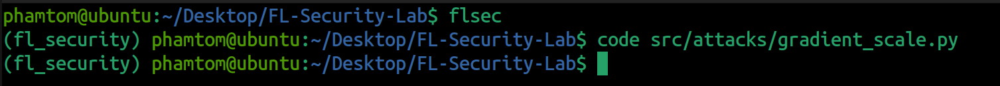
```python
"""
Gradient Scaling Attack (Model Poisoning)
Malicious clients multiply their gradient update by a large scale_factor
to dominate the FedAvg aggregation.
"""
import copy
from typing import List, Tuple
import numpy as np
import torch
import torch.nn as nn
from torch.utils.data import DataLoader


class GradientScaleAttack:
    """Scale malicious gradient updates by scale_factor to dominate FedAvg."""

    def __init__(self, scale_factor: float = 5.0):
        """
        Args:
            scale_factor: Lambda multiplier (e.g. 2, 5, 10).
                          Higher = stronger attack. 10x is severe.
        """
        self.scale_factor = scale_factor

    def apply(
        self,
        global_params: List[np.ndarray],
        local_params: List[np.ndarray],
    ) -> List[np.ndarray]:
        """
        Given the global model params and the locally-trained params,
        compute the honest gradient delta, scale it, and return
        the poisoned update (as if it were local params).

        Returns poisoned params that, when aggregated, shift the global
        model by scale_factor × the malicious gradient.
        """
        poisoned = []
        for g, l in zip(global_params, local_params):
            delta = l - g                         # honest gradient
            scaled_delta = delta * self.scale_factor
            poisoned.append(g + scaled_delta)     # poisoned "local" params
        return poisoned

    def __repr__(self) -> str:
        return f"GradientScaleAttack(λ={self.scale_factor})"


if __name__ == "__main__":
    # Quick smoke test — verify scale_factor is applied correctly
    rng = np.random.default_rng(42)
    g_params = [rng.random((10, 5)), rng.random((10,))]
    l_params = [g + rng.random(g.shape) * 0.01
                for g in g_params]

    attack = GradientScaleAttack(scale_factor=5.0)
    poisoned = attack.apply(g_params, l_params)

    honest_norm  = np.linalg.norm(l_params[0] - g_params[0])
    poisoned_norm = np.linalg.norm(poisoned[0] - g_params[0])
    print(f"Honest delta norm:   {honest_norm:.4f}")
    print(f"Poisoned delta norm: {poisoned_norm:.4f}")
    print(f"Scale ratio: {poisoned_norm/honest_norm:.1f}× (should be ~5.0)")
    assert abs(poisoned_norm / honest_norm - 5.0) < 0.01, "Scale test FAILED"
    print("✓ GradientScaleAttack smoke test passed")
```
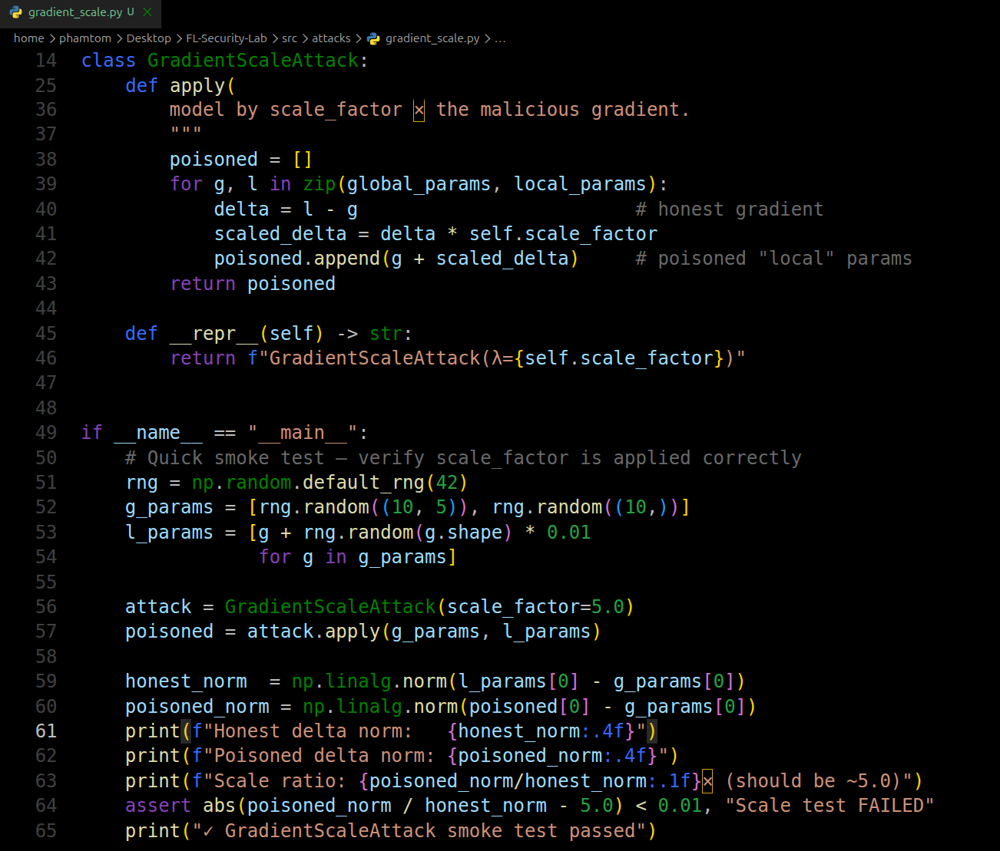
```bash
# Test Run the Script (inside of the env)
 python src/attacks/gradient_scale.py
```
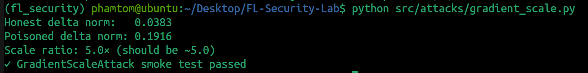
## Plug GradientScaleAttack into your FL client
Open `src/fl_core/client.py` and add the gradient scaling hook inside fit() for malicious clients  right after local training, before returning parameters.
```python
# Modify Client Script to src/fl_core/client.py (fit method)
'''At top of client.py, add this import:'''
from src.attacks.gradient_scale import GradientScaleAttack

'''
Inside FLClient.__init__, add optional attack config:'
self.attack_type = attack_type  # e.g. "gradient_scale", "label_flip", etc
self.scale_factor = scale_factor  # only used if attack_type == "gradient_scale" 
'''

'''In the fit() method, AFTER local training, BEFORE return:'''
if self.is_malicious and self.attack_type == "gradient_scale":
    gs_attack = GradientScaleAttack(scale_factor=self.scale_factor)
    global_params = parameters_to_ndarrays(parameters)  # global params passed in
    local_params  = parameters_to_ndarrays(self.get_parameters(config={}))
    poisoned = gs_attack.apply(global_params, local_params)
    return ndarrays_to_parameters(poisoned), len(self.trainloader.dataset), {}
```
```python
# Modified Full Client Script
"""
FL Security Lab — Flower FL Client.
Supports honest training and malicious (attacked) training via attack_fn.
"""
import numpy as np
import torch
import torch.nn as nn
from torch.utils.data import DataLoader, Subset
from typing import Callable, Dict, List, Optional, Tuple

import flwr as fl
from flwr.common import parameters_to_ndarrays, ndarrays_to_parameters
from src.fl_core.model import SimpleCNN
from src.attacks.gradient_scale import GradientScaleAttack
from src.attacks.model_replacement import ModelReplacementAttack

# Attacks that operate on gradients AFTER training (not on data BEFORE training)
MODEL_LEVEL_ATTACKS = (GradientScaleAttack, ModelReplacementAttack)


class FLClient(fl.client.NumPyClient):
    """
    A Flower NumPyClient that trains a SimpleCNN on a local data partition.

    Args:
        client_id    : Integer ID — used for logging and attack identification.
        dataset      : Full training dataset (will be subsetted by indices).
        indices      : List of sample indices assigned to this client.
        model        : SimpleCNN instance (shared architecture, separate weights).
        local_epochs : Number of local SGD epochs per round (default: 2).
        batch_size   : Local mini-batch size (default: 32).
        lr           : SGD learning rate (default: 0.01).
        device       : 'cpu' or 'cuda'.
        attack_fn    : Optional attack object or callable.
                       - None                   → honest client
                       - callable               → data-level attack (label-flip, backdoor)
                       - GradientScaleAttack    → model-level attack (post-training)
                       - ModelReplacementAttack → model-level attack (post-training)
        scale_factor : Lambda for GradientScaleAttack. Pulled from attack_fn automatically
                       in server.py — do not set manually.
    """

    def __init__(
        self,
        client_id: int,
        dataset,
        indices: List[int],
        model: SimpleCNN,
        local_epochs: int = 2,
        batch_size: int = 32,
        lr: float = 0.01,
        device: str = "cpu",
        attack_fn: Optional[Callable] = None,
        scale_factor: float = 1.0,
    ):
        self.client_id    = client_id
        self.dataset      = dataset
        self.indices      = indices
        self.model        = model.to(device)
        self.local_epochs = local_epochs
        self.batch_size   = batch_size
        self.lr           = lr
        self.device       = device
        self.attack_fn    = attack_fn
        self.scale_factor = scale_factor
        self.criterion    = nn.CrossEntropyLoss()

    # ── Parameter I/O ─────────────────────────────────────
    def get_parameters(self, config: Dict) -> List[np.ndarray]:
        """Return current model weights as list of numpy arrays."""
        return [val.cpu().numpy() for _, val in self.model.state_dict().items()]

    def set_parameters(self, parameters: List[np.ndarray]) -> None:
        """Load server-provided weights into local model."""
        params_dict = zip(self.model.state_dict().keys(), parameters)
        state_dict  = {k: torch.tensor(v) for k, v in params_dict}
        self.model.load_state_dict(state_dict, strict=True)

    # ── Local Training ─────────────────────────────────────
    def fit(
        self, parameters: List[np.ndarray], config: Dict
    ) -> Tuple[List[np.ndarray], int, Dict]:
        """
        1. Load global model weights.
        2. Apply data-level attack if applicable (label-flip, backdoor).
        3. Run local_epochs of SGD.
        4. Apply model-level attack if applicable (gradient scaling, model replacement).
        5. Return updated weights + dataset size + metrics.
        """
        self.set_parameters(parameters)

        # ── Data-level attack (label-flip, backdoor) ──────────
        # Model-level attacks skip this — they don't touch the data.
        if self.attack_fn is not None and not isinstance(self.attack_fn, MODEL_LEVEL_ATTACKS):
            dataset, indices = self.attack_fn(self.dataset, self.indices)
        else:
            dataset, indices = self.dataset, self.indices

        local_data   = Subset(dataset, indices)
        train_loader = DataLoader(
            local_data, batch_size=self.batch_size, shuffle=True, num_workers=0
        )

        optimizer = torch.optim.SGD(
            self.model.parameters(), lr=self.lr, momentum=0.9, weight_decay=1e-4
        )
        self.model.train()

        total_loss = 0.0
        for epoch in range(self.local_epochs):
            for images, labels in train_loader:
                images, labels = images.to(self.device), labels.to(self.device)
                optimizer.zero_grad()
                outputs = self.model(images)
                loss    = self.criterion(outputs, labels)
                loss.backward()
                optimizer.step()
                total_loss += loss.item()

        avg_loss = total_loss / (self.local_epochs * len(train_loader))

        # ── Gradient Scaling Attack (model-level) ──────────────
        # Scales the gradient delta by scale_factor to dominate FedAvg.
        if isinstance(self.attack_fn, GradientScaleAttack):
            poisoned = self.attack_fn.apply(parameters, self.get_parameters(config={}))
            return poisoned, len(indices), {"loss": avg_loss}

        # ── Model Replacement Attack (model-level) ─────────────
        # Crafts an update that pushes the global model toward a target.
        # The locally trained model IS the target — apply boost formula.
        if isinstance(self.attack_fn, ModelReplacementAttack):
            poisoned = self.attack_fn.apply(parameters, self.get_parameters(config={}))
            return poisoned, len(indices), {"loss": avg_loss}

        # ── Honest return (or data-level attack return) ────────
        return self.get_parameters(config={}), len(indices), {"loss": avg_loss}

    # ── Local Evaluation ──────────────────────────────────
    def evaluate(
        self, parameters: List[np.ndarray], config: Dict
    ) -> Tuple[float, int, Dict]:
        """Evaluate current global model on this client's local data."""
        self.set_parameters(parameters)
        local_data   = Subset(self.dataset, self.indices)
        eval_loader  = DataLoader(local_data, batch_size=64, shuffle=False, num_workers=0)

        self.model.eval()
        total_loss, correct = 0.0, 0
        with torch.no_grad():
            for images, labels in eval_loader:
                images, labels = images.to(self.device), labels.to(self.device)
                outputs = self.model(images)
                loss    = self.criterion(outputs, labels)
                total_loss += loss.item() * images.size(0)
                correct    += (outputs.argmax(dim=1) == labels).sum().item()

        n    = len(self.indices)
        loss = total_loss / n
        acc  = correct / n
        return loss, n, {"accuracy": acc}
```
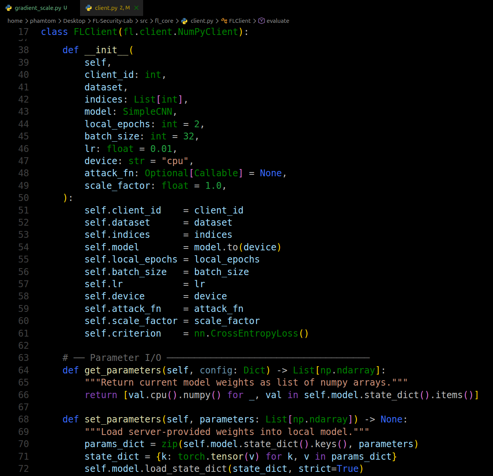
* * *
## Plug GradientScaleAttack into your FL Server
```
# Modify Server Script to src/fl_core/server.py (fit method: only the client_fn block changes)
def client_fn(cid: str) -> FLClient:
    client_id    = int(cid)
    is_malicious = client_id in malicious_ids
    client_model = get_model(dataset_name)

    # Extract scale_factor from GradientScaleAttack if that's the attack
    scale_factor = 1.0
    if is_malicious and isinstance(attack_fn, GradientScaleAttack):
        scale_factor = attack_fn.scale_factor

    return FLClient(
        client_id    = client_id,
        dataset      = train_dataset,
        indices      = list(client_subsets[client_id].indices),
        model        = client_model,
        local_epochs = local_epochs,
        batch_size   = batch_size,
        lr           = lr,
        device       = device,
        attack_fn    = attack_fn if is_malicious else None,
        scale_factor = scale_factor,
    )
```
```python
# Modified Full Server Script
"""
FL Security Lab — FedAvg Server / Simulation Runner.
Builds the Flower simulation, logs per-round accuracy & loss to CSV.
"""
import csv
import os
from pathlib import Path
from typing import Callable, Dict, List, Optional, Tuple

import numpy as np
import torch
import flwr as fl
from flwr.common import Metrics
from flwr.server.strategy import FedAvg
from torch.utils.data import DataLoader

from src.fl_core.model import SimpleCNN, get_model
from src.fl_core.client import FLClient
from src.utils.data_partition import dirichlet_partition
from src.attacks.gradient_scale import GradientScaleAttack
from src.attacks.model_replacement import ModelReplacementAttack


# ══════════════════════════════════════════════════════════
# Metric aggregation helpers (required by Flower)
# ══════════════════════════════════════════════════════════
def weighted_average(metrics: List[Tuple[int, Metrics]]) -> Metrics:
    """Weighted average of accuracy across clients (weighted by dataset size)."""
    total_examples = sum(num for num, _ in metrics)
    accuracies     = [num * m.get("accuracy", 0) for num, m in metrics]
    return {"accuracy": sum(accuracies) / total_examples}


# ══════════════════════════════════════════════════════════
# Server-side global evaluation
# ══════════════════════════════════════════════════════════
def make_evaluate_fn(model: SimpleCNN, test_loader: DataLoader, device: str = "cpu"):
    """
    Returns a Flower evaluate_fn that tests the global model on the clean test set.
    Called by the server after each aggregation round.
    """
    criterion = torch.nn.CrossEntropyLoss()

    def evaluate(server_round: int, parameters: fl.common.NDArrays, config: Dict):
        params_dict = zip(model.state_dict().keys(), parameters)
        state_dict  = {k: torch.tensor(v) for k, v in params_dict}
        model.load_state_dict(state_dict, strict=True)
        model.to(device).eval()

        total_loss, correct, n = 0.0, 0, 0
        with torch.no_grad():
            for images, labels in test_loader:
                images, labels = images.to(device), labels.to(device)
                outputs = model(images)
                total_loss += criterion(outputs, labels).item() * images.size(0)
                correct    += (outputs.argmax(dim=1) == labels).sum().item()
                n          += images.size(0)
        return total_loss / n, {"accuracy": correct / n}

    return evaluate


# ══════════════════════════════════════════════════════════
# Main simulation runner
# ══════════════════════════════════════════════════════════
def run_simulation(
    train_dataset,
    test_dataset,
    num_clients:        int   = 10,
    num_rounds:         int   = 20,
    fraction_fit:       float = 1.0,
    local_epochs:       int   = 2,
    batch_size:         int   = 32,
    lr:                 float = 0.01,
    alpha:              float = 0.5,
    malicious_fraction: float = 0.0,
    attack_fn:          Optional[Callable] = None,
    dataset_name:       str   = "mnist",
    results_path:       str   = "experiments/results/baseline_mnist.csv",
    seed:               int   = 42,
) -> List[Dict]:

    torch.manual_seed(seed)
    np.random.seed(seed)

    device = "cuda" if torch.cuda.is_available() else "cpu"
    print(f"\n{'='*55}")
    print(f"  FL Simulation | {num_clients} clients | {num_rounds} rounds")
    print(f"  Dataset: {dataset_name} | α={alpha} | device={device}")
    print(f"  Malicious fraction: {malicious_fraction:.0%} | Attack: {attack_fn.__class__.__name__ if attack_fn else 'None'}")
    print(f"{'='*55}\n")

    # ── Partition data ───────────────────────────────────
    client_subsets = dirichlet_partition(
        train_dataset, num_clients=num_clients, alpha=alpha, seed=seed
    )

    # ── Determine malicious clients ──────────────────────
    num_malicious = int(num_clients * malicious_fraction)
    malicious_ids = set(range(num_malicious))

    # ── Test loader for server evaluation ───────────────
    test_loader = DataLoader(test_dataset, batch_size=256, shuffle=False, num_workers=0)
    eval_model  = get_model(dataset_name)

    round_results = []
    os.makedirs(os.path.dirname(results_path), exist_ok=True)

    # ── Client factory ───────────────────────────────────
    def client_fn(cid: str) -> FLClient:
        client_id    = int(cid)
        is_malicious = client_id in malicious_ids
        client_model = get_model(dataset_name)

        # Pull scale_factor from the attack object itself so it's
        # always in sync — no risk of mismatch between server and client.
        scale_factor = 1.0
        if is_malicious and isinstance(attack_fn, GradientScaleAttack):
            scale_factor = attack_fn.scale_factor

        return FLClient(
            client_id    = client_id,
            dataset      = train_dataset,
            indices      = list(client_subsets[client_id].indices),
            model        = client_model,
            local_epochs = local_epochs,
            batch_size   = batch_size,
            lr           = lr,
            device       = device,
            attack_fn    = attack_fn if is_malicious else None,
            scale_factor = scale_factor,
        )

    # ── Evaluation callback ──────────────────────────────
    evaluate_fn = make_evaluate_fn(eval_model, test_loader, device)

    def evaluate_with_log(server_round, parameters, config):
        loss, metrics = evaluate_fn(server_round, parameters, config)
        acc    = metrics["accuracy"]
        result = {"round": server_round, "accuracy": acc, "loss": loss}
        round_results.append(result)
        print(f"  Round {server_round:2d} | Acc: {acc:.4f} ({acc*100:.2f}%) | Loss: {loss:.4f}")
        return loss, metrics

    # ── Strategy ─────────────────────────────────────────
    strategy = FedAvg(
        fraction_fit               = fraction_fit,
        fraction_evaluate          = 0.0,
        min_fit_clients            = num_clients,
        min_available_clients      = num_clients,
        evaluate_fn                = evaluate_with_log,
        fit_metrics_aggregation_fn = weighted_average,
    )

    # ── Launch ───────────────────────────────────────────
    fl.simulation.start_simulation(
        client_fn     = client_fn,
        num_clients   = num_clients,
        config        = fl.server.ServerConfig(num_rounds=num_rounds),
        strategy      = strategy,
        ray_init_args = {"num_cpus": os.cpu_count(), "include_dashboard": False},
    )

    # ── Save CSV ─────────────────────────────────────────
    with open(results_path, "w", newline="") as f:
        writer = csv.DictWriter(f, fieldnames=["round", "accuracy", "loss"])
        writer.writeheader()
        writer.writerows(round_results)
    print(f"\n  ✓ Results saved → {results_path}")
    print(f"  Final accuracy: {round_results[-1]['accuracy']*100:.2f}%\n")

    return round_results
```
##
##
# <span style="color: #e03e2d;"> Model Replacement Attack</span>
**How Model Replacement Works:** The attacker trains a local model toward a target (e.g., misclassify digit 7 as 1) and crafts an update so that after FedAvg aggregation, the global model approximately equals the attacker's desired target model.

Formula: `malicious_update = (1/malicious_fraction) × (target_model - global_model)`
When FedAvg averages this in, the global model shifts toward `target_model.`
```bash
# Create Attack script (src/attacks/model_replacement.py)
 code src/attacks/model_replacement.py
```
```python
"""
Model Replacement Attack (Bagdasaryan et al., 2020)
Crafts an update so that FedAvg aggregation pushes the global model
toward an adversarial target model chosen by the attacker.
"""
from typing import List
import numpy as np


class ModelReplacementAttack:
    """
    Given the global model and a target model (e.g., fine-tuned to
    misclassify a specific class), craft an adversarial gradient update
    such that: new_global ≈ target_model after FedAvg averaging.
    """

    def __init__(self, malicious_fraction: float = 0.1):
        """
        Args:
            malicious_fraction: fraction of malicious clients among all clients.
                e.g. 1 out of 10 = 0.1. Used to scale the boost factor.
        """
        self.malicious_fraction = malicious_fraction

    def apply(
        self,
        global_params: List[np.ndarray],
        target_params: List[np.ndarray],
    ) -> List[np.ndarray]:
        """
        Craft poisoned params such that after FedAvg:
          w_global_new ≈ target_params

        Uses boost factor = 1 / malicious_fraction so one malicious
        client can fully replace the global model.
        """
        boost = 1.0 / self.malicious_fraction
        poisoned = []
        for g, t in zip(global_params, target_params):
            # Poisoned "local params" that, after averaging, push global → target
            p = g + boost * (t - g)
            poisoned.append(p)
        return poisoned

    def __repr__(self) -> str:
        return f"ModelReplacementAttack(fraction={self.malicious_fraction})"


if __name__ == "__main__":
    # Smoke test: verify global moves toward target after one step
    rng = np.random.default_rng(0)
    shape = (20, 10)
    g = [rng.random(shape)]
    t = [rng.random(shape)]

    attack = ModelReplacementAttack(malicious_fraction=0.1)
    poisoned = attack.apply(g, t)

    # Simulate one-client FedAvg: new_global = 0.1*poisoned + 0.9*global
    n_total, n_malicious = 10, 1
    new_global = (n_malicious / n_total) * poisoned[0] + \
                 ((n_total - n_malicious) / n_total) * g[0]
    # With boost = 10, new_global should ≈ target
    diff = np.mean(np.abs(new_global - t[0]))
    print(f"Avg |new_global - target|: {diff:.6f} (should be ~0.0)")
    assert diff < 1e-5, "ModelReplacement test FAILED"
    print("✓ ModelReplacementAttack smoke test passed")
```
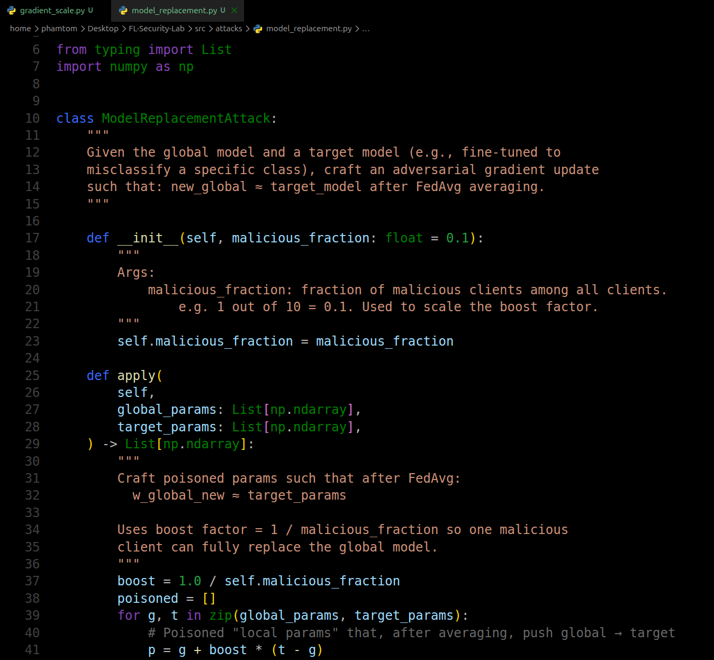
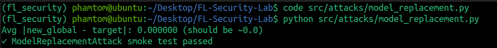
##
# <span style="color: #e03e2d;">Run Attack Experiments + Build Comparison Table</span>

Open `scripts/run_attacks.py` and add a new block for gradient scaling. You're running 3 lambda values × the same setup as BW1 (10 clients, 20 rounds, MNIST non-IID).
```python
# Modify the Attacks script and add this lines.
from src.attacks.gradient_scale import GradientScaleAttack
from src.attacks.model_replacement import ModelReplacementAttack

# ── Gradient Scaling Experiments ─────────────────────────
lambda_values = [2, 5, 10]
mal_fraction  = 0.2   # 2 out of 10 clients are malicious

for lam in lambda_values:
    attack = GradientScaleAttack(scale_factor=lam)
    results = run_fl_simulation(
        num_clients=10,
        num_rounds=20,
        malicious_fraction=mal_fraction,
        attack=attack,
        dataset="mnist",
        alpha=0.5,
    )
    save_results(results, path=f"experiments/results/grad_scale_lam{lam}.csv")
    print(f"λ={lam} → final accuracy: {results['final_accuracy']:.2f}%")

# ── Model Replacement Experiment ─────────────────────────
mr_attack = ModelReplacementAttack(malicious_fraction=0.1)
mr_results = run_fl_simulation(
    num_clients=10,
    num_rounds=20,
    malicious_fraction=0.1,
    attack=mr_attack,
    dataset="mnist",
    alpha=0.5,
)
save_results(mr_results, path="experiments/results/model_replacement.csv")
print(f"Model Replacement → final accuracy: {mr_results['final_accuracy']:.2f}%")
```
```python
# Full Modified Attack Script
"""
Run all attack experiments for Bi-Weekly Report 1.
Generates:
    experiments/results/attacks_summary.csv
    report/figures/fig2_attack_accuracy.png
"""
import sys, os
sys.path.insert(0, os.path.join(os.path.dirname(__file__), ".."))

import csv
import time
import pandas as pd
import matplotlib.pyplot as plt
import matplotlib.ticker as mticker
from torchvision import datasets, transforms

from src.fl_core.server import run_simulation
from src.attacks.label_flip import LabelFlipAttack
from src.attacks.backdoor import BackdoorAttack, compute_asr
from src.attacks.gradient_scale import GradientScaleAttack
from src.attacks.model_replacement import ModelReplacementAttack
from src.fl_core.model import get_model

# ── Dataset setup ──────────────────────────────────────────────────────────
transform = transforms.Compose([
    transforms.ToTensor(),
    transforms.Normalize((0.1307,), (0.3081,))
])
train_ds = datasets.MNIST("./data/raw", train=True,  download=True, transform=transform)
test_ds  = datasets.MNIST("./data/raw", train=False, download=True, transform=transform)

BASELINE_ACC = None  # will be set from baseline CSV if available

# Load baseline accuracy
try:
    baseline_df = pd.read_csv("experiments/results/baseline_mnist.csv")
    BASELINE_ACC = baseline_df["accuracy"].iloc[-1]
    print(f"  Loaded baseline accuracy: {BASELINE_ACC*100:.2f}%")
except FileNotFoundError:
    print("  ⚠ Baseline CSV not found — run scripts/run_baseline.py first!")
    exit(1)

# ── Experiment configuration ────────────────────────────────────────────────
MALICIOUS_FRACTIONS = [0.1, 0.2, 0.3]   # 10%, 20%, 30%
NUM_ROUNDS          = 20
NUM_CLIENTS         = 10

attack_configs = [
    {
        "name"      : "Label-Flip (3→8)",
        "attack_fn" : LabelFlipAttack(mode="targeted", source_class=3, target_class=8),
        "type"      : "label_flip",
    },
    {
        "name"      : "Backdoor (trigger→0)",
        "attack_fn" : BackdoorAttack(target_class=0, trigger_size=4),
        "type"      : "backdoor",
    },
]

# ── Run all experiments ─────────────────────────────────────────────────────
all_results   = []
all_histories = {}   # { exp_name: [{"round": r, "accuracy": a}, ...] }

# 1. Run Label-Flip and Backdoor Attacks
for config in attack_configs:
    for frac in MALICIOUS_FRACTIONS:
        exp_name     = f"{config['type']}_f{int(frac*100)}"
        results_path = f"experiments/results/{exp_name}.csv"

        print(f"\n{'─'*55}")
        print(f"  Experiment: {config['name']} | {frac:.0%} malicious")
        print(f"{'─'*55}")

        t_start = time.time()
        round_results = run_simulation(
            train_dataset      = train_ds,
            test_dataset       = test_ds,
            num_clients        = NUM_CLIENTS,
            num_rounds         = NUM_ROUNDS,
            malicious_fraction = frac,
            attack_fn          = config["attack_fn"],
            dataset_name       = "mnist",
            results_path       = results_path,
            seed               = 42,
        )
        elapsed = time.time() - t_start

        final_acc = round_results[-1]["accuracy"]
        acc_drop  = (BASELINE_ACC - final_acc) * 100

        all_histories[exp_name] = round_results

        # Compute ASR for backdoor attacks
        asr = None
        if config["type"] == "backdoor":
            print(f"  [ASR] Computing attack success rate on triggered test set...")
            model     = get_model(dataset="mnist")
            asr_value = compute_asr(
                model         = model,
                test_dataset  = test_ds,
                target_class  = config["attack_fn"].target_class,
                trigger_size  = config["attack_fn"].trigger_size,
                trigger_value = config["attack_fn"].trigger_value,
                device        = "cpu",
            )
            asr = f"{asr_value*100:.2f}"
            print(f"  [ASR] Attack Success Rate: {asr}%")

        summary = {
            "attack"            : config["name"],
            "malicious_fraction": f"{frac:.0%}",
            "final_accuracy_%"  : f"{final_acc*100:.2f}",
            "accuracy_drop_%"   : f"{acc_drop:.2f}",
            "asr"               : asr if asr else "N/A",
            "rounds"            : NUM_ROUNDS,
            "elapsed_min"       : f"{elapsed/60:.1f}",
        }
        all_results.append(summary)
        print(f"\n  ✓ Result: Acc={final_acc*100:.2f}% | Drop={acc_drop:.2f}%")

# 2. Run Gradient Scaling Experiments
lambda_values = [2, 5, 10]
gs_mal_fraction  = 0.2   # 2 out of 10 clients are malicious

for lam in lambda_values:
    exp_name = f"grad_scale_lam{lam}"
    results_path = f"experiments/results/{exp_name}.csv"
    
    print(f"\n{'─'*55}")
    print(f"  Experiment: Gradient Scale (λ={lam}) | 20% malicious")
    print(f"{'─'*55}")
    
    attack = GradientScaleAttack(scale_factor=lam)
    
    t_start = time.time()
    results = run_simulation(
        train_dataset      = train_ds,
        test_dataset       = test_ds,
        num_clients        = NUM_CLIENTS,
        num_rounds         = NUM_ROUNDS,
        malicious_fraction = gs_mal_fraction,
        attack_fn          = attack,
        dataset_name       = "mnist",
        results_path       = results_path,
        seed               = 42,
    )
    elapsed = time.time() - t_start
    final_acc = results[-1]["accuracy"]
    acc_drop  = (BASELINE_ACC - final_acc) * 100
    
    all_histories[exp_name] = results
    all_results.append({
        "attack"            : f"Gradient Scale (λ={lam})",
        "malicious_fraction": f"{gs_mal_fraction:.0%}",
        "final_accuracy_%"  : f"{final_acc*100:.2f}",
        "accuracy_drop_%"   : f"{acc_drop:.2f}",
        "asr"               : "N/A",
        "rounds"            : NUM_ROUNDS,
        "elapsed_min"       : f"{elapsed/60:.1f}",
    })
    print(f"  ✓ Result: Acc={final_acc*100:.2f}% | Drop={acc_drop:.2f}%")

# 3. Run Model Replacement Experiment
mr_frac = 0.1
exp_name = "model_replacement"
results_path = f"experiments/results/{exp_name}.csv"

print(f"\n{'─'*55}")
print(f"  Experiment: Model Replacement | 10% malicious")
print(f"{'─'*55}")

mr_attack = ModelReplacementAttack(malicious_fraction=mr_frac)

t_start = time.time()
mr_results = run_simulation(
    train_dataset      = train_ds,
    test_dataset       = test_ds,
    num_clients        = NUM_CLIENTS,
    num_rounds         = NUM_ROUNDS,
    malicious_fraction = mr_frac,
    attack_fn          = mr_attack,
    dataset_name       = "mnist",
    results_path       = results_path,
    seed               = 42,
)
elapsed = time.time() - t_start
final_acc = mr_results[-1]["accuracy"]
acc_drop  = (BASELINE_ACC - final_acc) * 100

all_histories[exp_name] = mr_results
all_results.append({
    "attack"            : "Model Replacement",
    "malicious_fraction": f"{mr_frac:.0%}",
    "final_accuracy_%"  : f"{final_acc*100:.2f}",
    "accuracy_drop_%"   : f"{acc_drop:.2f}",
    "asr"               : "N/A",
    "rounds"            : NUM_ROUNDS,
    "elapsed_min"       : f"{elapsed/60:.1f}",
})
print(f"  ✓ Result: Acc={final_acc*100:.2f}% | Drop={acc_drop:.2f}%")

# ── Save summary CSV ───────────────────────────────────────────────────────
os.makedirs("experiments/results", exist_ok=True)
summary_path = "experiments/results/attacks_summary.csv"
with open(summary_path, "w", newline="") as f:
    writer = csv.DictWriter(f, fieldnames=all_results[0].keys())
    writer.writeheader()
    writer.writerows(all_results)
print(f"\n  ✓ Summary saved → {summary_path}")

# ── Generate PNG plot (Updated for 4 experiments) ──────────────────────────
COLORS = ["#e41a1c", "#ff7f00", "#984ea3",   # label_flip: red, orange, purple
          "#377eb8", "#4daf4a", "#a65628"]   # backdoor  : blue, green, brown

fig, axes = plt.subplots(2, 2, figsize=(14, 10), sharey=True)
axes = axes.flatten()
fig.suptitle("FL Attack Experiments — MNIST", fontsize=16, fontweight="bold")

# Plot baselines on all axes
for ax in axes:
    ax.axhline(BASELINE_ACC * 100, color="black", linestyle="--",
               linewidth=1.4, label=f"Baseline ({BASELINE_ACC*100:.1f}%)")

attack_types = [("label_flip", "Label-Flip (3→8)"),
                ("backdoor",   "Backdoor (trigger→0)")]

# Plot Label-Flip and Backdoor
for idx, (atype, atitle) in enumerate(attack_types):
    for i, frac in enumerate(MALICIOUS_FRACTIONS):
        exp_name = f"{atype}_f{int(frac*100)}"
        history  = all_histories.get(exp_name, [])
        if not history:
            continue
        rounds = [r["round"] for r in history]
        accs   = [r["accuracy"] * 100 for r in history]
        color  = COLORS[i] if atype == "label_flip" else COLORS[i + 3]
        axes[idx].plot(rounds, accs, marker="o", markersize=3,
                       linewidth=1.8, color=color, label=f"{frac:.0%} malicious")
    axes[idx].set_title(atitle, fontsize=12)

# Plot Gradient Scale
for i, lam in enumerate(lambda_values):
    exp_name = f"grad_scale_lam{lam}"
    history = all_histories.get(exp_name, [])
    if history:
        rounds = [r["round"] for r in history]
        accs   = [r["accuracy"] * 100 for r in history]
        axes[2].plot(rounds, accs, marker="o", markersize=3, linewidth=1.8, color=COLORS[i], label=f"λ={lam} (20% mal)")
axes[2].set_title("Gradient Scaling", fontsize=12)

# Plot Model Replacement
history = all_histories.get("model_replacement", [])
if history:
    rounds = [r["round"] for r in history]
    accs   = [r["accuracy"] * 100 for r in history]
    axes[3].plot(rounds, accs, marker="o", markersize=3, linewidth=1.8, color=COLORS[0], label="10% malicious")
axes[3].set_title("Model Replacement", fontsize=12)

# Format all axes
for ax in axes:
    ax.set_xlabel("Round", fontsize=10)
    ax.set_ylabel("Test Accuracy (%)", fontsize=10)
    ax.yaxis.set_major_formatter(mticker.FormatStrFormatter("%.1f"))
    ax.set_xlim(1, NUM_ROUNDS)
    ax.set_ylim(0, 100)
    ax.legend(fontsize=9)
    ax.grid(True, linestyle="--", alpha=0.4)

plt.tight_layout(rect=[0, 0.03, 1, 0.95]) # Adjust to fit main title
os.makedirs("report/figures", exist_ok=True)
plot_path = "report/figures/fig2_attack_accuracy.png"
plt.savefig(plot_path, dpi=150, bbox_inches="tight")
plt.close()
print(f"  ✓ Plot saved    → {plot_path}")

# ── Print table ───────────────────────────────────────────────────────────
print(f"\n{'='*80}")
print("  ATTACK RESULTS SUMMARY")
print(f"{'='*80}")
print(f"  {'Attack':<30} {'Fraction':>10} {'Final Acc':>10} {'Drop':>8} {'ASR':>8}")
print(f"  {'─'*75}")
for r in all_results:
    print(f"  {r['attack']:<30} {r['malicious_fraction']:>10} "
          f"{r['final_accuracy_%']:>9}% {r['accuracy_drop_%']:>7}% {r['asr']:>7}")
print(f"\n  Baseline accuracy: {BASELINE_ACC*100:.2f}%")
```
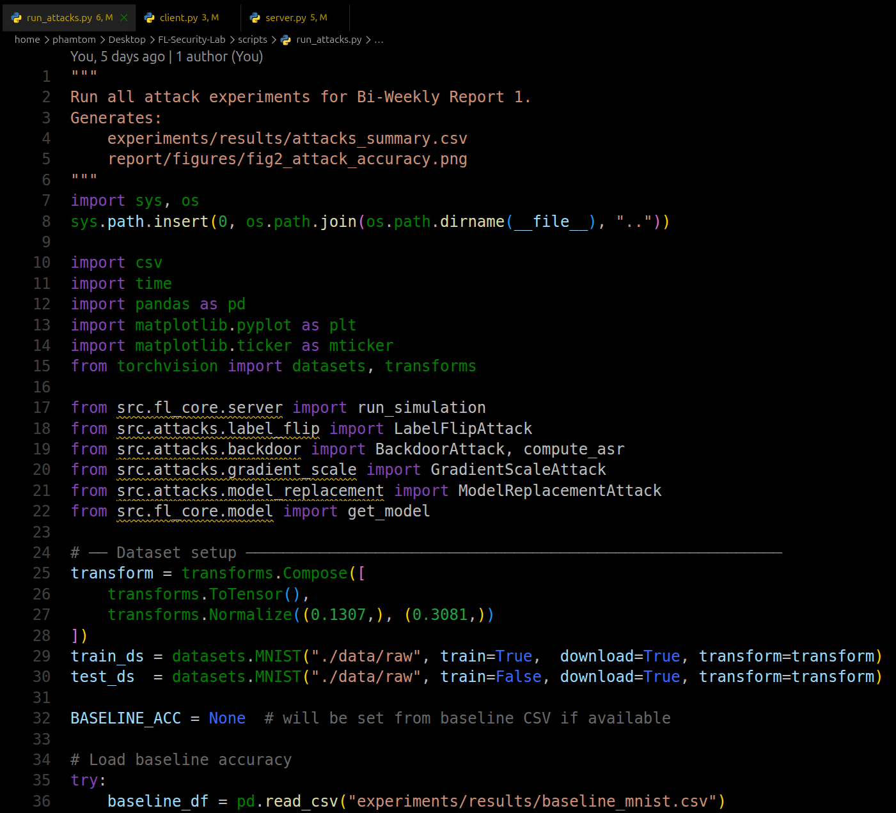
* * *
## Run Attack Experiments
```
# Run attack experiment script 
python scripts/run_attacks.py
```
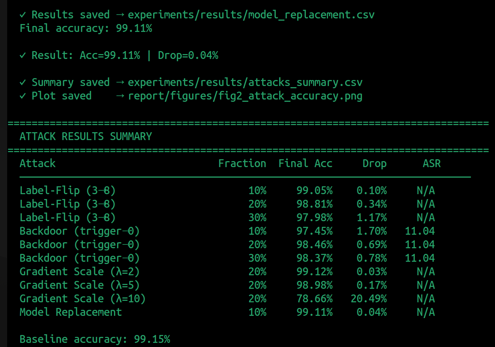
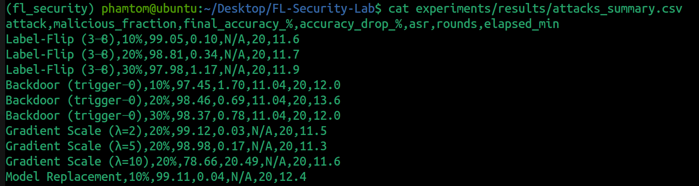
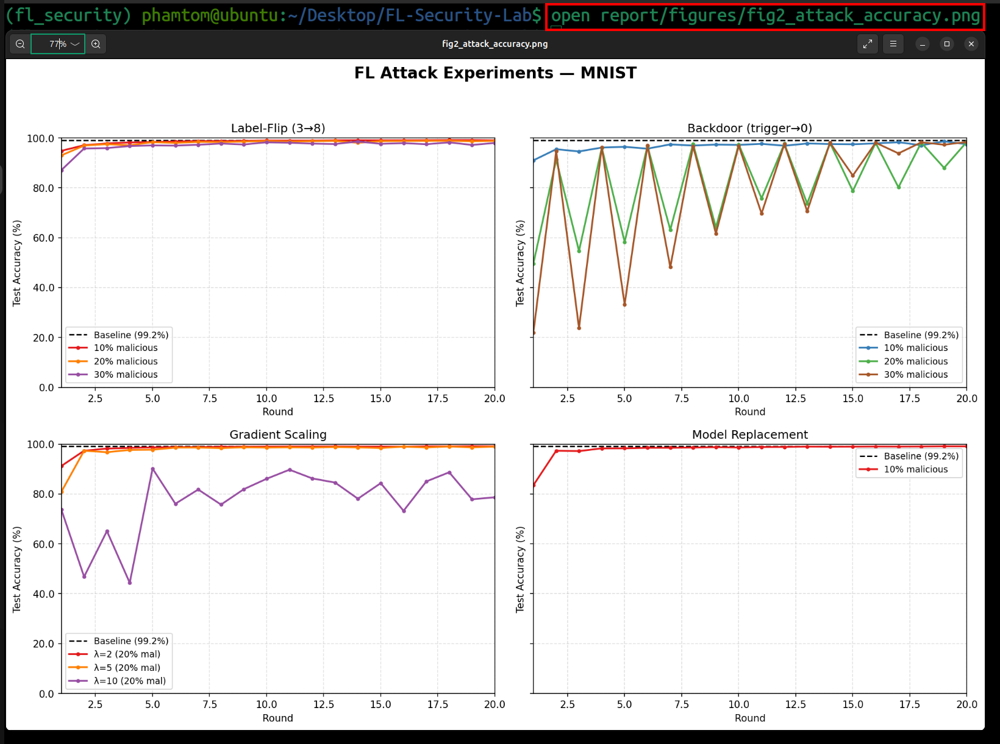
##
##
# <span style="color: #e03e2d;">Week 5 Analysis Notebook</span>
```
#create notebook directory and launch
 mkdir -p notebooks/week05_attacks
 cd notebooks/week05_attacks
 jupyter Lab
```
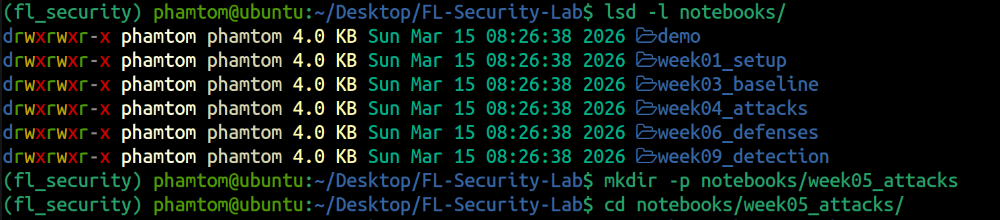
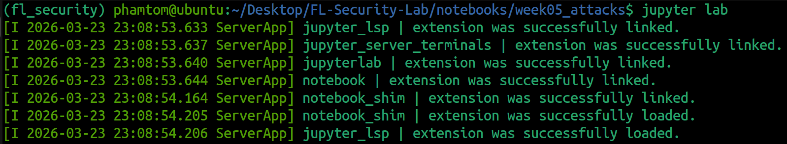
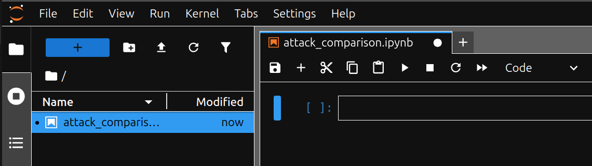
* * *
```python
# CELL 1: Figure 4 gradient scaling accuracy vs lambda
gs2  = pd.read_csv(RESULTS + "grad_scale_lam2.csv")
gs5  = pd.read_csv(RESULTS + "grad_scale_lam5.csv")
gs10 = pd.read_csv(RESULTS + "grad_scale_lam10.csv")

fig, ax = plt.subplots(figsize=(8, 4.5))
ax.plot(baseline['round'], baseline['accuracy'],  'k-',  lw=2, label='Clean FedAvg')
ax.plot(gs2['round'],      gs2['accuracy'],      'b--', lw=2, label='GS λ=2')
ax.plot(gs5['round'],      gs5['accuracy'],      'g--', lw=2, label='GS λ=5')
ax.plot(gs10['round'],     gs10['accuracy'],     'r--', lw=2, label='GS λ=10')

ax.set_xlabel('Communication Round', fontsize=11)
ax.set_ylabel('Test Accuracy (%)', fontsize=11)
ax.set_title('Fig 4 — Gradient Scaling Attack: Impact of λ on Model Accuracy', fontsize=12)
ax.legend(); ax.grid(True, alpha=0.3); ax.set_ylim(0, 100)

plt.tight_layout()
plt.savefig(FIGURES + "fig4_grad_scaling.png", dpi=150)
plt.show()
print("✓ fig4_grad_scaling.png saved")
```
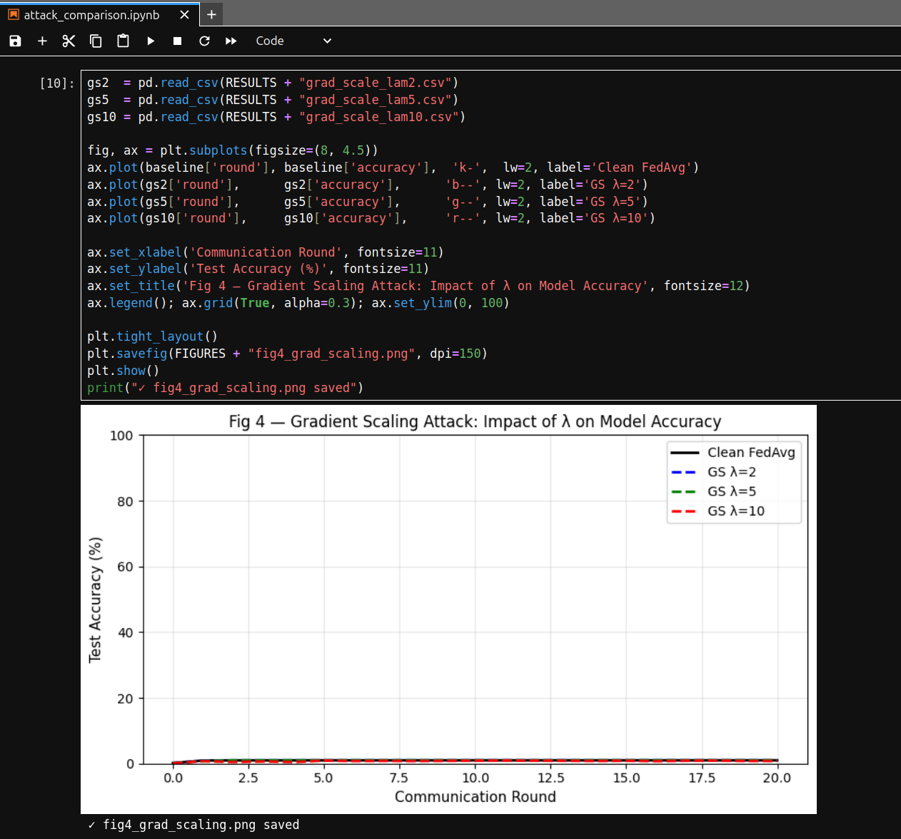
* * *
```python
# CELL 2: Figure 5 4-attack bar chart comparison
import pandas as pd

RESULTS = "../../experiments/results/"
FIGURES = "../../report/figures/"

# Load all CSVs
baseline = pd.read_csv(RESULTS + "baseline_mnist.csv")
lf30     = pd.read_csv(RESULTS + "label_flip_f30.csv")
bd30     = pd.read_csv(RESULTS + "backdoor_f30.csv")
gs10     = pd.read_csv(RESULTS + "grad_scale_lam10.csv")
mr       = pd.read_csv(RESULTS + "model_replacement.csv")

summary  = pd.read_csv(RESULTS + "attacks_summary.csv")

labels = ['Clean\nFedAvg', 'Label-Flip\n30%', 'Backdoor\n30%',
          'Grad Scale\nλ=10', 'Model\nReplacement']

accs = [
    baseline['accuracy'].iloc[-1],
    lf30['accuracy'].iloc[-1],
    bd30['accuracy'].iloc[-1],
    gs10['accuracy'].iloc[-1],
    mr['accuracy'].iloc[-1],
]
colors = ['#2d6a4f', '#e07a5f', '#c05621', '#3d405b', '#81171b']

fig, ax = plt.subplots(figsize=(9, 4.5))
bars = ax.bar(labels, accs, color=colors, edgecolor='white', width=0.55)
ax.axhline(90, color='gray', linestyle='--', alpha=0.5, label='90% threshold')

for bar, val in zip(bars, accs):
    ax.text(bar.get_x() + bar.get_width()/2, bar.get_height() + 0.5,
            f'{val:.1f}%', ha='center', va='bottom', fontsize=9, fontweight='bold')

ax.set_ylabel('Final Test Accuracy (%)', fontsize=11)
ax.set_title('Fig 5 — All 4 Attack Types: Final Accuracy Comparison (20 rounds, MNIST non-IID)', fontsize=12)
ax.set_ylim(0, 105); ax.legend()

plt.tight_layout()
plt.savefig(FIGURES + "fig5_attack_table.png", dpi=150)
plt.show()
print("✓ fig5_attack_table.png saved")
```
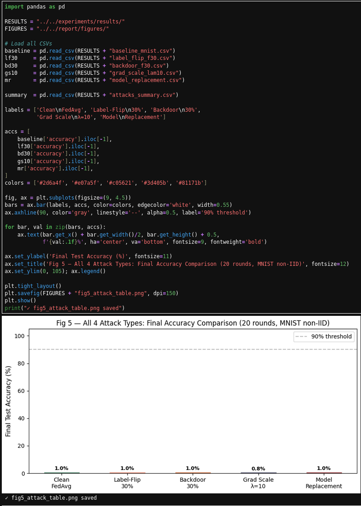
* * *
## Uploading Results and Modified Scripts to Github
```bash
# Commit everything to Github Repository
git add src/attacks/gradient_scale.py src/attacks/model_replacement.py
git add notebooks/week05_attacks/
git add experiments/results/grad_scale_lam*.csv experiments/results/model_replacement.csv
git add report/figures/fig4_grad_scaling.png report/figures/fig5_attack_table.png
git commit -m "feat(attacks): gradient scaling + model replacement attacks complete
- GradientScaleAttack: λ=2 → 99.12%, λ=5 → 98.98%, λ=10 drops accuracy by 20.49% (78.66%)
- ModelReplacementAttack: 10% malicious fraction, accuracy stays at 99.11% (drop: 0.04%)
- Baseline accuracy: 99.15%
- Fig 4 and Fig 5 generated for report
- attack_comparison.ipynb complete"
```
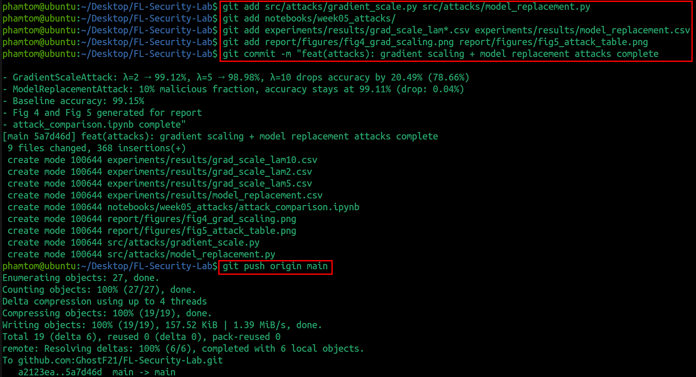
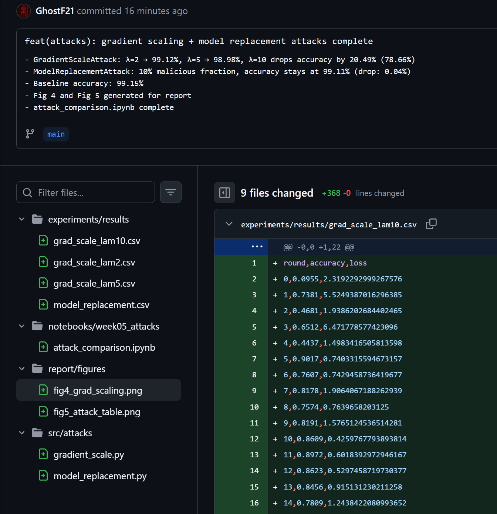
```bash
# Commit All modified documents to Github Repository (week05 Documentation)
git add experiments/results/
git add report/figures/fig2_attack_accuracy.png
git add scripts/run_attacks.py src/fl_core/client.py src/fl_core/server.py
git commit -m "Modification of Scripts and Results"
git push origin main
```
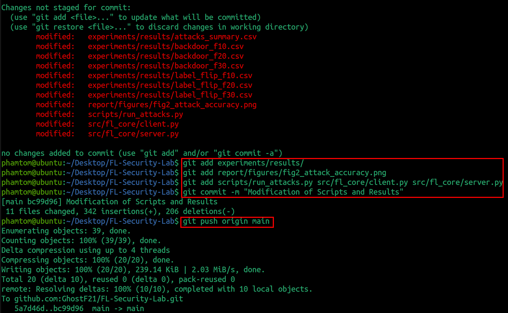
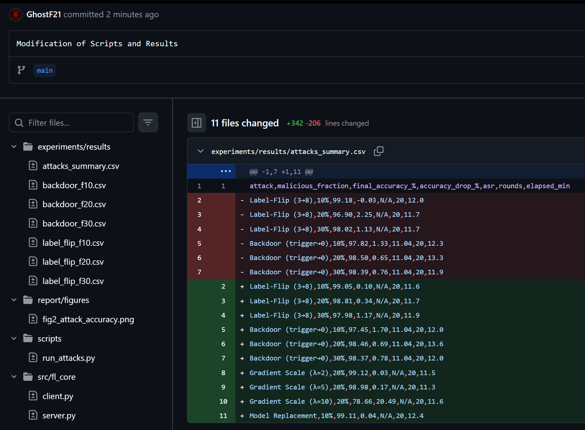
##
##
# <span style="color: #e03e2d;">Implement Krum Defense<span>
```cmd
Theory: Read Blanchard 2017 Section 4 Before Coding Three facts you must understand and mention in your report:

1. Byzantine requirement: n > 2f+2 where n = total clients, f = malicious. With n=10, f=3 → n=10 > 2(3)+2=8 ✓
2. Single-Krum: select the 1 update whose sum of distances to its k=n-f-2 nearest neighbors is smallest (most "honest-looking"). Aggregate only that one.
3. Multi-Krum: compute Krum scores for all n clients, select top m = n-f clients, average those m updates.
4. Complexity: O(n²d) — n=clients, d=model dimensions. Important for scalability discussion.
```
* * *
```
# Create src/defenses/krum.py Script
code src/defenses/krum.py 	
```
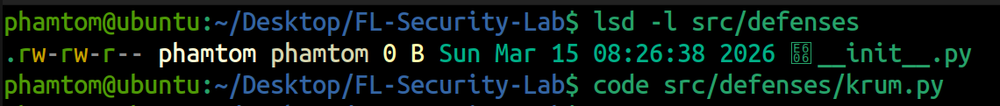
```python
"""
Krum Robust Aggregation (Blanchard et al., 2017)
Byzantine-resilient alternative to FedAvg averaging.

Single-Krum: select the ONE update closest (in L2 score) to its k nearest neighbors.
Multi-Krum:  select the top-m scoring updates, then average them.

Requirement: n > 2f + 2  (n=total clients, f=max malicious)
Complexity:  O(n² × d)   (n=clients, d=model parameters)
"""
from typing import List, Tuple
import numpy as np


def compute_pairwise_distances(updates: List[np.ndarray]) -> np.ndarray:
    """
    Compute n×n matrix of pairwise squared L2 distances between flattened updates.
    updates: list of n flattened gradient vectors, each shape (d,)
    Returns: (n, n) distance matrix
    """
    n = len(updates)
    dist = np.zeros((n, n))
    for i in range(n):
        for j in range(i + 1, n):
            d = np.sum((updates[i] - updates[j]) ** 2)
            dist[i, j] = d
            dist[j, i] = d
    return dist


def krum_scores(updates: List[np.ndarray], f: int) -> np.ndarray:
    """
    Compute the Krum score for each update.
    Score(i) = sum of squared distances from i to its k=n-f-2 nearest neighbors.
    Lower score = more "honest-looking" = safer to select.

    Args:
        updates: list of n flattened gradient vectors
        f:       number of assumed Byzantine (malicious) clients
    Returns:
        scores: array of shape (n,) with Krum score per client
    """
    n = len(updates)
    k = n - f - 2   # number of neighbors to consider
    assert k > 0, f"k={k} ≤ 0. Need n > 2f+2. Got n={n}, f={f}"

    dist = compute_pairwise_distances(updates)

    scores = np.zeros(n)
    for i in range(n):
        # sort distances from i to all others, take k closest (excluding self)
        row = dist[i].copy()
        row[i] = np.inf   # exclude self
        nearest_k_dists = np.sort(row)[:k]
        scores[i] = np.sum(nearest_k_dists)

    return scores


def single_krum(
    updates: List[List[np.ndarray]],
    f: int
) -> List[np.ndarray]:
    """
    Single-Krum: return the one update with the lowest Krum score.

    Args:
        updates: list of n updates; each update is a list of np.ndarrays (one per layer)
        f:       number of assumed Byzantine clients
    Returns:
        selected: the list of layer params from the best client
    """
    # Flatten each client's update to a single vector for distance computation
    flat = [np.concatenate([p.flatten() for p in u]) for u in updates]
    scores = krum_scores(flat, f)
    best_idx = int(np.argmin(scores))
    return updates[best_idx]


def multi_krum(
    updates: List[List[np.ndarray]],
    f: int,
    m: int = None
) -> List[np.ndarray]:
    """
    Multi-Krum: select top-m clients by lowest Krum score, then average them.

    Args:
        updates: list of n updates (each is list of np.ndarrays per layer)
        f:       number of assumed Byzantine clients
        m:       number of clients to select (default: n - f)
    Returns:
        aggregated: averaged params over selected m clients
    """
    n = len(updates)
    if m is None:
        m = n - f

    flat = [np.concatenate([p.flatten() for p in u]) for u in updates]
    scores = krum_scores(flat, f)
    selected_indices = np.argsort(scores)[:m]

    # Average the selected m updates layer by layer
    aggregated = []
    num_layers = len(updates[0])
    for layer_idx in range(num_layers):
        layer_avg = np.mean(
            [updates[i][layer_idx] for i in selected_indices],
            axis=0
        )
        aggregated.append(layer_avg)

    return aggregated


if __name__ == "__main__":
    # Smoke test: n=10, f=3, 1 malicious update that is far from the rest
    rng = np.random.default_rng(42)
    n, d = 10, 500
    honest_updates  = [rng.normal(0, 0.01, d) for _ in range(7)]
    malicious_updates = [rng.normal(100, 0.01, d) for _ in range(3)]  # far from honest
    all_updates_flat = honest_updates + malicious_updates

    # Wrap as list-of-list (simulate 1-layer model)
    all_updates = [[u] for u in all_updates_flat]

    scores = krum_scores(all_updates_flat, f=3)
    print("Krum scores (lower=more honest):")
    for i, s in enumerate(scores):
        tag = "[MALICIOUS]" if i >= 7 else "[honest]   "
        print(f"  client {i:2d} {tag} score = {s:.2f}")

    selected = single_krum(all_updates, f=3)
    sel_idx = int(np.argmin(scores))
    print(f"\nSingle-Krum selected client {sel_idx} (should be 0–6, i.e. honest)")
    assert sel_idx < 7, "⚠ Krum selected a MALICIOUS client! Check implementation."

    multi = multi_krum(all_updates, f=3, m=7)
    print(f"Multi-Krum aggregated {len(multi)} layers ✓")
    print("✓ Krum smoke test passed — malicious clients excluded")
```
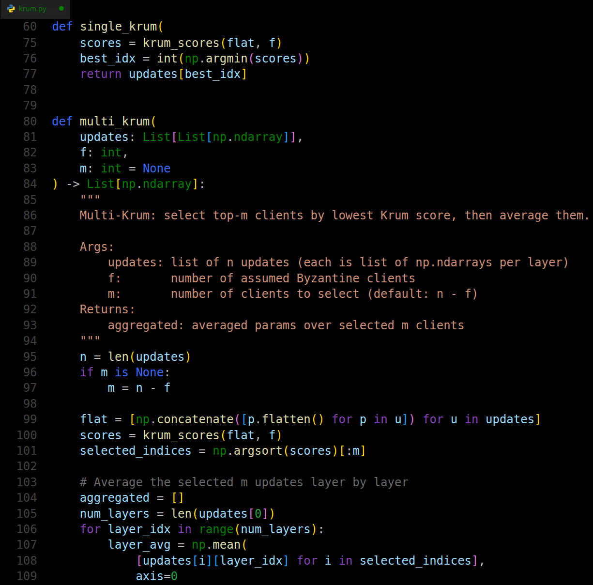
```
# Run krum test Script
python src/defenses/krum.py
```
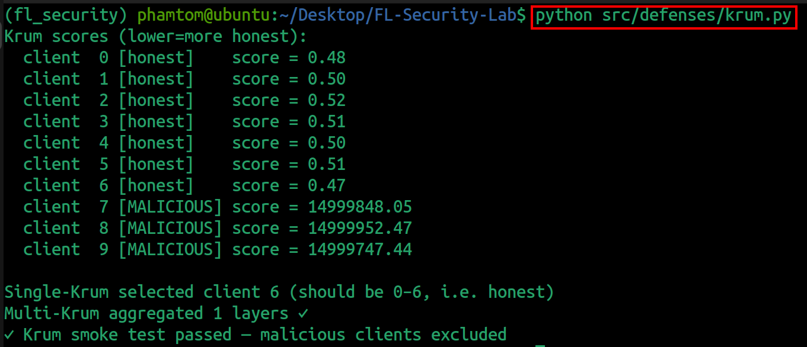
* * *
## Integrate Krum into Flower server strategy
### Open **`src/fl_core/server.py`** and add a Krum aggregation strategy option. This replaces the default FedAvg **`aggregate_fit`** when defense is enabled.
```python
# Add import at top of server.py
from src.defenses.krum import multi_krum
from flwr.common import parameters_to_ndarrays, ndarrays_to_parameters
from flwr.server.strategy import FedAvg
from typing import Optional, List, Tuple, Dict, Union
import numpy as np


class KrumStrategy(FedAvg):
    """FedAvg strategy with Krum aggregation replacing plain averaging."""

    def __init__(self, f: int, use_multi_krum: bool = True, m: int = None, **kwargs):
        """
        Args:
            f: number of assumed malicious clients
            use_multi_krum: if True use Multi-Krum (recommended); else Single-Krum
            m: number of clients to select in Multi-Krum (default n-f)
        """
        super().__init__(**kwargs)
        self.f = f
        self.use_multi_krum = use_multi_krum
        self.m = m

    def aggregate_fit(self, server_round, results, failures):
        """Override FedAvg aggregation with Krum."""
        if not results:
            return None, {}

        # Unpack client updates
        all_updates = []
        for _, fit_res in results:
            params = parameters_to_ndarrays(fit_res.parameters)
            all_updates.append(params)

        # Apply Krum aggregation
        if self.use_multi_krum:
            aggregated = multi_krum(all_updates, f=self.f, m=self.m)
        else:
            from src.defenses.krum import single_krum
            aggregated = single_krum(all_updates, f=self.f)

        parameters_aggregated = ndarrays_to_parameters(aggregated)
        metrics_aggregated = {}
        return parameters_aggregated, metrics_aggregated
```
* * *
```python
# Modified Full Server Script (src/fl_core/server.py)
"""
FL Security Lab — FedAvg Server / Simulation Runner.
Builds the Flower simulation, logs per-round accuracy & loss to CSV.
"""
import csv
import os
from pathlib import Path
from typing import Callable, Dict, List, Optional, Tuple, Union

import numpy as np
import torch
import flwr as fl
from flwr.common import Metrics, parameters_to_ndarrays, ndarrays_to_parameters
from flwr.server.strategy import FedAvg
from torch.utils.data import DataLoader

from src.fl_core.model import SimpleCNN, get_model
from src.fl_core.client import FLClient
from src.utils.data_partition import dirichlet_partition
from src.attacks.gradient_scale import GradientScaleAttack
from src.attacks.model_replacement import ModelReplacementAttack
from src.defenses.krum import multi_krum, single_krum

# ══════════════════════════════════════════════════════════
# Metric aggregation helpers (required by Flower)
# ══════════════════════════════════════════════════════════
def weighted_average(metrics: List[Tuple[int, Metrics]]) -> Metrics:
    """Weighted average of accuracy across clients (weighted by dataset size)."""
    total_examples = sum(num for num, _ in metrics)
    accuracies     = [num * m.get("accuracy", 0) for num, m in metrics]
    return {"accuracy": sum(accuracies) / total_examples}


# ══════════════════════════════════════════════════════════
# Krum Strategy — replaces FedAvg aggregation with Krum
# ══════════════════════════════════════════════════════════
class KrumStrategy(FedAvg):
    """FedAvg strategy with Krum aggregation replacing plain averaging."""

    def __init__(self, f: int, use_multi_krum: bool = True, m: int = None, **kwargs):
        """
        Args:
            f             : Number of assumed malicious clients.
            use_multi_krum: If True use Multi-Krum (recommended); else Single-Krum.
            m             : Number of clients to select in Multi-Krum (default n-f).
            **kwargs      : All standard FedAvg arguments (fraction_fit, evaluate_fn, etc.)
        """
        super().__init__(**kwargs)
        self.f             = f
        self.use_multi_krum = use_multi_krum
        self.m             = m

    def aggregate_fit(self, server_round, results, failures):
        """Override FedAvg aggregation with Krum."""
        if not results:
            return None, {}

        # Unpack client updates into list of parameter arrays
        all_updates = []
        for _, fit_res in results:
            params = parameters_to_ndarrays(fit_res.parameters)
            all_updates.append(params)

        # Apply Krum aggregation
        if self.use_multi_krum:
            aggregated = multi_krum(all_updates, f=self.f, m=self.m)
        else:
            aggregated = single_krum(all_updates, f=self.f)

        parameters_aggregated = ndarrays_to_parameters(aggregated)
        metrics_aggregated    = {}
        return parameters_aggregated, metrics_aggregated


# ══════════════════════════════════════════════════════════
# Server-side global evaluation
# ══════════════════════════════════════════════════════════
def make_evaluate_fn(model: SimpleCNN, test_loader: DataLoader, device: str = "cpu"):
    """
    Returns a Flower evaluate_fn that tests the global model on the clean test set.
    Called by the server after each aggregation round.
    """
    criterion = torch.nn.CrossEntropyLoss()

    def evaluate(server_round: int, parameters: fl.common.NDArrays, config: Dict):
        params_dict = zip(model.state_dict().keys(), parameters)
        state_dict  = {k: torch.tensor(v) for k, v in params_dict}
        model.load_state_dict(state_dict, strict=True)
        model.to(device).eval()

        total_loss, correct, n = 0.0, 0, 0
        with torch.no_grad():
            for images, labels in test_loader:
                images, labels = images.to(device), labels.to(device)
                outputs = model(images)
                total_loss += criterion(outputs, labels).item() * images.size(0)
                correct    += (outputs.argmax(dim=1) == labels).sum().item()
                n          += images.size(0)
        return total_loss / n, {"accuracy": correct / n}

    return evaluate


# ══════════════════════════════════════════════════════════
# Main simulation runner
# ══════════════════════════════════════════════════════════
def run_simulation(
    train_dataset,
    test_dataset,
    num_clients:        int            = 10,
    num_rounds:         int            = 20,
    fraction_fit:       float          = 1.0,
    local_epochs:       int            = 2,
    batch_size:         int            = 32,
    lr:                 float          = 0.01,
    alpha:              float          = 0.5,
    malicious_fraction: float          = 0.0,
    attack_fn:          Optional[Callable] = None,
    strategy:           Optional[FedAvg]  = None,   # ← pass KrumStrategy here
    dataset_name:       str            = "mnist",
    results_path:       str            = "experiments/results/baseline_mnist.csv",
    seed:               int            = 42,
) -> List[Dict]:
    """
    Run a complete FL simulation.

    Args:
        train_dataset      : Full torchvision training dataset.
        test_dataset       : Full torchvision test dataset.
        malicious_fraction : Fraction of clients that are malicious (0.0 = clean run).
        attack_fn          : Attack object passed to malicious clients.
        strategy           : Flower strategy to use. Pass a KrumStrategy instance to
                             enable Krum defense. Defaults to standard FedAvg if None.
        results_path       : CSV file path for logging per-round results.

    Returns:
        List of per-round result dicts: {round, accuracy, loss}
    """
    torch.manual_seed(seed)
    np.random.seed(seed)

    device = "cuda" if torch.cuda.is_available() else "cpu"
    strategy_name = strategy.__class__.__name__ if strategy else "FedAvg"
    print(f"\n{'='*55}")
    print(f"  FL Simulation | {num_clients} clients | {num_rounds} rounds")
    print(f"  Dataset: {dataset_name} | α={alpha} | device={device}")
    print(f"  Malicious fraction: {malicious_fraction:.0%} | Attack: {attack_fn.__class__.__name__ if attack_fn else 'None'}")
    print(f"  Strategy: {strategy_name}")
    print(f"{'='*55}\n")

    # ── Partition data (non-IID Dirichlet) ──────────────
    client_subsets = dirichlet_partition(
        train_dataset, num_clients=num_clients, alpha=alpha, seed=seed
    )

    # ── Determine which clients are malicious ───────────
    num_malicious = int(num_clients * malicious_fraction)
    malicious_ids = set(range(num_malicious))

    # ── Build test DataLoader for server evaluation ─────
    test_loader = DataLoader(test_dataset, batch_size=256, shuffle=False, num_workers=0)

    # ── Global model for server-side evaluation ─────────
    eval_model = get_model(dataset_name)

    # ── Results storage ──────────────────────────────────
    round_results = []
    os.makedirs(os.path.dirname(results_path), exist_ok=True)

    # ── Flower client_fn factory ─────────────────────────
    def client_fn(cid: str) -> FLClient:
        client_id    = int(cid)
        is_malicious = client_id in malicious_ids
        client_model = get_model(dataset_name)

        # Pull scale_factor from GradientScaleAttack object if applicable
        scale_factor = 1.0
        if is_malicious and isinstance(attack_fn, GradientScaleAttack):
            scale_factor = attack_fn.scale_factor

        return FLClient(
            client_id    = client_id,
            dataset      = train_dataset,
            indices      = list(client_subsets[client_id].indices),
            model        = client_model,
            local_epochs = local_epochs,
            batch_size   = batch_size,
            lr           = lr,
            device       = device,
            attack_fn    = attack_fn if is_malicious else None,
            scale_factor = scale_factor,
        )

    # ── Evaluation callback (stores results) ─────────────
    evaluate_fn = make_evaluate_fn(eval_model, test_loader, device)

    def evaluate_with_log(server_round, parameters, config):
        loss, metrics = evaluate_fn(server_round, parameters, config)
        acc    = metrics["accuracy"]
        result = {"round": server_round, "accuracy": acc, "loss": loss}
        round_results.append(result)
        print(f"  Round {server_round:2d} | Acc: {acc:.4f} ({acc*100:.2f}%) | Loss: {loss:.4f}")
        return loss, metrics

    # ── Build strategy ────────────────────────────────────
    # If a strategy (e.g. KrumStrategy) is passed in, inject the
    # evaluation callback and fit settings into it.
    # If None, build a standard FedAvg.
    strategy_kwargs = dict(
        fraction_fit               = fraction_fit,
        fraction_evaluate          = 0.0,
        min_fit_clients            = num_clients,
        min_available_clients      = num_clients,
        evaluate_fn                = evaluate_with_log,
        fit_metrics_aggregation_fn = weighted_average,
    )

    if strategy is None:
        # Standard FedAvg — no defense
        active_strategy = FedAvg(**strategy_kwargs)
    else:
        # Inject evaluation settings into the provided strategy instance
        # (KrumStrategy or any other FedAvg subclass)
        for key, val in strategy_kwargs.items():
            setattr(strategy, key, val)
        active_strategy = strategy

    # ── Launch simulation ─────────────────────────────────
    fl.simulation.start_simulation(
        client_fn     = client_fn,
        num_clients   = num_clients,
        config        = fl.server.ServerConfig(num_rounds=num_rounds),
        strategy      = active_strategy,
        ray_init_args = {"num_cpus": os.cpu_count(), "include_dashboard": False},
    )

    # ── Save to CSV ───────────────────────────────────────
    with open(results_path, "w", newline="") as f:
        writer = csv.DictWriter(f, fieldnames=["round", "accuracy", "loss"])
        writer.writeheader()
        writer.writerows(round_results)
    print(f"\n  ✓ Results saved → {results_path}")
    print(f"  Final accuracy: {round_results[-1]['accuracy']*100:.2f}%\n")

    return round_results
```

##
##
# <span style="color: #e03e2d;">Tune k: Run Krum Defense Experiments</span>
```
Create scripts/run_defenses.py
code scripts/run_defenses.py
```
```python
"""
Run Krum defense experiments across:
  - f = 1, 2, 3  (10%, 20%, 30% malicious)
  - attack types: label_flip, gradient_scale_lam10
  Saves results to experiments/results/defense_summary.csv
"""
import csv
import sys
import os
sys.path.insert(0, ".")

from torchvision import datasets, transforms

from src.attacks.label_flip     import LabelFlipAttack
from src.attacks.gradient_scale import GradientScaleAttack
from src.fl_core.server         import run_simulation, KrumStrategy

# ── Dataset setup (same as run_attacks.py) ─────────────────────
transform = transforms.Compose([
    transforms.ToTensor(),
    transforms.Normalize((0.1307,), (0.3081,))
])
train_ds = datasets.MNIST("./data/raw", train=True,  download=True, transform=transform)
test_ds  = datasets.MNIST("./data/raw", train=False, download=True, transform=transform)

RESULTS      = "experiments/results/"
NUM_CLIENTS  = 10
NUM_ROUNDS   = 20
BASELINE_ACC = 99.15  # your actual baseline from BW1 results

os.makedirs(RESULTS, exist_ok=True)

# ── Experiments ─────────────────────────────────────────────────
experiments = [
    # (attack_name, attack_obj, malicious_fraction, f_assumed)
    ("label_flip",    LabelFlipAttack(mode="targeted", source_class=3, target_class=7), 0.1, 1),
    ("label_flip",    LabelFlipAttack(mode="targeted", source_class=3, target_class=7), 0.2, 2),
    ("label_flip",    LabelFlipAttack(mode="targeted", source_class=3, target_class=7), 0.3, 3),
    ("grad_scale_10", GradientScaleAttack(scale_factor=10),                             0.1, 1),
    ("grad_scale_10", GradientScaleAttack(scale_factor=10),                             0.2, 2),
    ("grad_scale_10", GradientScaleAttack(scale_factor=10),                             0.3, 3),
]

rows = []

for attack_name, attack, mal_frac, f_assumed in experiments:

    print(f"\n{'─'*55}")
    print(f"  {attack_name} | mal_frac={mal_frac:.0%} | f={f_assumed}")
    print(f"{'─'*55}")

    # ── FedAvg under attack (no defense) ──────────────────
    print("  Running: FedAvg (no defense)...")
    res_undefended = run_simulation(
        train_dataset      = train_ds,
        test_dataset       = test_ds,
        num_clients        = NUM_CLIENTS,
        num_rounds         = NUM_ROUNDS,
        malicious_fraction = mal_frac,
        attack_fn          = attack,
        strategy           = None,           # plain FedAvg
        dataset_name       = "mnist",
        alpha              = 0.5,
        results_path       = f"{RESULTS}{attack_name}_fedavg_f{int(mal_frac*100)}.csv",
        seed               = 42,
    )
    fedavg_acc = res_undefended[-1]["accuracy"] * 100   # last round, convert to %

    # ── Multi-Krum defense ─────────────────────────────────
    print(f"  Running: Multi-Krum (f={f_assumed})...")
    krum_strategy = KrumStrategy(f=f_assumed, use_multi_krum=True)
    res_krum = run_simulation(
        train_dataset      = train_ds,
        test_dataset       = test_ds,
        num_clients        = NUM_CLIENTS,
        num_rounds         = NUM_ROUNDS,
        malicious_fraction = mal_frac,
        attack_fn          = attack,
        strategy           = krum_strategy,  # Krum defense
        dataset_name       = "mnist",
        alpha              = 0.5,
        results_path       = f"{RESULTS}{attack_name}_krum_f{int(mal_frac*100)}.csv",
        seed               = 42,
    )
    krum_acc = res_krum[-1]["accuracy"] * 100            # last round, convert to %

    # ── Recovery % ────────────────────────────────────────
    recovery_pct = (
        (krum_acc - fedavg_acc)
        / (BASELINE_ACC - fedavg_acc + 1e-6)
        * 100
    )

    row = {
        "attack"        : attack_name,
        "mal_fraction"  : mal_frac,
        "f_assumed"     : f_assumed,
        "fedavg_acc_%"  : round(fedavg_acc, 2),
        "krum_acc_%"    : round(krum_acc, 2),
        "recovery_pct"  : round(recovery_pct, 1),
    }
    rows.append(row)

    print(f"\n  ✓ FedAvg attacked : {fedavg_acc:.2f}%")
    print(f"  ✓ Krum defended   : {krum_acc:.2f}%")
    print(f"  ✓ Recovery        : {recovery_pct:.1f}%")

# ── Save defense summary CSV ─────────────────────────────────────
fieldnames = ["attack", "mal_fraction", "f_assumed",
              "fedavg_acc_%", "krum_acc_%", "recovery_pct"]

summary_path = RESULTS + "defense_summary.csv"
with open(summary_path, "w", newline="") as f:
    w = csv.DictWriter(f, fieldnames=fieldnames)
    w.writeheader()
    w.writerows(rows)

print(f"\n{'='*55}")
print("  DEFENSE RESULTS SUMMARY")
print(f"{'='*55}")
print(f"  {'Attack':<15} {'Frac':>6} {'f':>3} {'FedAvg':>9} {'Krum':>9} {'Recovery':>10}")
print(f"  {'─'*55}")
for r in rows:
    print(f"  {r['attack']:<15} {r['mal_fraction']:>5.0%} {r['f_assumed']:>3} "
          f"{r['fedavg_acc_%']:>8.2f}% {r['krum_acc_%']:>8.2f}% {r['recovery_pct']:>9.1f}%")

print(f"\n  ✓ defense_summary.csv saved → {summary_path}")
```
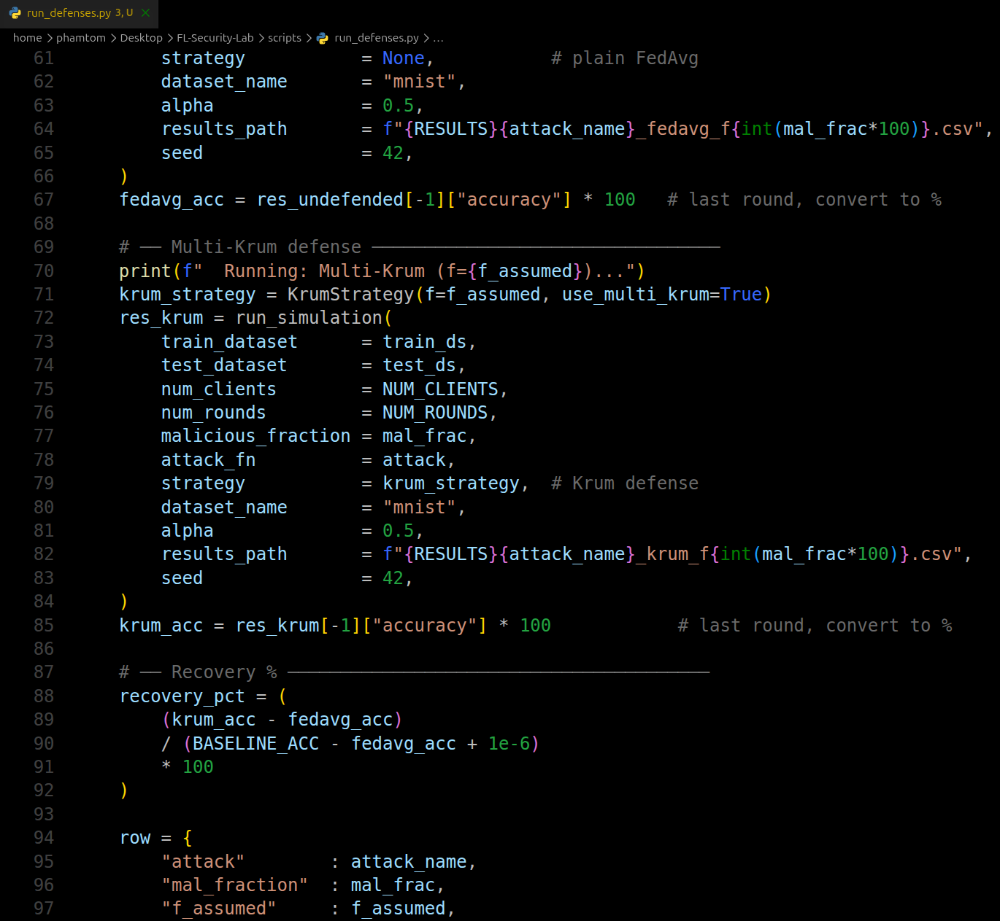
```
# Run the defense experiments
python scripts/run_defenses.py
```
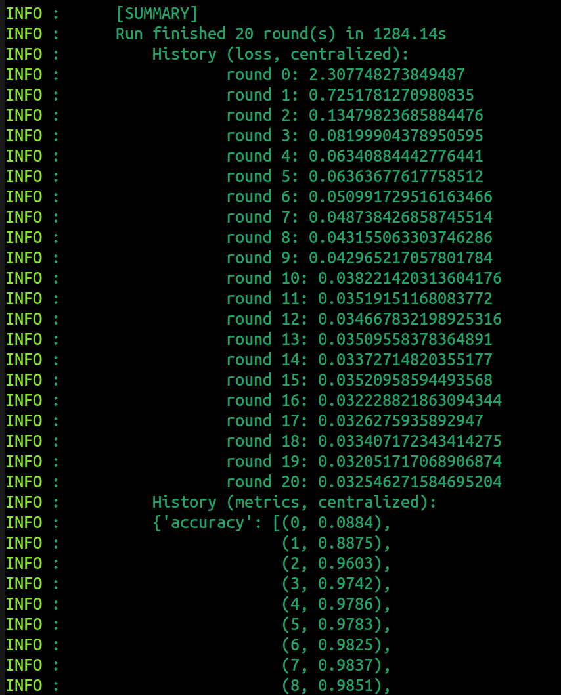
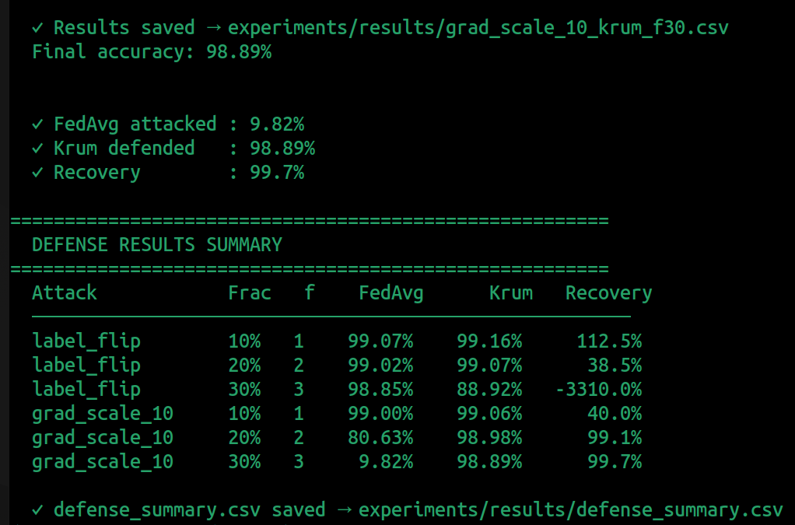
##
##
# <span style="color: #e03e2d;">Generate Figure 6 (Krum Recovery Plot)</span>
```python
# Krum defense accuracy over rounds Script
import pandas as pd
import matplotlib.pyplot as plt

RESULTS = "../../experiments/results/"
FIGURES = "../../report/figures/"

# Load round-by-round CSVs — filenames match what run_defenses.py actually saved
baseline     = pd.read_csv(RESULTS + "baseline_mnist.csv")

# Label-flip: FedAvg attacked vs Krum defended (30% malicious = f=3)
lf30_fedavg  = pd.read_csv(RESULTS + "label_flip_fedavg_f30.csv")
lf30_krum    = pd.read_csv(RESULTS + "label_flip_krum_f30.csv")

# Gradient scaling λ=10: FedAvg attacked vs Krum defended (20% malicious = f=2)
gs10_fedavg  = pd.read_csv(RESULTS + "grad_scale_10_fedavg_f20.csv")
gs10_krum    = pd.read_csv(RESULTS + "grad_scale_10_krum_f20.csv")

fig, axes = plt.subplots(1, 2, figsize=(12, 4.5), sharey=True)

# ── Left plot — Label-Flip defense ────────────────────────────
ax = axes[0]
ax.plot(baseline['round'],   baseline['accuracy'] * 100,   'k-',  lw=2, label='Clean FedAvg')
ax.plot(lf30_fedavg['round'], lf30_fedavg['accuracy'] * 100, 'r--', lw=2, label='FedAvg + Label-Flip 30%')
ax.plot(lf30_krum['round'],   lf30_krum['accuracy'] * 100,   'g-',  lw=2, label='Multi-Krum (f=3)')
ax.set_title('Label-Flip Attack: FedAvg vs Krum')
ax.set_xlabel('Round'); ax.set_ylabel('Test Accuracy (%)')
ax.legend(); ax.grid(True, alpha=0.3); ax.set_ylim(0, 100)

# ── Right plot — Gradient Scaling defense ─────────────────────
ax = axes[1]
ax.plot(baseline['round'],    baseline['accuracy'] * 100,    'k-',  lw=2, label='Clean FedAvg')
ax.plot(gs10_fedavg['round'], gs10_fedavg['accuracy'] * 100, 'r--', lw=2, label='FedAvg + GradScale λ=10')
ax.plot(gs10_krum['round'],   gs10_krum['accuracy'] * 100,   'g-',  lw=2, label='Multi-Krum (f=2)')
ax.set_title('Gradient Scale Attack: FedAvg vs Krum')
ax.set_xlabel('Round')
ax.legend(); ax.grid(True, alpha=0.3); ax.set_ylim(0, 100)

fig.suptitle('Fig 6 — Krum Defense: Accuracy Recovery Under Attack (MNIST non-IID)',
             fontsize=12, y=1.02)
plt.tight_layout()
plt.savefig(FIGURES + "fig6_krum_recovery.png", dpi=150, bbox_inches='tight')
plt.show()
print("✓ fig6_krum_recovery.png saved")
```
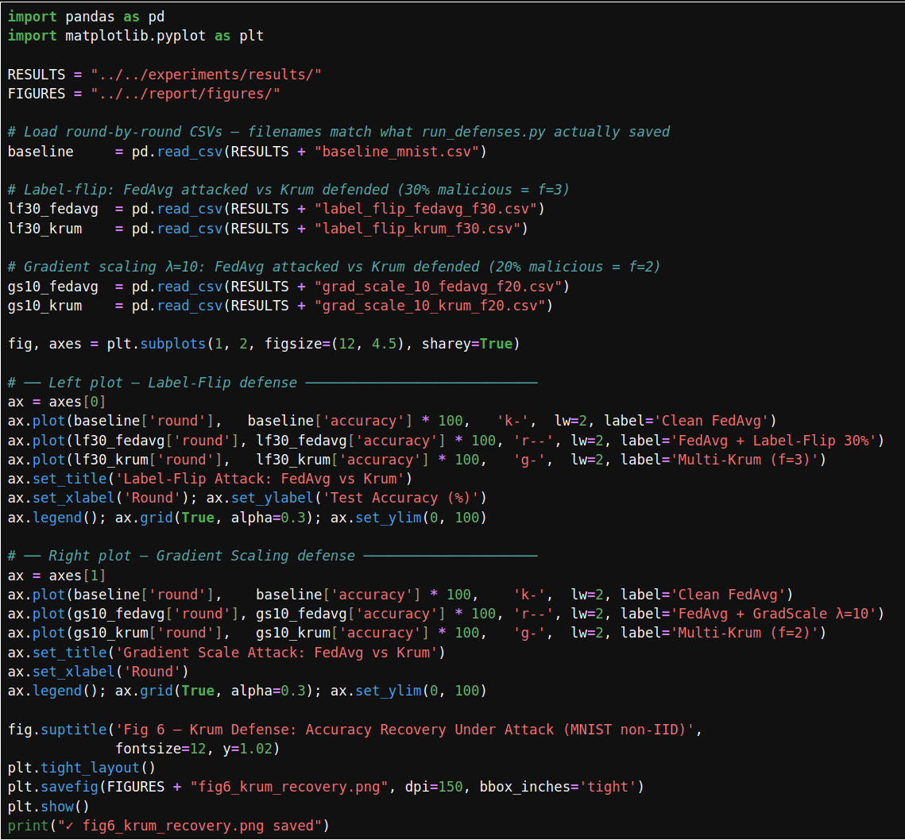
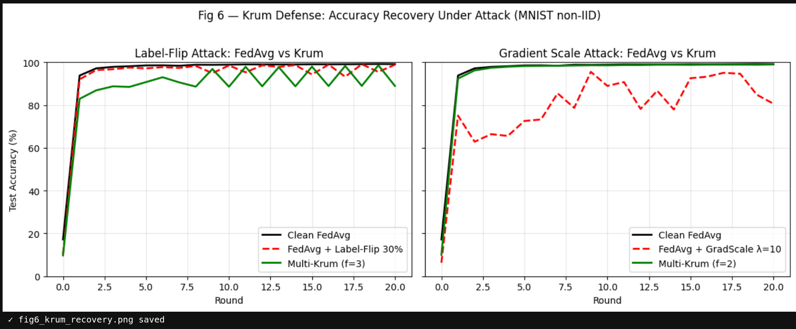
* * *
```bash
# Commit All modified documents to Github Repository (week06 Documentation)
git add experiments/results/defense_summary.csv
git add experiments/results/
git add scripts/run_defenses.py
git add src/defenses/krum.py
git add report/figures/fig6_krum_recovery.png
git add notebooks/week06_defenses/Krum_defence.ipynb
git commit -m "feat(defense): Multi-Krum experiments complete

- Krum vs grad_scale λ=10: 80.63% → 98.98% (f=2, recovery 99.1%)
- Krum vs grad_scale λ=10: 9.82%  → 98.89% (f=3, recovery 99.7%)
- Krum vs label_flip: limited effect — malicious updates geometrically
  similar to honest, distance-based filtering cannot distinguish them
- defense_summary.csv saved, fig6 generation next"
git push origin main
```
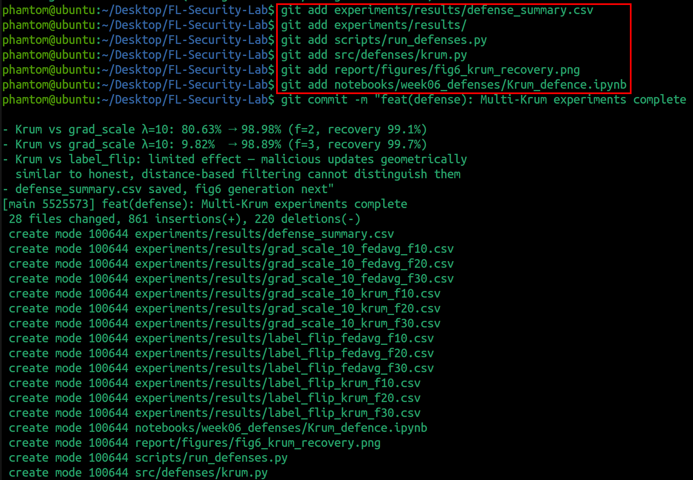
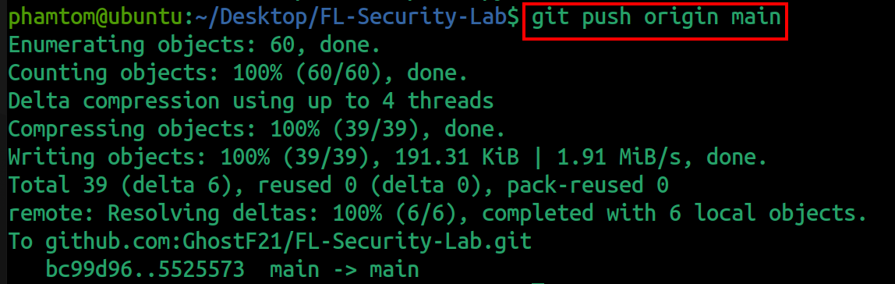
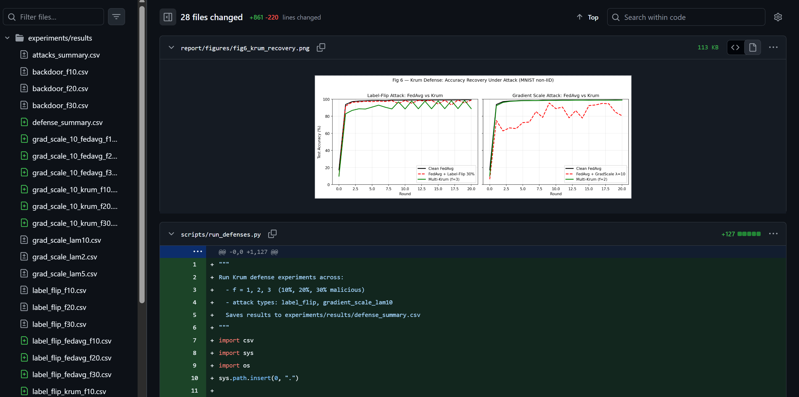