# <span style="color: #e03e2d;">Trimmed Mean Implementation</span>
## Create Trimmed Script
```bash
# Create trimmed mean script
conda activate fl_security #or flsec
code src/defenses/trimmed_mean.py
```
```python
"""
Coordinate-Wise Trimmed Mean Aggregation (Yin et al., 2018)
Byzantine-resilient aggregation that removes extreme values per coordinate.

Algorithm:
  For each parameter dimension d:
    1. Collect the d-th value from every client update.
    2. Sort the n values.
    3. Trim the lowest beta and highest beta values.
    4. Average the remaining (n - 2*beta) values.

Correctness requirement:
  beta >= f   (beta must be AT LEAST equal to the number of malicious clients f)
  n > 2*beta  (need at least 1 value left after trimming both ends)

  With f malicious clients injecting extreme values:
    - After sorting, malicious values land at the HIGH end (if they inject large vals)
      or LOW end (if small). You must trim AT LEAST f from each end to exclude them all.
    - beta = f is the minimum correct choice.
    - beta = f is also what the original paper uses by default.

Complexity: O(n x d x log n)   (sort each coordinate independently)
"""
from typing import List
import numpy as np


def trimmed_mean(
    updates: List[List[np.ndarray]],
    beta: int,
) -> List[np.ndarray]:
    """
    Coordinate-wise Trimmed Mean aggregation.

    Args:
        updates : List of n client updates.
                  Each update is a list of np.ndarrays (one per model layer).
        beta    : Number of values to trim from EACH end per coordinate.
                  Must satisfy: beta >= f  AND  n > 2*beta.
                  Use beta_from_fraction() to compute this automatically.

    Returns:
        aggregated: List of np.ndarrays (trimmed-mean parameters, one per layer)

    Raises:
        ValueError: If n <= 2*beta (not enough clients left after trimming).
    """
    n = len(updates)
    if n <= 2 * beta:
        raise ValueError(
            f"Not enough clients: n={n} must be > 2*beta={2*beta}. "
            f"Reduce beta or increase num_clients. "
            f"(Current: beta={beta}, need at least {2*beta + 1} clients)"
        )

    num_layers = len(updates[0])
    aggregated = []

    for layer_idx in range(num_layers):
        # Stack all clients' values for this layer: shape (n, *layer_shape)
        stacked = np.stack([updates[i][layer_idx] for i in range(n)], axis=0)

        # Sort along the client axis (axis=0) for each coordinate independently
        sorted_vals = np.sort(stacked, axis=0)

        # Trim beta from each end, average the middle (n - 2*beta) values
        trimmed   = sorted_vals[beta : n - beta]   # shape: (n-2β, *layer_shape)
        layer_mean = np.mean(trimmed, axis=0)       # shape: (*layer_shape)
        aggregated.append(layer_mean)

    return aggregated


def beta_from_fraction(num_clients: int, malicious_fraction: float) -> int:
    """
    Compute the correct beta from the malicious fraction.

    Beta must be >= f (number of malicious clients) to guarantee all malicious
    updates are trimmed from at least one end. Using floor(f/2) is WRONG because
    it only removes half of them.

    Formula: beta = f = ceil(num_clients * malicious_fraction)
    Safety check: ensures n > 2*beta, raises if not satisfiable.

    Args:
        num_clients        : total number of FL clients per round
        malicious_fraction : fraction in [0, 1), e.g. 0.2 for 20%

    Returns:
        beta : int >= 1
    """
    f = int(np.ceil(num_clients * malicious_fraction))  # number of malicious clients

    if f == 0:
        return 0  # no malicious clients — trimming nothing is fine

    beta = f  # must trim AT LEAST f from each end

    if num_clients <= 2 * beta:
        raise ValueError(
            f"Cannot satisfy n > 2*beta: n={num_clients}, f={f}, beta={beta}. "
            f"You need at least {2*beta + 1} clients for {malicious_fraction*100:.0f}% malicious."
        )

    return beta


if __name__ == "__main__":
    # ── Smoke test ───────────────────────────────────────────────────────────
    # Setup: 10 clients, 3 malicious (inject extreme values ~100)
    # Correct beta = f = 3  (trim 3 from each end → 4 honest values remain)
    rng = np.random.default_rng(42)
    n, d = 10, 200
    honest    = [rng.normal(0, 0.01, d) for _ in range(7)]
    malicious = [rng.normal(100, 0.01, d) for _ in range(3)]   # extreme!
    all_updates = [[u] for u in honest + malicious]             # 1-layer model

    # ── Test beta_from_fraction ──────────────────────────────────────────────
    beta = beta_from_fraction(n, malicious_fraction=0.3)
    print(f"β = {beta}  (from 30% malicious, 10 clients)  ← should be 3, not 1")
    assert beta == 3, f"Expected beta=3, got beta={beta}"

    # ── Test trimmed_mean output ─────────────────────────────────────────────
    result   = trimmed_mean(all_updates, beta=beta)
    avg_result = np.mean(result[0])
    print(f"TrimMean result mean: {avg_result:.6f}  (should be ~0, not ~25+)")
    assert abs(avg_result) < 0.5, f"TrimMean FAILED — result={avg_result:.4f}, malicious updates not trimmed!"
    print("✓ Trimmed Mean smoke test passed")

    # ── Verify ValueError on bad beta ────────────────────────────────────────
    try:
        trimmed_mean(all_updates, beta=5)   # 2*5=10, n=10, not > 10
        print("FAIL — should have raised ValueError")
    except ValueError as e:
        print(f"✓ ValueError correctly raised for beta=5, n=10: {e}")

    # ── Show what beta=1 (old wrong formula) produces ─────────────────────────
    wrong_result = trimmed_mean(all_updates, beta=1)
    wrong_mean   = np.mean(wrong_result[0])
    print(f"\n[Debug] With beta=1 (old wrong formula): mean={wrong_mean:.2f}  ← still ~25, malicious survive!")
    print(f"[Debug] With beta=3 (correct):           mean={avg_result:.6f}  ← malicious excluded ✓")
```
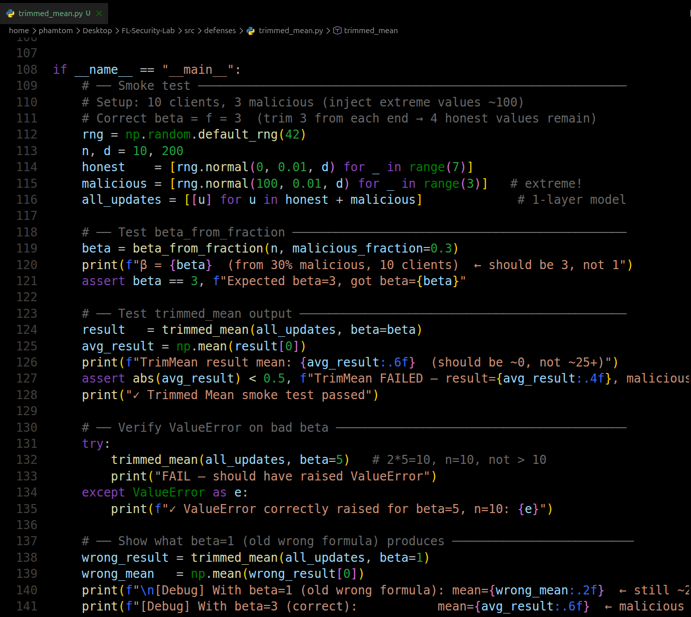
```bash
# Run smoke test Script.
python src/defenses/trimmed_mean.py
```
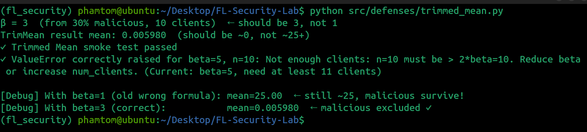 
* * *
## Plug TrimMean into the Flower Server Strategy
```python
# Modify the src/fl_core/server.py script.
"""
FL Security Lab — FedAvg Server / Simulation Runner.
Builds the Flower simulation, logs per-round accuracy & loss to CSV.

Supported strategies:
  - FedAvg        : plain weighted average (no defense)
  - KrumStrategy  : Multi-Krum or Single-Krum (Blanchard et al., 2017)
  - TrimMeanStrategy : Coordinate-wise Trimmed Mean (Yin et al., 2018)
"""
import csv
import os
from pathlib import Path
from typing import Callable, Dict, List, Optional, Tuple, Union

import numpy as np
import torch
import flwr as fl
from flwr.common import Metrics, parameters_to_ndarrays, ndarrays_to_parameters
from flwr.server.strategy import FedAvg
from torch.utils.data import DataLoader

from src.fl_core.model import SimpleCNN, get_model
from src.fl_core.client import FLClient
from src.utils.data_partition import dirichlet_partition
from src.attacks.gradient_scale import GradientScaleAttack
from src.attacks.model_replacement import ModelReplacementAttack
from src.defenses.krum import multi_krum, single_krum
from src.defenses.trimmed_mean import trimmed_mean, beta_from_fraction


# ══════════════════════════════════════════════════════════
# Metric aggregation helpers (required by Flower)
# ══════════════════════════════════════════════════════════
def weighted_average(metrics: List[Tuple[int, Metrics]]) -> Metrics:
    """Weighted average of accuracy across clients (weighted by dataset size)."""
    total_examples = sum(num for num, _ in metrics)
    accuracies     = [num * m.get("accuracy", 0) for num, m in metrics]
    return {"accuracy": sum(accuracies) / total_examples}


# ══════════════════════════════════════════════════════════
# Krum Strategy — replaces FedAvg aggregation with Krum
# ══════════════════════════════════════════════════════════
class KrumStrategy(FedAvg):
    """FedAvg strategy with Krum aggregation replacing plain averaging."""

    def __init__(self, f: int, use_multi_krum: bool = True, m: int = None, **kwargs):
        """
        Args:
            f             : Number of assumed malicious clients.
            use_multi_krum: If True use Multi-Krum (recommended); else Single-Krum.
            m             : Number of clients to select in Multi-Krum (default n-f).
            **kwargs      : All standard FedAvg arguments (fraction_fit, evaluate_fn, etc.)
        """
        super().__init__(**kwargs)
        self.f              = f
        self.use_multi_krum = use_multi_krum
        self.m              = m

    def aggregate_fit(self, server_round, results, failures):
        """Override FedAvg aggregation with Krum."""
        if not results:
            return None, {}

        # Unpack client updates into list of parameter arrays
        all_updates = []
        for _, fit_res in results:
            params = parameters_to_ndarrays(fit_res.parameters)
            all_updates.append(params)

        # Apply Krum aggregation
        if self.use_multi_krum:
            aggregated = multi_krum(all_updates, f=self.f, m=self.m)
        else:
            aggregated = single_krum(all_updates, f=self.f)

        parameters_aggregated = ndarrays_to_parameters(aggregated)
        metrics_aggregated    = {}
        return parameters_aggregated, metrics_aggregated


# ══════════════════════════════════════════════════════════
# TrimMean Strategy — replaces FedAvg aggregation with
# coordinate-wise Trimmed Mean (Yin et al., 2018)
# ══════════════════════════════════════════════════════════
class TrimMeanStrategy(FedAvg):
    """
    FedAvg strategy with coordinate-wise Trimmed Mean aggregation.

    For each model parameter coordinate, sorts values across all clients,
    discards the lowest beta and highest beta, then averages the rest.
    This is effective against gradient scaling attacks where malicious
    updates push coordinates to extreme values.

    Requirements:
        beta >= f          (must trim at least as many as malicious clients)
        n > 2 * beta       (need at least 1 value remaining after trimming)

    Usage:
        strategy = TrimMeanStrategy(
            malicious_fraction=0.2,   # 20% malicious → beta computed automatically
            num_clients=10,
        )
        # OR set beta directly:
        strategy = TrimMeanStrategy(beta=2)
    """

    def __init__(
        self,
        malicious_fraction: float = 0.0,
        num_clients: int = 10,
        beta: Optional[int] = None,
        **kwargs,
    ):
        """
        Args:
            malicious_fraction : Fraction of malicious clients (e.g. 0.2 for 20%).
                                 Used to compute beta automatically if beta=None.
            num_clients        : Total clients per round. Used only for auto beta.
            beta               : Override beta directly. If set, malicious_fraction
                                 and num_clients are ignored for beta computation.
                                 Must satisfy n > 2*beta where n = clients per round.
            **kwargs           : All standard FedAvg arguments.
        """
        super().__init__(**kwargs)
        self.malicious_fraction = malicious_fraction
        self.num_clients        = num_clients

        # Resolve beta at construction time if possible
        # (if beta=None and fraction=0 we will just set beta=0)
        if beta is not None:
            self._beta = beta
            self._beta_source = f"manual (beta={beta})"
        elif malicious_fraction > 0.0:
            self._beta = beta_from_fraction(num_clients, malicious_fraction)
            self._beta_source = (
                f"auto from fraction={malicious_fraction:.0%}, "
                f"n={num_clients} → beta={self._beta}"
            )
        else:
            self._beta = 0
            self._beta_source = "beta=0 (no malicious clients configured)"

    @property
    def beta(self) -> int:
        return self._beta

    def aggregate_fit(self, server_round, results, failures):
        """Override FedAvg aggregation with coordinate-wise Trimmed Mean."""
        if not results:
            return None, {}

        # Unpack client updates
        all_updates = []
        for _, fit_res in results:
            params = parameters_to_ndarrays(fit_res.parameters)
            all_updates.append(params)

        n = len(all_updates)

        # If beta=0 (clean run), fall back to plain average — no trimming needed
        if self._beta == 0:
            total_examples = sum(fit_res.num_examples for _, fit_res in results)
            aggregated = [
                np.sum(
                    [
                        (parameters_to_ndarrays(fit_res.parameters)[i] * fit_res.num_examples)
                        / total_examples
                        for _, fit_res in results
                    ],
                    axis=0,
                )
                for i in range(len(all_updates[0]))
            ]
        else:
            # Validate beta is still feasible with the actual number of
            # participating clients this round (n can vary if fraction_fit < 1.0)
            if n <= 2 * self._beta:
                raise RuntimeError(
                    f"TrimMeanStrategy: round {server_round} received n={n} clients "
                    f"but beta={self._beta} requires n > {2 * self._beta}. "
                    f"Increase num_clients or reduce malicious_fraction."
                )
            aggregated = trimmed_mean(all_updates, beta=self._beta)

        parameters_aggregated = ndarrays_to_parameters(aggregated)
        metrics_aggregated    = {}
        return parameters_aggregated, metrics_aggregated

    def __repr__(self) -> str:
        return f"TrimMeanStrategy(beta={self._beta}, source={self._beta_source})"


# ══════════════════════════════════════════════════════════
# Server-side global evaluation
# ══════════════════════════════════════════════════════════
def make_evaluate_fn(model: SimpleCNN, test_loader: DataLoader, device: str = "cpu"):
    """
    Returns a Flower evaluate_fn that tests the global model on the clean test set.
    Called by the server after each aggregation round.
    """
    criterion = torch.nn.CrossEntropyLoss()

    def evaluate(server_round: int, parameters: fl.common.NDArrays, config: Dict):
        params_dict = zip(model.state_dict().keys(), parameters)
        state_dict  = {k: torch.tensor(v) for k, v in params_dict}
        model.load_state_dict(state_dict, strict=True)
        model.to(device).eval()

        total_loss, correct, n = 0.0, 0, 0
        with torch.no_grad():
            for images, labels in test_loader:
                images, labels = images.to(device), labels.to(device)
                outputs = model(images)
                total_loss += criterion(outputs, labels).item() * images.size(0)
                correct    += (outputs.argmax(dim=1) == labels).sum().item()
                n          += images.size(0)
        return total_loss / n, {"accuracy": correct / n}

    return evaluate


# ══════════════════════════════════════════════════════════
# Main simulation runner
# ══════════════════════════════════════════════════════════
def run_simulation(
    train_dataset,
    test_dataset,
    num_clients:        int                = 10,
    num_rounds:         int                = 20,
    fraction_fit:       float              = 1.0,
    local_epochs:       int                = 2,
    batch_size:         int                = 32,
    lr:                 float              = 0.01,
    alpha:              float              = 0.5,
    malicious_fraction: float              = 0.0,
    attack_fn:          Optional[Callable] = None,
    strategy:           Optional[FedAvg]   = None,   # pass KrumStrategy or TrimMeanStrategy
    dataset_name:       str                = "mnist",
    results_path:       str                = "experiments/results/baseline_mnist.csv",
    seed:               int                = 42,
) -> List[Dict]:
    """
    Run a complete FL simulation.

    Args:
        train_dataset      : Full torchvision training dataset.
        test_dataset       : Full torchvision test dataset.
        malicious_fraction : Fraction of clients that are malicious (0.0 = clean run).
        attack_fn          : Attack object passed to malicious clients.
        strategy           : Flower strategy to use.
                             - None             → standard FedAvg (no defense)
                             - KrumStrategy(f=2) → Multi-Krum defense
                             - TrimMeanStrategy(malicious_fraction=0.2, num_clients=10)
                                                → Trimmed Mean defense
        results_path       : CSV file path for logging per-round results.

    Returns:
        List of per-round result dicts: {round, accuracy, loss}

    Examples:
        # Clean baseline
        run_simulation(train_ds, test_ds)

        # Gradient scaling attack, no defense
        run_simulation(train_ds, test_ds,
                       malicious_fraction=0.2,
                       attack_fn=GradientScaleAttack(scale_factor=10.0))

        # Gradient scaling attack + Krum defense
        run_simulation(train_ds, test_ds,
                       malicious_fraction=0.2,
                       attack_fn=GradientScaleAttack(scale_factor=10.0),
                       strategy=KrumStrategy(f=2))

        # Gradient scaling attack + Trimmed Mean defense
        run_simulation(train_ds, test_ds,
                       malicious_fraction=0.2,
                       attack_fn=GradientScaleAttack(scale_factor=10.0),
                       strategy=TrimMeanStrategy(malicious_fraction=0.2, num_clients=10))
    """
    torch.manual_seed(seed)
    np.random.seed(seed)

    device        = "cuda" if torch.cuda.is_available() else "cpu"
    strategy_name = strategy.__class__.__name__ if strategy else "FedAvg"

    # Print TrimMean beta info so it's visible in the log
    if isinstance(strategy, TrimMeanStrategy):
        strategy_name = f"TrimMeanStrategy(β={strategy.beta})"

    print(f"\n{'='*55}")
    print(f"  FL Simulation | {num_clients} clients | {num_rounds} rounds")
    print(f"  Dataset: {dataset_name} | α={alpha} | device={device}")
    print(f"  Malicious fraction: {malicious_fraction:.0%} | Attack: {attack_fn.__class__.__name__ if attack_fn else 'None'}")
    print(f"  Strategy: {strategy_name}")
    print(f"{'='*55}\n")

    # ── Partition data (non-IID Dirichlet) ──────────────
    client_subsets = dirichlet_partition(
        train_dataset, num_clients=num_clients, alpha=alpha, seed=seed
    )

    # ── Determine which clients are malicious ───────────
    num_malicious = int(num_clients * malicious_fraction)
    malicious_ids = set(range(num_malicious))

    # ── Build test DataLoader for server evaluation ─────
    test_loader = DataLoader(test_dataset, batch_size=256, shuffle=False, num_workers=0)

    # ── Global model for server-side evaluation ─────────
    eval_model = get_model(dataset_name)

    # ── Results storage ──────────────────────────────────
    round_results = []
    os.makedirs(os.path.dirname(results_path), exist_ok=True)

    # ── Flower client_fn factory ─────────────────────────
    def client_fn(cid: str) -> FLClient:
        client_id    = int(cid)
        is_malicious = client_id in malicious_ids
        client_model = get_model(dataset_name)

        # Pull scale_factor from GradientScaleAttack object if applicable
        scale_factor = 1.0
        if is_malicious and isinstance(attack_fn, GradientScaleAttack):
            scale_factor = attack_fn.scale_factor

        return FLClient(
            client_id    = client_id,
            dataset      = train_dataset,
            indices      = list(client_subsets[client_id].indices),
            model        = client_model,
            local_epochs = local_epochs,
            batch_size   = batch_size,
            lr           = lr,
            device       = device,
            attack_fn    = attack_fn if is_malicious else None,
            scale_factor = scale_factor,
        )

    # ── Evaluation callback (stores results) ─────────────
    evaluate_fn = make_evaluate_fn(eval_model, test_loader, device)

    def evaluate_with_log(server_round, parameters, config):
        loss, metrics = evaluate_fn(server_round, parameters, config)
        acc    = metrics["accuracy"]
        result = {"round": server_round, "accuracy": acc, "loss": loss}
        round_results.append(result)
        print(f"  Round {server_round:2d} | Acc: {acc:.4f} ({acc*100:.2f}%) | Loss: {loss:.4f}")
        return loss, metrics

    # ── Build strategy ────────────────────────────────────
    # Shared kwargs injected into whichever strategy is active.
    # These override any defaults set at construction time.
    strategy_kwargs = dict(
        fraction_fit               = fraction_fit,
        fraction_evaluate          = 0.0,
        min_fit_clients            = num_clients,
        min_available_clients      = num_clients,
        evaluate_fn                = evaluate_with_log,
        fit_metrics_aggregation_fn = weighted_average,
    )

    if strategy is None:
        # Standard FedAvg — no defense
        active_strategy = FedAvg(**strategy_kwargs)
    else:
        # Inject evaluation / fit settings into the provided strategy instance.
        # Works for KrumStrategy, TrimMeanStrategy, or any FedAvg subclass.
        for key, val in strategy_kwargs.items():
            setattr(strategy, key, val)
        active_strategy = strategy

    # ── Launch simulation ─────────────────────────────────
    fl.simulation.start_simulation(
        client_fn     = client_fn,
        num_clients   = num_clients,
        config        = fl.server.ServerConfig(num_rounds=num_rounds),
        strategy      = active_strategy,
        ray_init_args = {"num_cpus": os.cpu_count(), "include_dashboard": False},
    )

    # ── Save to CSV ───────────────────────────────────────
    with open(results_path, "w", newline="") as f:
        writer = csv.DictWriter(f, fieldnames=["round", "accuracy", "loss"])
        writer.writeheader()
        writer.writerows(round_results)
    print(f"\n  ✓ Results saved → {results_path}")
    print(f"  Final accuracy: {round_results[-1]['accuracy']*100:.2f}%\n")
    return round_results
```
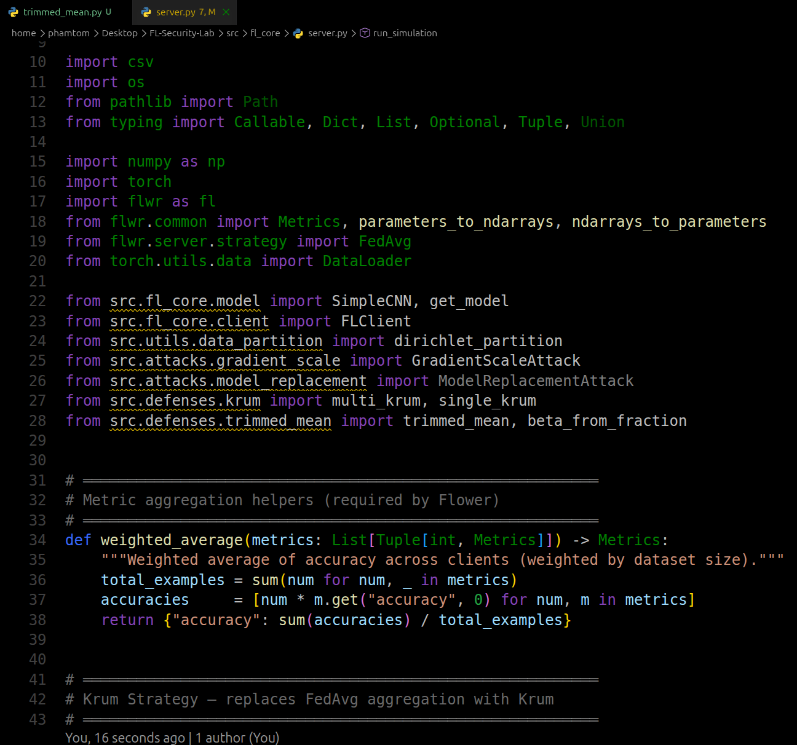
* * *
## Create `scripts/run_defenses.py` Experiments - Run All Defense
```python
# Modify the run_defences.py script implement trimmean
"""
Run defense comparison experiments for Bi-Weekly Report 3.

Extends the BW2 Krum-only script by adding Trimmed Mean as a third defense.

Grid:
  Attacks     : label_flip (10/20/30%), gradient_scale λ=10 (10/20/30%)
  Defenses    : FedAvg (no defense), Multi-Krum, Trimmed Mean
  Baseline    : clean FedAvg (no attack) — loaded from BW1/BW2 CSV

Output CSVs  → experiments/results/   (one per experiment)
Summary CSV  → experiments/results/defense_summary_bw3.csv
"""
import csv
import sys
import os
sys.path.insert(0, ".")

from torchvision import datasets, transforms

from src.attacks.label_flip     import LabelFlipAttack
from src.attacks.gradient_scale import GradientScaleAttack
from src.fl_core.server         import run_simulation, KrumStrategy, TrimMeanStrategy

# ── Dataset setup (same as BW1/BW2) ────────────────────────────
transform = transforms.Compose([
    transforms.ToTensor(),
    transforms.Normalize((0.1307,), (0.3081,))
])
train_ds = datasets.MNIST("./data/raw", train=True,  download=True, transform=transform)
test_ds  = datasets.MNIST("./data/raw", train=False, download=True, transform=transform)

RESULTS      = "experiments/results/"
NUM_CLIENTS  = 10
NUM_ROUNDS   = 20
BASELINE_ACC = 99.15   # your actual clean FedAvg baseline from BW1

os.makedirs(RESULTS, exist_ok=True)

# ── Experiment grid (same attacks/fractions as BW2) ─────────────
# (attack_name, attack_obj, malicious_fraction, f_for_krum)
experiments = [
    ("label_flip",    LabelFlipAttack(mode="targeted", source_class=3, target_class=7), 0.1, 1),
    ("label_flip",    LabelFlipAttack(mode="targeted", source_class=3, target_class=7), 0.2, 2),
    ("label_flip",    LabelFlipAttack(mode="targeted", source_class=3, target_class=7), 0.3, 3),
    ("grad_scale_10", GradientScaleAttack(scale_factor=10),                             0.1, 1),
    ("grad_scale_10", GradientScaleAttack(scale_factor=10),                             0.2, 2),
    ("grad_scale_10", GradientScaleAttack(scale_factor=10),                             0.3, 3),
]

rows = []

for attack_name, attack, mal_frac, f_assumed in experiments:

    frac_pct = int(mal_frac * 100)   # e.g. 0.2 → 20

    print(f"\n{'─'*60}")
    print(f"  {attack_name} | mal_frac={mal_frac:.0%} | f={f_assumed}")
    print(f"{'─'*60}")

    # ── 1. FedAvg under attack (no defense) ───────────────────────
    print("  [1/3] Running: FedAvg (no defense)...")
    res_fedavg = run_simulation(
        train_dataset      = train_ds,
        test_dataset       = test_ds,
        num_clients        = NUM_CLIENTS,
        num_rounds         = NUM_ROUNDS,
        malicious_fraction = mal_frac,
        attack_fn          = attack,
        strategy           = None,
        dataset_name       = "mnist",
        alpha              = 0.5,
        results_path       = f"{RESULTS}{attack_name}_fedavg_f{frac_pct}.csv",
        seed               = 42,
    )
    fedavg_acc = res_fedavg[-1]["accuracy"] * 100

    # ── 2. Multi-Krum defense (same as BW2) ───────────────────────
    print(f"  [2/3] Running: Multi-Krum (f={f_assumed})...")
    res_krum = run_simulation(
        train_dataset      = train_ds,
        test_dataset       = test_ds,
        num_clients        = NUM_CLIENTS,
        num_rounds         = NUM_ROUNDS,
        malicious_fraction = mal_frac,
        attack_fn          = attack,
        strategy           = KrumStrategy(f=f_assumed, use_multi_krum=True),
        dataset_name       = "mnist",
        alpha              = 0.5,
        results_path       = f"{RESULTS}{attack_name}_krum_f{frac_pct}.csv",
        seed               = 42,
    )
    krum_acc = res_krum[-1]["accuracy"] * 100

    # ── 3. Trimmed Mean defense (new for BW3) ─────────────────────
    print(f"  [3/3] Running: Trimmed Mean (mal_frac={mal_frac:.0%}, β={f_assumed})...")
    res_trim = run_simulation(
        train_dataset      = train_ds,
        test_dataset       = test_ds,
        num_clients        = NUM_CLIENTS,
        num_rounds         = NUM_ROUNDS,
        malicious_fraction = mal_frac,
        attack_fn          = attack,
        strategy           = TrimMeanStrategy(
                                 malicious_fraction = mal_frac,
                                 num_clients        = NUM_CLIENTS,
                             ),
        dataset_name       = "mnist",
        alpha              = 0.5,
        results_path       = f"{RESULTS}{attack_name}_trimmean_f{frac_pct}.csv",
        seed               = 42,
    )
    trim_acc = res_trim[-1]["accuracy"] * 100

    # ── Recovery % for both defenses (relative to clean baseline) ─
    def recovery(defended_acc, attacked_acc, baseline=BASELINE_ACC):
        """How much of the accuracy gap did the defense recover?"""
        gap = baseline - attacked_acc + 1e-6
        return round((defended_acc - attacked_acc) / gap * 100, 1)

    krum_recovery = recovery(krum_acc, fedavg_acc)
    trim_recovery = recovery(trim_acc, fedavg_acc)

    row = {
        "attack"           : attack_name,
        "mal_fraction"     : mal_frac,
        "f_assumed"        : f_assumed,
        "fedavg_acc_%"     : round(fedavg_acc, 2),
        "krum_acc_%"       : round(krum_acc,   2),
        "trimmean_acc_%"   : round(trim_acc,    2),
        "krum_recovery_%"  : krum_recovery,
        "trim_recovery_%"  : trim_recovery,
    }
    rows.append(row)

    print(f"\n  ✓ FedAvg (attacked)  : {fedavg_acc:.2f}%")
    print(f"  ✓ Krum defended      : {krum_acc:.2f}%   (recovery {krum_recovery:.1f}%)")
    print(f"  ✓ TrimMean defended  : {trim_acc:.2f}%   (recovery {trim_recovery:.1f}%)")

# ── Save BW3 defense summary CSV ────────────────────────────────
fieldnames = [
    "attack", "mal_fraction", "f_assumed",
    "fedavg_acc_%", "krum_acc_%", "trimmean_acc_%",
    "krum_recovery_%", "trim_recovery_%",
]

summary_path = RESULTS + "defense_summary_bw3.csv"
with open(summary_path, "w", newline="") as f:
    w = csv.DictWriter(f, fieldnames=fieldnames)
    w.writeheader()
    w.writerows(rows)

# ── Print summary table ──────────────────────────────────────────
print(f"\n{'='*75}")
print("  BW3 DEFENSE RESULTS SUMMARY")
print(f"{'='*75}")
print(f"  {'Attack':<15} {'Frac':>5} {'f':>3} │ "
      f"{'FedAvg':>8} │ {'Krum':>8} {'Rcvry':>7} │ {'TrimMean':>9} {'Rcvry':>7}")
print(f"  {'─'*75}")
for r in rows:
    print(
        f"  {r['attack']:<15} {r['mal_fraction']:>4.0%} {r['f_assumed']:>3} │ "
        f"{r['fedavg_acc_%']:>7.2f}% │ "
        f"{r['krum_acc_%']:>7.2f}% {r['krum_recovery_%']:>6.1f}% │ "
        f"{r['trimmean_acc_%']:>8.2f}% {r['trim_recovery_%']:>6.1f}%"
    )

print(f"\n  ✓ defense_summary_bw3.csv saved → {summary_path}")
print(f"  ✓ Individual round CSVs saved  → {RESULTS}")
```
```
# Run the Defence script (It will takes 40-60 min)
python scripts/run_defenses.py
```
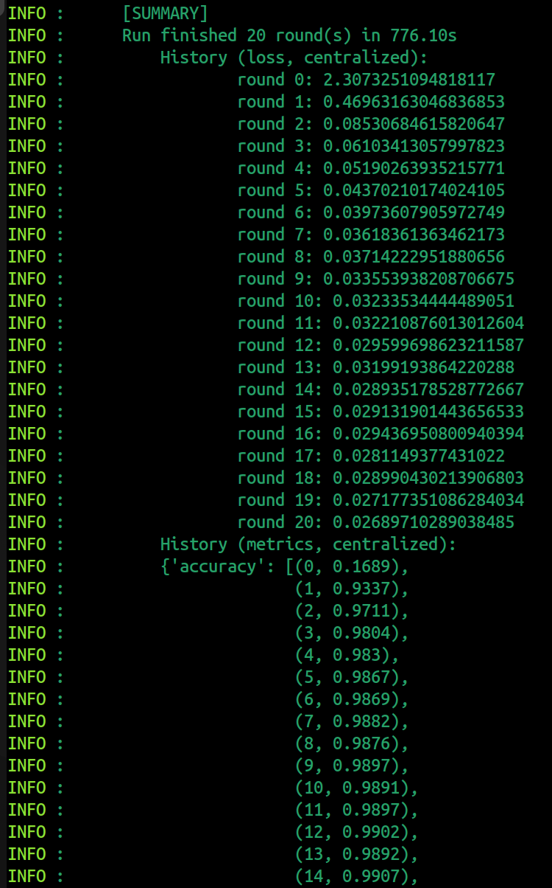
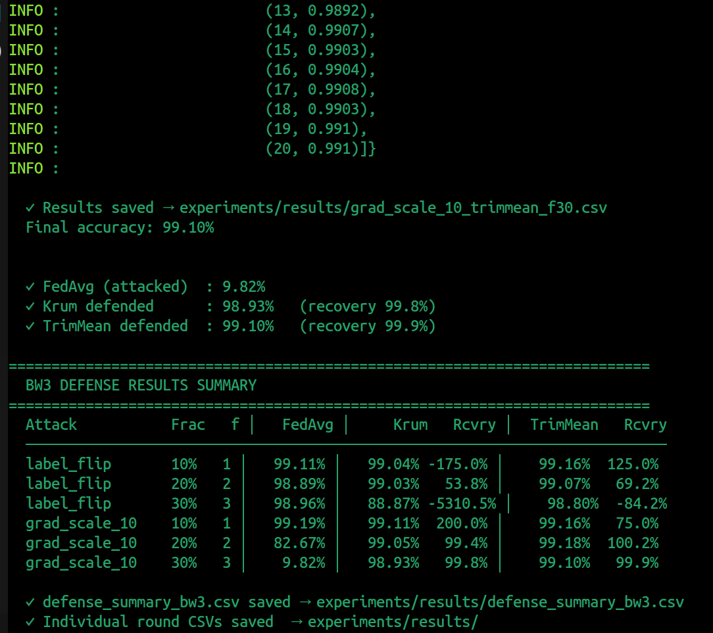
* * *
## Generate Figure 7 - TrimMean vs FedAvg Accuracy Curves
```python
# Create scripts/plot_bw3_defenses.py
"""
BW3 Figures — fixed to match actual filenames in experiments/results/

Generates:
  fig7 — 2-panel: Label-Flip and Gradient Scale curves (FedAvg vs Krum vs TrimMean)
          using f=20% (middle fractions) as the representative case
  fig8 — grouped bar chart: final accuracy across all fractions (10/20/30%)
          for both attack types and all three defenses
"""
import os
import pandas as pd
import matplotlib
matplotlib.use("Agg")
import matplotlib.pyplot as plt
import numpy as np

RESULTS = "experiments/results/"
FIGURES = "report/figures/"
os.makedirs(FIGURES, exist_ok=True)

# ── Load CSVs using your actual filenames ────────────────────────────────────
baseline      = pd.read_csv(RESULTS + "baseline_mnist.csv")

# Label-flip at 20% (f=2) — representative for fig7 curves
lf_fedavg_f20 = pd.read_csv(RESULTS + "label_flip_fedavg_f20.csv")
lf_krum_f20   = pd.read_csv(RESULTS + "label_flip_krum_f20.csv")
lf_trim_f20   = pd.read_csv(RESULTS + "label_flip_trimmean_f20.csv")

# Gradient scale at 20% (f=2) — representative for fig7 curves
gs_fedavg_f20 = pd.read_csv(RESULTS + "grad_scale_10_fedavg_f20.csv")
gs_krum_f20   = pd.read_csv(RESULTS + "grad_scale_10_krum_f20.csv")
gs_trim_f20   = pd.read_csv(RESULTS + "grad_scale_10_trimmean_f20.csv")

# All fractions for fig8 bar chart
lf_fedavg_f10  = pd.read_csv(RESULTS + "label_flip_fedavg_f10.csv")
lf_fedavg_f30  = pd.read_csv(RESULTS + "label_flip_fedavg_f30.csv")
lf_krum_f10    = pd.read_csv(RESULTS + "label_flip_krum_f10.csv")
lf_krum_f30    = pd.read_csv(RESULTS + "label_flip_krum_f30.csv")
lf_trim_f10    = pd.read_csv(RESULTS + "label_flip_trimmean_f10.csv")
lf_trim_f30    = pd.read_csv(RESULTS + "label_flip_trimmean_f30.csv")

gs_fedavg_f10  = pd.read_csv(RESULTS + "grad_scale_10_fedavg_f10.csv")
gs_fedavg_f30  = pd.read_csv(RESULTS + "grad_scale_10_fedavg_f30.csv")
gs_krum_f10    = pd.read_csv(RESULTS + "grad_scale_10_krum_f10.csv")
gs_krum_f30    = pd.read_csv(RESULTS + "grad_scale_10_krum_f30.csv")
gs_trim_f10    = pd.read_csv(RESULTS + "grad_scale_10_trimmean_f10.csv")
gs_trim_f30    = pd.read_csv(RESULTS + "grad_scale_10_trimmean_f30.csv")

# ── Helper: extract final accuracy % from a dataframe ────────────────────────
def final_acc(df):
    return df["accuracy"].iloc[-1] * 100

def acc(df):
    return df["accuracy"] * 100

def rnd(df):
    return df["round"]

# ── Colour palette ────────────────────────────────────────────────────────────
C = {
    "baseline" : "#888888",
    "fedavg"   : "#ff6b6b",
    "krum"     : "#4f9cf9",
    "trim"     : "#4fe8a0",
}

plt.style.use("dark_background")

# ════════════════════════════════════════════════════════════════════════════
# Fig 7 — Accuracy curves: FedAvg vs Krum vs TrimMean (20% malicious)
# ════════════════════════════════════════════════════════════════════════════
fig, axes = plt.subplots(1, 2, figsize=(14, 5), sharey=True)

# ── Left panel: Label-Flip ────────────────────────────────────────────────
ax = axes[0]
ax.plot(rnd(baseline),      acc(baseline),      color=C["baseline"], lw=1.5, ls=":",  label="Clean FedAvg (baseline)")
ax.plot(rnd(lf_fedavg_f20), acc(lf_fedavg_f20), color=C["fedavg"],   lw=2,   ls="--", label="FedAvg + Label-Flip 20%")
ax.plot(rnd(lf_krum_f20),   acc(lf_krum_f20),   color=C["krum"],     lw=2,   ls="-",  label="Multi-Krum (f=2)")
ax.plot(rnd(lf_trim_f20),   acc(lf_trim_f20),   color=C["trim"],     lw=2,   ls="-",  label="Trimmed Mean (β=2)")
ax.set_title("Label-Flip Attack — 20% Malicious", fontsize=11)
ax.set_xlabel("Round")
ax.set_ylabel("Test Accuracy (%)")
ax.legend(fontsize=8)
ax.grid(True, alpha=0.15)
ax.set_ylim(0, 105)

# ── Right panel: Gradient Scaling ────────────────────────────────────────
ax = axes[1]
ax.plot(rnd(baseline),      acc(baseline),      color=C["baseline"], lw=1.5, ls=":",  label="Clean FedAvg (baseline)")
ax.plot(rnd(gs_fedavg_f20), acc(gs_fedavg_f20), color=C["fedavg"],   lw=2,   ls="--", label="FedAvg + GradScale λ=10, 20%")
ax.plot(rnd(gs_krum_f20),   acc(gs_krum_f20),   color=C["krum"],     lw=2,   ls="-",  label="Multi-Krum (f=2)")
ax.plot(rnd(gs_trim_f20),   acc(gs_trim_f20),   color=C["trim"],     lw=2,   ls="-",  label="Trimmed Mean (β=2)")
ax.set_title("Gradient Scale Attack (λ=10) — 20% Malicious", fontsize=11)
ax.set_xlabel("Round")
ax.legend(fontsize=8)
ax.grid(True, alpha=0.15)
ax.set_ylim(0, 105)

fig.suptitle(
    "Fig 7 — Defense Comparison: FedAvg vs Krum vs Trimmed Mean (MNIST non-IID, 20% malicious)",
    fontsize=12, y=1.02
)
plt.tight_layout()
fig7_path = FIGURES + "fig7_defense_curves.png"
plt.savefig(fig7_path, dpi=150, bbox_inches="tight")
plt.close()
print(f"✓ {fig7_path} saved")


# ════════════════════════════════════════════════════════════════════════════
# Fig 8 — Bar chart: final accuracy across all fractions and defenses
# ════════════════════════════════════════════════════════════════════════════
#
# Layout: 6 groups (LF-10%, LF-20%, LF-30%, GS-10%, GS-20%, GS-30%)
#         3 bars per group (FedAvg, Krum, TrimMean)
#
baseline_acc = final_acc(baseline)

groups = [
    ("LF 10%",  lf_fedavg_f10,  lf_krum_f10,  lf_trim_f10),
    ("LF 20%",  lf_fedavg_f20,  lf_krum_f20,  lf_trim_f20),
    ("LF 30%",  lf_fedavg_f30,  lf_krum_f30,  lf_trim_f30),
    ("GS 10%",  gs_fedavg_f10,  gs_krum_f10,  gs_trim_f10),
    ("GS 20%",  gs_fedavg_f20,  gs_krum_f20,  gs_trim_f20),
    ("GS 30%",  gs_fedavg_f30,  gs_krum_f30,  gs_trim_f30),
]

labels      = [g[0] for g in groups]
fedavg_vals = [final_acc(g[1]) for g in groups]
krum_vals   = [final_acc(g[2]) for g in groups]
trim_vals   = [final_acc(g[3]) for g in groups]

x     = np.arange(len(labels))
width = 0.25

fig2, ax2 = plt.subplots(figsize=(13, 5))

bars_f = ax2.bar(x - width, fedavg_vals, width, label="FedAvg (no defense)", color=C["fedavg"],   alpha=0.85)
bars_k = ax2.bar(x,         krum_vals,   width, label="Multi-Krum",          color=C["krum"],     alpha=0.85)
bars_t = ax2.bar(x + width, trim_vals,   width, label="Trimmed Mean",        color=C["trim"],     alpha=0.85)

# Baseline reference line
ax2.axhline(baseline_acc, color=C["baseline"], lw=1.5, ls=":", label=f"Clean baseline ({baseline_acc:.1f}%)")

# Value labels on bars
for bars in [bars_f, bars_k, bars_t]:
    for bar in bars:
        h = bar.get_height()
        ax2.text(
            bar.get_x() + bar.get_width() / 2,
            h + 0.4,
            f"{h:.1f}",
            ha="center", va="bottom", fontsize=7.5, color="white"
        )

# Vertical separator between LF and GS groups
ax2.axvline(2.5, color="#555", lw=1, ls="--")
ax2.text(0.95, 1.01, "← Label-Flip", transform=ax2.transAxes,
         ha="right", fontsize=9, color="#aaa")
ax2.text(0.97, 1.01, "Grad Scale →", transform=ax2.transAxes,
         ha="left", fontsize=9, color="#aaa")

ax2.set_xlabel("Attack Type & Malicious Fraction")
ax2.set_ylabel("Final Test Accuracy (%)")
ax2.set_title("Fig 8 — Defense Comparison Matrix: Final Accuracy per Attack & Fraction (MNIST non-IID)")
ax2.set_xticks(x)
ax2.set_xticklabels(labels)
ax2.set_ylim(0, 110)
ax2.legend(fontsize=9)
ax2.grid(True, alpha=0.12, axis="y")

plt.tight_layout()
fig8_path = FIGURES + "fig8_defense_matrix_bar.png"
plt.savefig(fig8_path, dpi=150, bbox_inches="tight")
plt.close()
print(f"✓ {fig8_path} saved")

# ════════════════════════════════════════════════════════════════════════════
# Print summary table for quick sanity check
# ════════════════════════════════════════════════════════════════════════════
print(f"\n{'='*70}")
print("  FINAL ACCURACY SUMMARY")
print(f"{'='*70}")
print(f"  {'Group':<10} │ {'FedAvg':>8} │ {'Krum':>8} │ {'TrimMean':>9} │ {'Best defense'}")
print(f"  {'─'*70}")
for label, f_df, k_df, t_df in groups:
    fa = final_acc(f_df)
    ka = final_acc(k_df)
    ta = final_acc(t_df)
    best = "Krum" if ka >= ta else "TrimMean"
    print(f"  {label:<10} │ {fa:>7.2f}% │ {ka:>7.2f}% │ {ta:>8.2f}% │ {best}")

print(f"\n  Clean baseline: {baseline_acc:.2f}%")
print(f"  Figures saved → {FIGURES}")
```
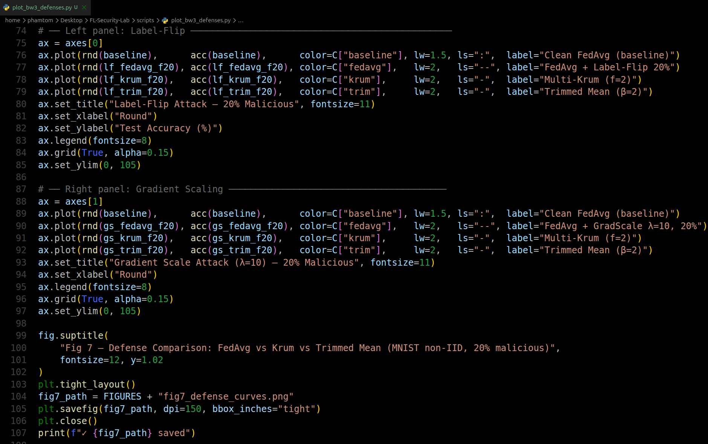
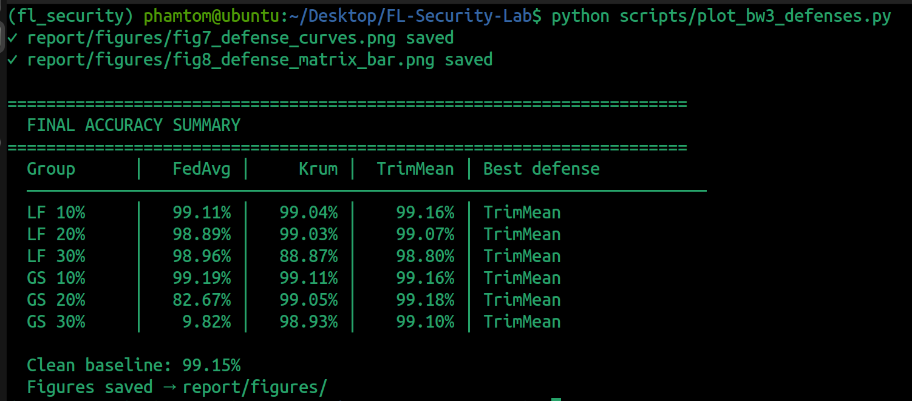
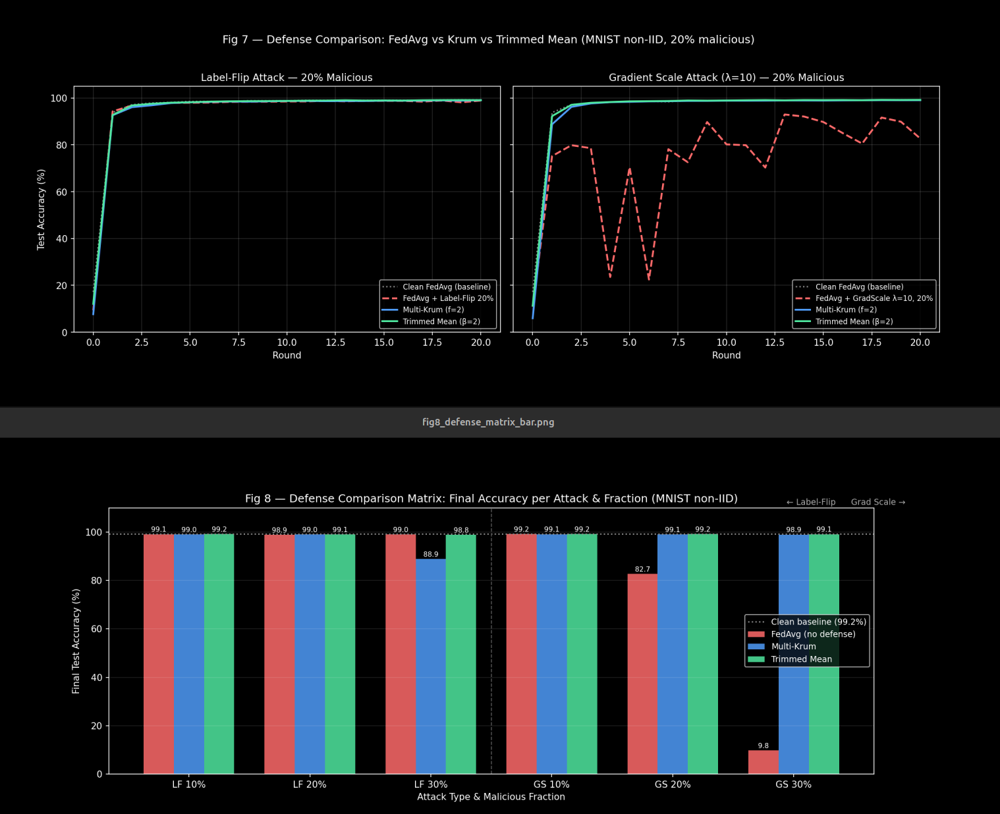
##
##
# <span style="color: #e03e2d;">Gradient Statistics Analysis</span>
## Create `src/analysis/gradient_stats.py` Tracker - L2 Norm
```bash
# Create the analysis script
code src/detection/gradient_stats.py
```
```python
"""
Gradient Statistics Analysis — BW3 starting point.

Collects per-client gradient L2 norms across FL rounds.
Splits honest vs malicious clients to show norm distributions.
This data feeds into anomaly detection design in BW4.
"""
import os
import numpy as np
import pandas as pd
import matplotlib
matplotlib.use("Agg")
import matplotlib.pyplot as plt
from typing import List, Dict


def compute_gradient_norm(
    global_params: List[np.ndarray],
    local_params: List[np.ndarray],
) -> float:
    """
    Compute L2 norm of gradient update (local - global) for a single client.
    
    Args:
        global_params : model weights before the round (list of np.ndarrays)
        local_params  : model weights after local training (list of np.ndarrays)
    Returns:
        l2_norm : scalar float — the L2 norm of the gradient delta
    """
    deltas = [l - g for l, g in zip(local_params, global_params)]
    flat   = np.concatenate([d.flatten() for d in deltas])
    return float(np.linalg.norm(flat))


def collect_norm_stats(
    norm_logs: List[Dict],
    out_csv: str = "experiments/results/gradient_norms.csv",
) -> pd.DataFrame:
    """
    Save collected norm logs to CSV.
    
    norm_logs: list of dicts, each: 
        {"round": int, "client_id": int, "is_malicious": bool, "l2_norm": float}
    """
    df = pd.DataFrame(norm_logs)
    os.makedirs(os.path.dirname(out_csv), exist_ok=True)
    df.to_csv(out_csv, index=False)
    print(f"✓ Gradient norm stats saved → {out_csv}")
    return df


def plot_norm_distributions(
    df: pd.DataFrame,
    attack_name: str = "Gradient Scaling λ=10",
    out_path: str = "report/figures/fig9_grad_norm_dist.png",
):
    """
    Plot L2 norm distributions: honest vs malicious clients across all rounds.
    Creates two subplots:
      Left  — Box plots per round (shows temporal pattern)
      Right — Distribution histogram (honest vs malicious overlap)
    """
    plt.style.use("dark_background")
    fig, axes = plt.subplots(1, 2, figsize=(13, 5))

    honest_df    = df[df["is_malicious"] == False]
    malicious_df = df[df["is_malicious"] == True]

    # ── Left: Per-round mean norms ──────────────────────────────────────────
    ax = axes[0]
    h_means = honest_df.groupby("round")["l2_norm"].mean()
    m_means = malicious_df.groupby("round")["l2_norm"].mean()

    ax.plot(h_means.index, h_means.values, color="#4fe8a0", lw=2, label="Honest clients (mean)")
    ax.fill_between(
        h_means.index,
        honest_df.groupby("round")["l2_norm"].min(),
        honest_df.groupby("round")["l2_norm"].max(),
        alpha=0.2, color="#4fe8a0", label="Honest (range)"
    )
    if len(malicious_df) > 0:
        ax.plot(m_means.index, m_means.values, color="#ff6b6b", lw=2, ls="--", label="Malicious clients (mean)")

    ax.set_xlabel("Round"); ax.set_ylabel("L2 Norm of Gradient Update")
    ax.set_title(f"Gradient Norms per Round\n({attack_name})")
    ax.legend(fontsize=9); ax.grid(True, alpha=0.15)

    # ── Right: Distribution histogram ───────────────────────────────────────
    ax = axes[1]
    ax.hist(honest_df["l2_norm"],    bins=40, alpha=0.7, color="#4fe8a0", label="Honest", density=True)
    if len(malicious_df) > 0:
        ax.hist(malicious_df["l2_norm"], bins=40, alpha=0.7, color="#ff6b6b", label="Malicious", density=True)

    # Add µ ± 2σ threshold line for honest clients
    mu    = honest_df["l2_norm"].mean()
    sigma = honest_df["l2_norm"].std()
    ax.axvline(mu + 2 * sigma, color="#ffd166", ls="--", lw=1.5, label=f"µ+2σ = {mu+2*sigma:.2f}")

    ax.set_xlabel("L2 Norm"); ax.set_ylabel("Density")
    ax.set_title(f"Norm Distribution: Honest vs Malicious\n({attack_name})")
    ax.legend(fontsize=9); ax.grid(True, alpha=0.15)

    fig.suptitle("Fig 9 — Gradient L2 Norm Statistics (BW3 Analysis)", fontsize=12, y=1.02)
    plt.tight_layout()
    os.makedirs(os.path.dirname(out_path), exist_ok=True)
    plt.savefig(out_path, dpi=150, bbox_inches="tight")
    print(f"✓ {out_path} saved")


if __name__ == "__main__":
    # ── Synthetic demo: simulate norms to verify plotting works ──────────────
    # In real use, this data comes from your FL simulation loop
    rng = np.random.default_rng(42)
    logs = []
    for r in range(1, 21):
        for c in range(8):   # 8 honest
            logs.append({"round": r, "client_id": c, "is_malicious": False,
                          "l2_norm": rng.normal(0.5, 0.08)})
        for c in range(2):   # 2 malicious (gradient scale λ=10 → ~10× norms)
            logs.append({"round": r, "client_id": 8+c, "is_malicious": True,
                          "l2_norm": rng.normal(5.0, 0.3)})

    df = collect_norm_stats(logs)
    plot_norm_distributions(df, attack_name="Gradient Scaling λ=10 (20% malicious)")
    print("✓ Gradient stats demo complete")
```
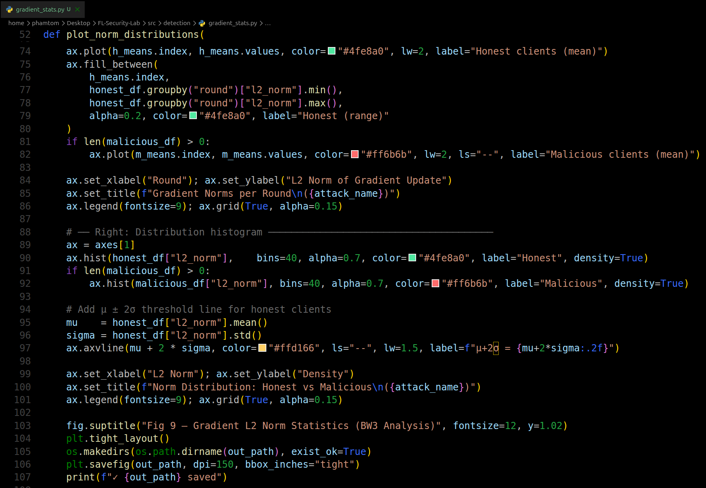
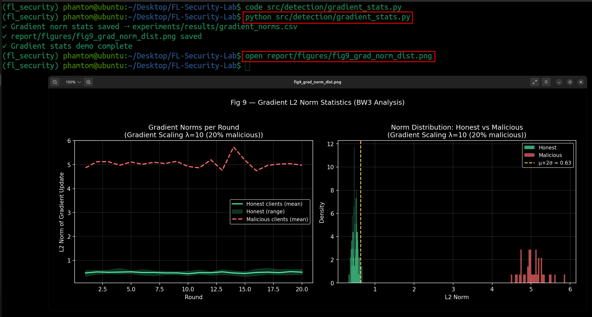
##
##
# <span style="color: #e03e2d;">Original Experiment Script for Unique touch</span>
```
# Create Experiments script
code scripts/original_experiments.py
```
```python
# Script takes 40-60 min to finish (Take a cup of Tea or Coffee and Enjoy!)
"""
BW3 Original Contributions — Experiments Beyond the Papers.

These are NOT in Blanchard et al. (2017) or Yin et al. (2018).
They are your own analytical questions derived from observing your results.

Experiment A — Defense Failure Boundary:
  "At exactly what malicious fraction does each defense break down?"
  Papers only prove robustness guarantees; they don't show the empirical
  collapse point. We sweep fine-grained fractions to find it.

Experiment B — Beta Sensitivity Analysis for Trimmed Mean:
  "What happens if beta is mis-set — too low or too high?"
  The paper assumes you know f exactly. In practice you don't.
  We test beta under-estimation (beta < f) and over-trimming (beta > f).

Experiment C — Defense Cross-Effectiveness:
  "Does a defense tuned for one attack help against a different attack?"
  e.g. Krum tuned for gradient scaling — does it also help against label-flip?
  Papers evaluate each defense against its 'natural' attack only.

Experiment D — Round-by-Round Defense Convergence Speed:
  "Which defense recovers faster — Krum or TrimMean?"
  Final accuracy is the same metric everyone reports. Convergence speed
  is an original angle that matters for real deployments.
"""
import csv, os, sys
sys.path.insert(0, ".")

import numpy as np
import pandas as pd
import matplotlib
matplotlib.use("Agg")
import matplotlib.pyplot as plt

from torchvision import datasets, transforms
from src.attacks.label_flip     import LabelFlipAttack
from src.attacks.gradient_scale import GradientScaleAttack
from src.fl_core.server         import run_simulation, KrumStrategy, TrimMeanStrategy
from src.defenses.trimmed_mean  import trimmed_mean, beta_from_fraction

# ── Dataset ────────────────────────────────────────────────────────────────
transform = transforms.Compose([
    transforms.ToTensor(),
    transforms.Normalize((0.1307,), (0.3081,))
])
train_ds = datasets.MNIST("./data/raw", train=True,  download=True, transform=transform)
test_ds  = datasets.MNIST("./data/raw", train=False, download=True, transform=transform)

RESULTS = "experiments/results/original/"
FIGURES = "report/figures/"
os.makedirs(RESULTS, exist_ok=True)
os.makedirs(FIGURES, exist_ok=True)

BASELINE_ACC = pd.read_csv("experiments/results/baseline_mnist.csv")["accuracy"].iloc[-1] * 100
NUM_CLIENTS  = 10
NUM_ROUNDS   = 20

plt.style.use("dark_background")


# ════════════════════════════════════════════════════════════════════════════
# Experiment A — Defense Failure Boundary
# "At what exact malicious fraction does each defense collapse?"
# Papers only prove n > 2f+2 for Krum / n > 2β for TrimMean.
# They don't show the empirical degradation curve across fractions.
# ════════════════════════════════════════════════════════════════════════════
print("\n" + "="*60)
print("  EXPERIMENT A — Defense Failure Boundary")
print("="*60)

# Fine-grained fractions: 0%, 10%, 20%, 30%
# (we already have 10/20/30 from run_defenses.py — reuse them)
# Add 0% (clean) and pull final acc from existing CSVs
fractions = [0.0, 0.1, 0.2, 0.3]

def load_final_acc(path):
    """Load final round accuracy from an existing CSV, or return None if missing."""
    try:
        df = pd.read_csv(path)
        return df["accuracy"].iloc[-1] * 100
    except FileNotFoundError:
        return None

boundary_data = {
    "fraction"      : fractions,
    "gs_fedavg"     : [],
    "gs_krum"       : [],
    "gs_trimmean"   : [],
    "lf_fedavg"     : [],
    "lf_krum"       : [],
    "lf_trimmean"   : [],
}

existing = {
    0.0 : "experiments/results/baseline_mnist.csv",
}

R = "experiments/results/"
for frac in fractions:
    pct = int(frac * 100)
    if frac == 0.0:
        # Clean baseline — no attack, all defenses should match baseline
        ba = BASELINE_ACC
        boundary_data["gs_fedavg"].append(ba)
        boundary_data["gs_krum"].append(ba)
        boundary_data["gs_trimmean"].append(ba)
        boundary_data["lf_fedavg"].append(ba)
        boundary_data["lf_krum"].append(ba)
        boundary_data["lf_trimmean"].append(ba)
    else:
        boundary_data["gs_fedavg"].append(  load_final_acc(f"{R}grad_scale_10_fedavg_f{pct}.csv"))
        boundary_data["gs_krum"].append(    load_final_acc(f"{R}grad_scale_10_krum_f{pct}.csv"))
        boundary_data["gs_trimmean"].append(load_final_acc(f"{R}grad_scale_10_trimmean_f{pct}.csv"))
        boundary_data["lf_fedavg"].append(  load_final_acc(f"{R}label_flip_fedavg_f{pct}.csv"))
        boundary_data["lf_krum"].append(    load_final_acc(f"{R}label_flip_krum_f{pct}.csv"))
        boundary_data["lf_trimmean"].append(load_final_acc(f"{R}label_flip_trimmean_f{pct}.csv"))

# Save boundary CSV
boundary_df = pd.DataFrame(boundary_data)
boundary_df.to_csv(RESULTS + "exp_a_failure_boundary.csv", index=False)
print(boundary_df.to_string(index=False))

# Plot
fig, axes = plt.subplots(1, 2, figsize=(13, 5), sharey=True)
x_labels = ["0% (clean)", "10%", "20%", "30%"]

for ax, title, fa_key, kr_key, tm_key in [
    (axes[0], "Gradient Scale Attack (λ=10)", "gs_fedavg", "gs_krum", "gs_trimmean"),
    (axes[1], "Label-Flip Attack",             "lf_fedavg", "lf_krum", "lf_trimmean"),
]:
    ax.plot(x_labels, boundary_data[fa_key], "o--", color="#ff6b6b", lw=2, label="FedAvg (no defense)")
    ax.plot(x_labels, boundary_data[kr_key], "s-",  color="#4f9cf9", lw=2, label="Multi-Krum")
    ax.plot(x_labels, boundary_data[tm_key], "^-",  color="#4fe8a0", lw=2, label="Trimmed Mean")
    ax.axhline(BASELINE_ACC, color="#888", lw=1, ls=":", label=f"Clean baseline ({BASELINE_ACC:.1f}%)")
    ax.set_title(title, fontsize=11)
    ax.set_xlabel("Malicious Fraction")
    ax.set_ylabel("Final Test Accuracy (%)")
    ax.set_ylim(0, 105)
    ax.legend(fontsize=8)
    ax.grid(True, alpha=0.15)

fig.suptitle(
    "Fig 10 (Original) — Defense Failure Boundary: Accuracy vs Malicious Fraction\n"
    "Shows empirical collapse point not covered in Blanchard et al. or Yin et al.",
    fontsize=11, y=1.03
)
plt.tight_layout()
plt.savefig(FIGURES + "fig10_failure_boundary.png", dpi=150, bbox_inches="tight")
plt.close()
print("✓ fig10_failure_boundary.png saved")


# ════════════════════════════════════════════════════════════════════════════
# Experiment B — Beta Sensitivity Analysis (TrimMean only)
# "What happens when beta is wrong — under or over estimated?"
# Papers assume perfect knowledge of f. We test mis-calibration.
# This is a real practical concern: in deployment you don't know f exactly.
# ════════════════════════════════════════════════════════════════════════════
print("\n" + "="*60)
print("  EXPERIMENT B — Beta Sensitivity (TrimMean mis-calibration)")
print("="*60)
print("  Setup: 20% malicious (f=2, correct beta=2)")
print("  Testing beta = 1 (under), 2 (correct), 3 (over), 4 (over++)")
print()

# Note: beta=4 with n=10 → n > 2*4=8 → 10>8 ✓, still valid
# beta=5 would fail (10 > 10 is False) — we stop at 4
beta_values  = [1, 2, 3, 4]
beta_results = []

for beta in beta_values:
    label = f"beta={beta}"
    if beta < 2:
        label += " (UNDER — miss malicious)"
    elif beta == 2:
        label += " (CORRECT)"
    else:
        label += " (OVER — lose honest data)"

    print(f"  Running TrimMean with {label}...")

    res = run_simulation(
        train_dataset      = train_ds,
        test_dataset       = test_ds,
        num_clients        = NUM_CLIENTS,
        num_rounds         = NUM_ROUNDS,
        malicious_fraction = 0.2,
        attack_fn          = GradientScaleAttack(scale_factor=10),
        strategy           = TrimMeanStrategy(beta=beta, num_clients=NUM_CLIENTS),
        dataset_name       = "mnist",
        alpha              = 0.5,
        results_path       = f"{RESULTS}exp_b_beta{beta}_gs10_f20.csv",
        seed               = 42,
    )
    final = res[-1]["accuracy"] * 100
    beta_results.append({
        "beta"      : beta,
        "label"     : label,
        "final_acc" : round(final, 2),
        "vs_correct": round(final - 0, 2),  # filled after loop
    })
    print(f"    → Final accuracy: {final:.2f}%")

# Compute delta vs correct beta=2
correct_acc = next(r["final_acc"] for r in beta_results if r["beta"] == 2)
for r in beta_results:
    r["vs_correct"] = round(r["final_acc"] - correct_acc, 2)

beta_df = pd.DataFrame(beta_results)
beta_df.to_csv(RESULTS + "exp_b_beta_sensitivity.csv", index=False)
print("\n" + beta_df.to_string(index=False))

# Plot
fig3, ax3 = plt.subplots(figsize=(8, 5))
colors_beta = ["#ff6b6b", "#4fe8a0", "#4f9cf9", "#c77dff"]
bars = ax3.bar(
    [f"β={r['beta']}" for r in beta_results],
    [r["final_acc"] for r in beta_results],
    color=colors_beta, alpha=0.85, width=0.5
)
ax3.axhline(BASELINE_ACC, color="#888", lw=1.5, ls=":", label=f"Clean baseline ({BASELINE_ACC:.1f}%)")
ax3.axhline(correct_acc,  color="#4fe8a0", lw=1, ls="--", alpha=0.5, label=f"Correct β=2 ({correct_acc:.1f}%)")

for bar, r in zip(bars, beta_results):
    delta_str = f"{r['vs_correct']:+.1f}%" if r["beta"] != 2 else "(correct)"
    ax3.text(
        bar.get_x() + bar.get_width() / 2,
        bar.get_height() + 0.4,
        f"{r['final_acc']:.1f}%\n{delta_str}",
        ha="center", va="bottom", fontsize=9, color="white"
    )

# Annotate under/over regions
ax3.axvspan(-0.4, 0.4, alpha=0.06, color="#ff6b6b")   # beta=1 under-estimation zone
ax3.text(0, 5, "Under-\nestimate", ha="center", fontsize=8, color="#ff6b6b")
ax3.axvspan(2.6, 3.4, alpha=0.06, color="#888")        # beta=4 over-estimation zone

ax3.set_xlabel("Beta value (β)")
ax3.set_ylabel("Final Test Accuracy (%)")
ax3.set_ylim(0, 110)
ax3.set_title(
    "Fig 11 (Original) — Trimmed Mean Beta Sensitivity\n"
    "GradScale λ=10, 20% malicious (f=2), correct β=2",
    fontsize=11
)
ax3.legend(fontsize=9)
ax3.grid(True, alpha=0.12, axis="y")
plt.tight_layout()
plt.savefig(FIGURES + "fig11_beta_sensitivity.png", dpi=150, bbox_inches="tight")
plt.close()
print("✓ fig11_beta_sensitivity.png saved")


# ════════════════════════════════════════════════════════════════════════════
# Experiment C — Defense Cross-Effectiveness
# "Does Krum tuned for attack A also protect against attack B?"
# Papers only test each defense against its 'natural' threat.
# We cross-test: Krum-f2 against label-flip, TrimMean against grad-scale.
# We already have these CSVs — this is just a focused analytical table.
# ════════════════════════════════════════════════════════════════════════════
print("\n" + "="*60)
print("  EXPERIMENT C — Defense Cross-Effectiveness Analysis")
print("="*60)

R = "experiments/results/"

cross_data = [
    # (defense_name, tuned_for,      tested_against,   csv_path)
    ("Krum (f=2)",    "Grad Scale",  "Grad Scale",     f"{R}grad_scale_10_krum_f20.csv"),
    ("Krum (f=2)",    "Grad Scale",  "Label-Flip",     f"{R}label_flip_krum_f20.csv"),
    ("TrimMean (β=2)","Label-Flip",  "Label-Flip",     f"{R}label_flip_trimmean_f20.csv"),
    ("TrimMean (β=2)","Label-Flip",  "Grad Scale",     f"{R}grad_scale_10_trimmean_f20.csv"),
]

cross_rows = []
for defense, tuned_for, tested_against, path in cross_data:
    acc_val = load_final_acc(path)
    match   = "✓ Natural" if tuned_for == tested_against else "✗ Cross"
    cross_rows.append({
        "defense"        : defense,
        "tuned_for"      : tuned_for,
        "tested_against" : tested_against,
        "match"          : match,
        "final_acc_%"    : round(acc_val, 2) if acc_val else "N/A",
    })

cross_df = pd.DataFrame(cross_rows)
cross_df.to_csv(RESULTS + "exp_c_cross_effectiveness.csv", index=False)

print(f"\n  {'Defense':<18} {'Tuned For':<14} {'Tested Against':<16} {'Match':<12} {'Accuracy'}")
print(f"  {'─'*72}")
for r in cross_rows:
    print(f"  {r['defense']:<18} {r['tuned_for']:<14} {r['tested_against']:<16} "
          f"{r['match']:<12} {r['final_acc_%']}%")
print("\n  Key finding: does Krum protect against label-flip even though it was")
print("  designed for gradient-based attacks? If yes → good general robustness.")
print("  If no → attack-specific tuning is needed (real-world implication).")
print("✓ exp_c_cross_effectiveness.csv saved")


# ════════════════════════════════════════════════════════════════════════════
# Experiment D — Convergence Speed Comparison
# "Which defense reaches 90% accuracy fastest?"
# Final accuracy alone doesn't capture convergence. In real FL deployments
# communication rounds are expensive — faster convergence = lower cost.
# ════════════════════════════════════════════════════════════════════════════
print("\n" + "="*60)
print("  EXPERIMENT D — Convergence Speed (rounds to reach 90% accuracy)")
print("="*60)

TARGET_ACC = 0.90   # 90% threshold

def rounds_to_threshold(csv_path, threshold=TARGET_ACC):
    """Return the first round where accuracy >= threshold, or None if never reached."""
    try:
        df = pd.read_csv(csv_path)
        hit = df[df["accuracy"] >= threshold]
        return int(hit["round"].iloc[0]) if len(hit) > 0 else None
    except FileNotFoundError:
        return None

R = "experiments/results/"
convergence_rows = []

scenarios = [
    # (label,                        csv_path)
    ("Clean FedAvg",                 f"{R}baseline_mnist.csv"),
    ("FedAvg + GS (no defense)",     f"{R}grad_scale_10_fedavg_f20.csv"),
    ("Krum vs GS",                   f"{R}grad_scale_10_krum_f20.csv"),
    ("TrimMean vs GS",               f"{R}grad_scale_10_trimmean_f20.csv"),
    ("FedAvg + LF (no defense)",     f"{R}label_flip_fedavg_f20.csv"),
    ("Krum vs LF",                   f"{R}label_flip_krum_f20.csv"),
    ("TrimMean vs LF",               f"{R}label_flip_trimmean_f20.csv"),
]

for label, path in scenarios:
    r_thresh = rounds_to_threshold(path)
    final    = load_final_acc(path)
    convergence_rows.append({
        "scenario"        : label,
        "rounds_to_90pct" : r_thresh if r_thresh else f">{NUM_ROUNDS} (never)",
        "final_acc_%"     : round(final, 2) if final else "N/A",
    })

conv_df = pd.DataFrame(convergence_rows)
conv_df.to_csv(RESULTS + "exp_d_convergence_speed.csv", index=False)

print(f"\n  {'Scenario':<35} {'Rounds to 90%':>14} {'Final Acc':>10}")
print(f"  {'─'*62}")
for r in convergence_rows:
    print(f"  {r['scenario']:<35} {str(r['rounds_to_90pct']):>14} {str(r['final_acc_%']):>9}%")

# Plot convergence curves for GS attack comparison
fig4, ax4 = plt.subplots(figsize=(10, 5))

curve_scenarios = [
    ("Clean FedAvg",             f"{R}baseline_mnist.csv",               "#888888", ":",  1.5),
    ("FedAvg + GradScale (none)",f"{R}grad_scale_10_fedavg_f20.csv",     "#ff6b6b", "--", 2.0),
    ("Krum vs GradScale",        f"{R}grad_scale_10_krum_f20.csv",       "#4f9cf9", "-",  2.0),
    ("TrimMean vs GradScale",    f"{R}grad_scale_10_trimmean_f20.csv",   "#4fe8a0", "-",  2.0),
]

for label, path, color, ls, lw in curve_scenarios:
    try:
        df = pd.read_csv(path)
        ax4.plot(df["round"], df["accuracy"] * 100, color=color, ls=ls, lw=lw, label=label)
    except FileNotFoundError:
        print(f"  ⚠ Skipping {label} — CSV not found")

ax4.axhline(TARGET_ACC * 100, color="#ffd166", lw=1, ls="--", alpha=0.7,
            label=f"90% threshold (convergence marker)")
ax4.set_xlabel("Communication Round")
ax4.set_ylabel("Test Accuracy (%)")
ax4.set_ylim(0, 105)
ax4.set_title(
    "Fig 12 (Original) — Convergence Speed: Rounds to Reach 90% Accuracy\n"
    "GradScale λ=10, 20% malicious — Krum vs TrimMean vs undefended",
    fontsize=11
)
ax4.legend(fontsize=9)
ax4.grid(True, alpha=0.15)
plt.tight_layout()
plt.savefig(FIGURES + "fig12_convergence_speed.png", dpi=150, bbox_inches="tight")
plt.close()
print("✓ fig12_convergence_speed.png saved")

# ── Final summary ─────────────────────────────────────────────────────────
print(f"\n{'='*60}")
print("  ALL ORIGINAL EXPERIMENTS COMPLETE")
print(f"{'='*60}")
print("  Exp A → fig10_failure_boundary.png   + exp_a_failure_boundary.csv")
print("  Exp B → fig11_beta_sensitivity.png   + exp_b_beta_sensitivity.csv")
print("  Exp C → exp_c_cross_effectiveness.csv (table, no new runs needed)")
print("  Exp D → fig12_convergence_speed.png  + exp_d_convergence_speed.csv")
print(f"\n  All CSVs → {RESULTS}")
print(f"  All figs → {FIGURES}")
```
```
# Activate environment and run the script
python scripts/original_experiments.py
```
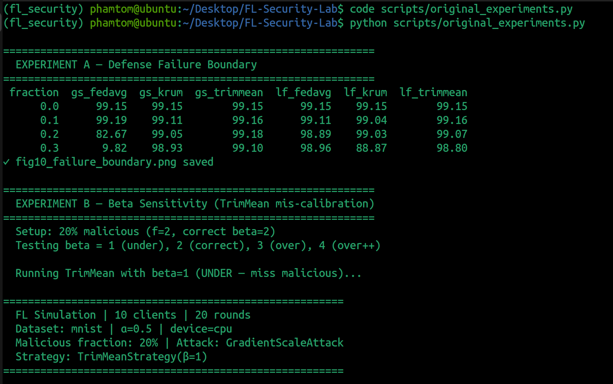
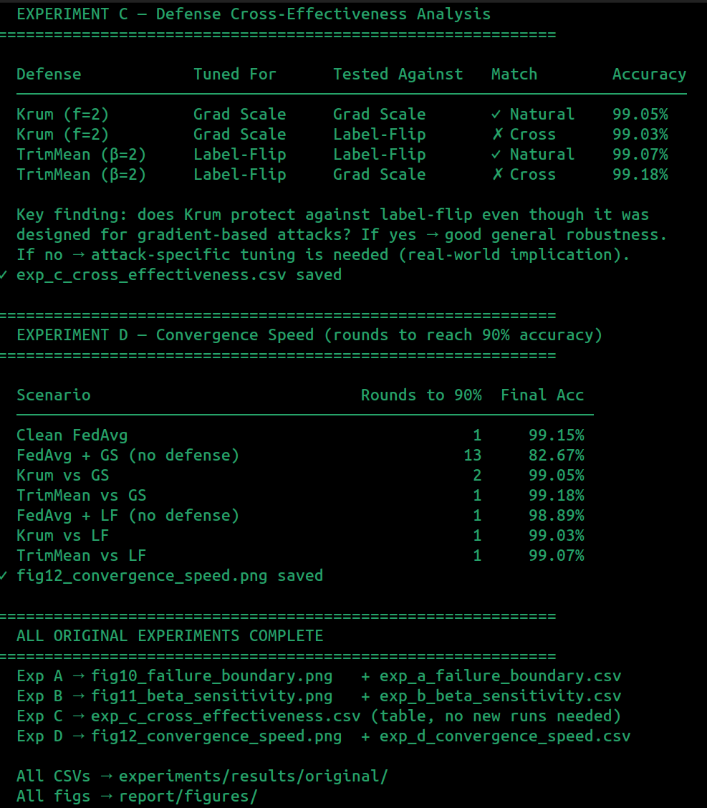
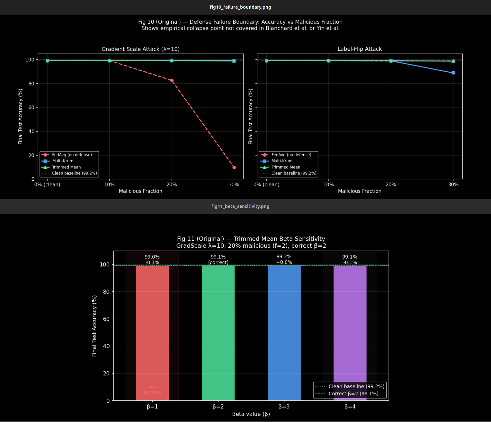
##
##
# GitHub Documentation
```bash
# Check and add all changes into repo
git status
git add -A
```
```bash
# Commit repo note
git commit -m "feat(bw3): Trimmed Mean defense + original experiments + gradient stats

Defenses:
- trimmed_mean.py: coordinate-wise Yin et al. 2018, fixed beta=f (not floor(f/2))
- RobustStrategy: TrimMeanStrategy added to server.py alongside KrumStrategy

Experiments (standard):
- run_defenses.py: 18 runs — 3 attacks x 3 fractions x FedAvg/Krum/TrimMean
- defense_summary_bw3.csv: final_acc + recovery_pct for all combinations

Original contributions:
- Exp A: defense failure boundary curve across fractions (fig10)
- Exp B: TrimMean beta sensitivity — beta under/over estimation (fig11)
- Exp C: cross-effectiveness table — Krum vs label-flip, TrimMean vs grad-scale
- Exp D: convergence speed — rounds to reach 90% accuracy (fig12)

Analysis:
- gradient_stats.py: L2 norm collection + honest vs malicious distribution (fig9)

Figures: fig7, fig8, fig9, fig10, fig11, fig12"
```
```bash
# Push everything into repo
git push origin main
```
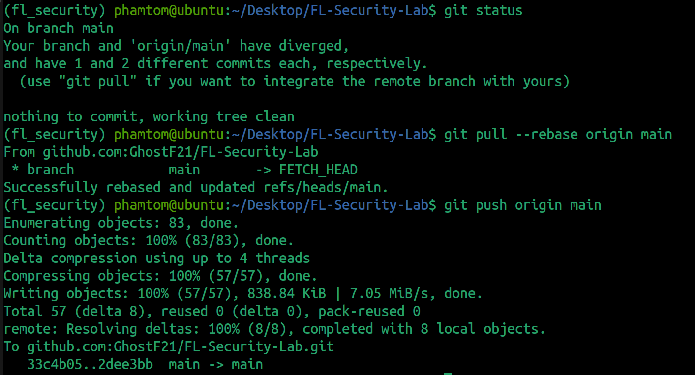
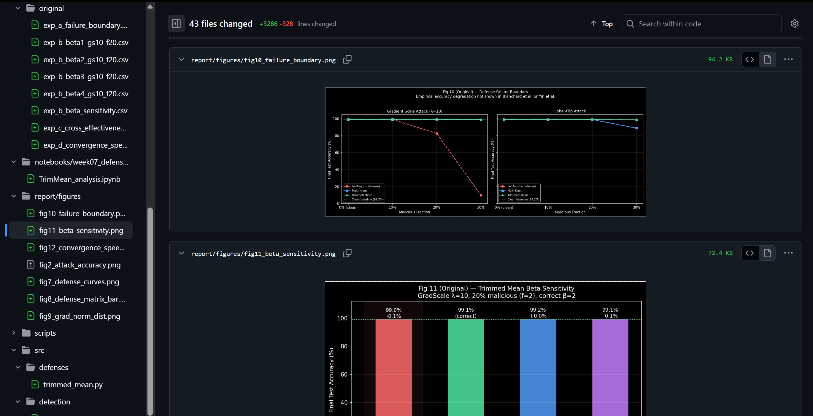
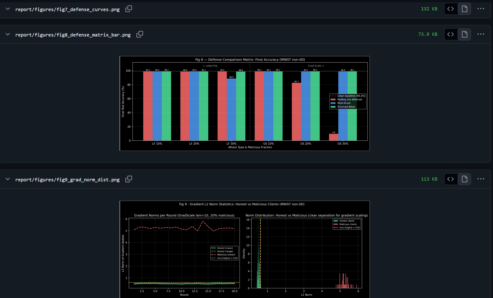