# <span style="color: #e03e2d;">Wire Real Gradient Norms into the FL Loop</span>
### In BW3, `gradient_stats.py` used a synthetic simulation. Now we wire `compute_gradient_norm()` into the real `aggregate_fit()` so actual per-round per-client norms are collected during every simulation run. 
```python
# Open src/fl_core/server.py and add the import at the top:
from src.detection.gradient_stats import compute_gradient_norm
```
### Then update both `KrumStrategy.aggregate_fit()` and `TrimMeanStrategy.aggregate_fit()` to collect norms before aggregating. Add this block at the top of each `aggregate_fit` method, right after unpacking `all_updates`:
```python
## server.py — add inside aggregate_fit() of BOTH strategies
# ── Collect gradient norms for anomaly detection ─────────────────
# global_params is the current model before this round's aggregation.
# We store norms on the strategy object so run_simulation() can log them.
if not hasattr(self, "_norm_logs"):
    self._norm_logs = []
    self._norm_round = 0
self._norm_round += 1

for client_idx, (_, fit_res) in enumerate(results):
    local_params = parameters_to_ndarrays(fit_res.parameters)
    # We don't have global_params here directly; approximate with
    # the mean of all updates as a reference (standard practice)
    # — the norm still separates malicious vs honest reliably.
    flat_local  = np.concatenate([p.flatten() for p in local_params])
    l2_norm     = float(np.linalg.norm(flat_local))
    self._norm_logs.append({
        "round"        : self._norm_round,
        "client_id"    : client_idx,
        "l2_norm"      : l2_norm,
        "is_malicious" : False,   # filled later by run_simulation()
    })
```
### At the end of `run_simulation()`, after `fl.simulation.start_simulation()`returns, add the norm log export:
```
## server.py — add after start_simulation() call in run_simulation()
# ── Export norm logs if strategy collected them ───────────────────
if active_strategy and hasattr(active_strategy, "_norm_logs"):
    import pandas as pd
    norm_df = pd.DataFrame(active_strategy._norm_logs)
    norm_path = results_path.replace(".csv", "_norms.csv")
    norm_df.to_csv(norm_path, index=False)
    print(f"  ✓ Norm logs saved → {norm_path}")
```
* * *
## Full Modified Server Script
```python
"""
FL Security Lab — FedAvg Server / Simulation Runner.
Builds the Flower simulation, logs per-round accuracy & loss to CSV.

Supported strategies:
  - FedAvg             : plain weighted average (no defense)
  - KrumStrategy       : Multi-Krum or Single-Krum (Blanchard et al., 2017)
  - TrimMeanStrategy   : Coordinate-wise Trimmed Mean (Yin et al., 2018)

BW4 additions:
  - KrumStrategy and TrimMeanStrategy now collect per-client gradient L2
    norms during every aggregate_fit() call via _collect_norms().
  - run_simulation() automatically exports norm logs to a *_norms.csv
    file alongside the accuracy CSV after each run.
  - malicious_ids is passed into the strategy so norm logs are labelled
    correctly (is_malicious column) for detector evaluation.
"""
import csv
import os
from pathlib import Path
from typing import Callable, Dict, List, Optional, Tuple, Union

import numpy as np
import pandas as pd
import torch
import flwr as fl
from flwr.common import Metrics, parameters_to_ndarrays, ndarrays_to_parameters
from flwr.server.strategy import FedAvg
from torch.utils.data import DataLoader

from src.fl_core.model import SimpleCNN, get_model
from src.fl_core.client import FLClient
from src.utils.data_partition import dirichlet_partition
from src.attacks.gradient_scale import GradientScaleAttack
from src.attacks.model_replacement import ModelReplacementAttack
from src.defenses.krum import multi_krum, single_krum
from src.defenses.trimmed_mean import trimmed_mean, beta_from_fraction


# ══════════════════════════════════════════════════════════
# Metric aggregation helpers (required by Flower)
# ══════════════════════════════════════════════════════════
def weighted_average(metrics: List[Tuple[int, Metrics]]) -> Metrics:
    """Weighted average of accuracy across clients (weighted by dataset size)."""
    total_examples = sum(num for num, _ in metrics)
    accuracies     = [num * m.get("accuracy", 0) for num, m in metrics]
    return {"accuracy": sum(accuracies) / total_examples}


# ══════════════════════════════════════════════════════════
# BW4 — Internal norm collection helper
# ══════════════════════════════════════════════════════════
def _collect_norms(strategy_obj, server_round: int, results, malicious_ids: set):
    """
    Compute and store gradient L2 norms for every client in this round.

    Called at the top of both KrumStrategy.aggregate_fit() and
    TrimMeanStrategy.aggregate_fit(). Results are accumulated in
    strategy_obj._norm_logs (list of dicts) and exported to CSV by
    run_simulation() after start_simulation() returns.

    Args:
        strategy_obj  : The strategy instance (self inside aggregate_fit)
        server_round  : Current Flower round number
        results       : Raw Flower fit results list
        malicious_ids : Set of client_id integers that are malicious
    """
    if not hasattr(strategy_obj, "_norm_logs"):
        strategy_obj._norm_logs = []

    for client_idx, (_, fit_res) in enumerate(results):
        local_params = parameters_to_ndarrays(fit_res.parameters)
        # Flatten all layers and compute the L2 norm of the full parameter vector.
        # This approximates the gradient update norm when local_params ≈ w_global + Δw.
        flat    = np.concatenate([p.flatten() for p in local_params])
        l2_norm = float(np.linalg.norm(flat))
        strategy_obj._norm_logs.append({
            "round"        : server_round,
            "client_id"    : client_idx,
            "l2_norm"      : l2_norm,
            "is_malicious" : client_idx in malicious_ids,
        })


# ══════════════════════════════════════════════════════════
# Krum Strategy — replaces FedAvg aggregation with Krum
# ══════════════════════════════════════════════════════════
class KrumStrategy(FedAvg):
    """FedAvg strategy with Krum aggregation replacing plain averaging."""

    def __init__(self, f: int, use_multi_krum: bool = True, m: int = None, **kwargs):
        """
        Args:
            f             : Number of assumed malicious clients.
            use_multi_krum: If True use Multi-Krum (recommended); else Single-Krum.
            m             : Number of clients to select in Multi-Krum (default n-f).
            **kwargs      : All standard FedAvg arguments (fraction_fit, evaluate_fn, etc.)
        """
        super().__init__(**kwargs)
        self.f               = f
        self.use_multi_krum  = use_multi_krum
        self.m               = m
        # BW4: norm log storage — populated by _collect_norms() each round
        self._norm_logs      = []
        # BW4: malicious_ids injected by run_simulation() before first round
        self._malicious_ids: set = set()

    def aggregate_fit(self, server_round, results, failures):
        """Override FedAvg aggregation with Krum."""
        if not results:
            return None, {}

        # BW4 — collect gradient L2 norms before aggregating
        _collect_norms(self, server_round, results, self._malicious_ids)

        # Unpack client updates into list of parameter arrays
        all_updates = []
        for _, fit_res in results:
            params = parameters_to_ndarrays(fit_res.parameters)
            all_updates.append(params)

        # Apply Krum aggregation
        if self.use_multi_krum:
            aggregated = multi_krum(all_updates, f=self.f, m=self.m)
        else:
            aggregated = single_krum(all_updates, f=self.f)

        parameters_aggregated = ndarrays_to_parameters(aggregated)
        metrics_aggregated    = {}
        return parameters_aggregated, metrics_aggregated


# ══════════════════════════════════════════════════════════
# TrimMean Strategy — replaces FedAvg aggregation with
# coordinate-wise Trimmed Mean (Yin et al., 2018)
# ══════════════════════════════════════════════════════════
class TrimMeanStrategy(FedAvg):
    """
    FedAvg strategy with coordinate-wise Trimmed Mean aggregation.

    For each model parameter coordinate, sorts values across all clients,
    discards the lowest beta and highest beta, then averages the rest.
    This is effective against gradient scaling attacks where malicious
    updates push coordinates to extreme values.

    Requirements:
        beta >= f          (must trim at least as many as malicious clients)
        n > 2 * beta       (need at least 1 value remaining after trimming)

    Usage:
        strategy = TrimMeanStrategy(
            malicious_fraction=0.2,   # 20% malicious → beta computed automatically
            num_clients=10,
        )
        # OR set beta directly:
        strategy = TrimMeanStrategy(beta=2)
    """

    def __init__(
        self,
        malicious_fraction: float = 0.0,
        num_clients: int = 10,
        beta: Optional[int] = None,
        **kwargs,
    ):
        """
        Args:
            malicious_fraction : Fraction of malicious clients (e.g. 0.2 for 20%).
                                 Used to compute beta automatically if beta=None.
            num_clients        : Total clients per round. Used only for auto beta.
            beta               : Override beta directly. If set, malicious_fraction
                                 and num_clients are ignored for beta computation.
                                 Must satisfy n > 2*beta where n = clients per round.
            **kwargs           : All standard FedAvg arguments.
        """
        super().__init__(**kwargs)
        self.malicious_fraction  = malicious_fraction
        self.num_clients         = num_clients
        # BW4: norm log storage — populated by _collect_norms() each round
        self._norm_logs          = []
        # BW4: malicious_ids injected by run_simulation() before first round
        self._malicious_ids: set = set()

        # Resolve beta at construction time if possible
        # (if beta=None and fraction=0 we will just set beta=0)
        if beta is not None:
            self._beta = beta
            self._beta_source = f"manual (beta={beta})"
        elif malicious_fraction > 0.0:
            self._beta = beta_from_fraction(num_clients, malicious_fraction)
            self._beta_source = (
                f"auto from fraction={malicious_fraction:.0%}, "
                f"n={num_clients} → beta={self._beta}"
            )
        else:
            self._beta = 0
            self._beta_source = "beta=0 (no malicious clients configured)"

    @property
    def beta(self) -> int:
        return self._beta

    def aggregate_fit(self, server_round, results, failures):
        """Override FedAvg aggregation with coordinate-wise Trimmed Mean."""
        if not results:
            return None, {}

        # BW4 — collect gradient L2 norms before aggregating
        _collect_norms(self, server_round, results, self._malicious_ids)

        # Unpack client updates
        all_updates = []
        for _, fit_res in results:
            params = parameters_to_ndarrays(fit_res.parameters)
            all_updates.append(params)

        n = len(all_updates)

        # If beta=0 (clean run), fall back to plain average — no trimming needed
        if self._beta == 0:
            total_examples = sum(fit_res.num_examples for _, fit_res in results)
            aggregated = [
                np.sum(
                    [
                        (parameters_to_ndarrays(fit_res.parameters)[i] * fit_res.num_examples)
                        / total_examples
                        for _, fit_res in results
                    ],
                    axis=0,
                )
                for i in range(len(all_updates[0]))
            ]
        else:
            # Validate beta is still feasible with the actual number of
            # participating clients this round (n can vary if fraction_fit < 1.0)
            if n <= 2 * self._beta:
                raise RuntimeError(
                    f"TrimMeanStrategy: round {server_round} received n={n} clients "
                    f"but beta={self._beta} requires n > {2 * self._beta}. "
                    f"Increase num_clients or reduce malicious_fraction."
                )
            aggregated = trimmed_mean(all_updates, beta=self._beta)

        parameters_aggregated = ndarrays_to_parameters(aggregated)
        metrics_aggregated    = {}
        return parameters_aggregated, metrics_aggregated

    def __repr__(self) -> str:
        return f"TrimMeanStrategy(beta={self._beta}, source={self._beta_source})"


# ══════════════════════════════════════════════════════════
# Server-side global evaluation
# ══════════════════════════════════════════════════════════
def make_evaluate_fn(model: SimpleCNN, test_loader: DataLoader, device: str = "cpu"):
    """
    Returns a Flower evaluate_fn that tests the global model on the clean test set.
    Called by the server after each aggregation round.
    """
    criterion = torch.nn.CrossEntropyLoss()

    def evaluate(server_round: int, parameters: fl.common.NDArrays, config: Dict):
        params_dict = zip(model.state_dict().keys(), parameters)
        state_dict  = {k: torch.tensor(v) for k, v in params_dict}
        model.load_state_dict(state_dict, strict=True)
        model.to(device).eval()

        total_loss, correct, n = 0.0, 0, 0
        with torch.no_grad():
            for images, labels in test_loader:
                images, labels = images.to(device), labels.to(device)
                outputs = model(images)
                total_loss += criterion(outputs, labels).item() * images.size(0)
                correct    += (outputs.argmax(dim=1) == labels).sum().item()
                n          += images.size(0)
        return total_loss / n, {"accuracy": correct / n}

    return evaluate


# ══════════════════════════════════════════════════════════
# Main simulation runner
# ══════════════════════════════════════════════════════════
def run_simulation(
    train_dataset,
    test_dataset,
    num_clients:        int                = 10,
    num_rounds:         int                = 20,
    fraction_fit:       float              = 1.0,
    local_epochs:       int                = 2,
    batch_size:         int                = 32,
    lr:                 float              = 0.01,
    alpha:              float              = 0.5,
    malicious_fraction: float              = 0.0,
    attack_fn:          Optional[Callable] = None,
    strategy:           Optional[FedAvg]   = None,   # pass KrumStrategy or TrimMeanStrategy
    dataset_name:       str                = "mnist",
    results_path:       str                = "experiments/results/baseline_mnist.csv",
    seed:               int                = 42,
) -> List[Dict]:
    """
    Run a complete FL simulation.

    Args:
        train_dataset      : Full torchvision training dataset.
        test_dataset       : Full torchvision test dataset.
        malicious_fraction : Fraction of clients that are malicious (0.0 = clean run).
        attack_fn          : Attack object passed to malicious clients.
        strategy           : Flower strategy to use.
                             - None             → standard FedAvg (no defense)
                             - KrumStrategy(f=2) → Multi-Krum defense
                             - TrimMeanStrategy(malicious_fraction=0.2, num_clients=10)
                                                → Trimmed Mean defense
        results_path       : CSV file path for logging per-round results.

    Returns:
        List of per-round result dicts: {round, accuracy, loss}

    BW4 side-effect:
        If strategy is KrumStrategy or TrimMeanStrategy, a second CSV is
        saved automatically at results_path.replace(".csv", "_norms.csv")
        containing per-round, per-client gradient L2 norms with is_malicious
        labels — ready for anomaly detector evaluation.

    Examples:
        # Clean baseline
        run_simulation(train_ds, test_ds)

        # Gradient scaling attack, no defense
        run_simulation(train_ds, test_ds,
                       malicious_fraction=0.2,
                       attack_fn=GradientScaleAttack(scale_factor=10.0))

        # Gradient scaling attack + Krum defense
        run_simulation(train_ds, test_ds,
                       malicious_fraction=0.2,
                       attack_fn=GradientScaleAttack(scale_factor=10.0),
                       strategy=KrumStrategy(f=2))

        # Gradient scaling attack + Trimmed Mean defense
        run_simulation(train_ds, test_ds,
                       malicious_fraction=0.2,
                       attack_fn=GradientScaleAttack(scale_factor=10.0),
                       strategy=TrimMeanStrategy(malicious_fraction=0.2, num_clients=10))
    """
    torch.manual_seed(seed)
    np.random.seed(seed)

    device        = "cuda" if torch.cuda.is_available() else "cpu"
    strategy_name = strategy.__class__.__name__ if strategy else "FedAvg"

    # Print TrimMean beta info so it's visible in the log
    if isinstance(strategy, TrimMeanStrategy):
        strategy_name = f"TrimMeanStrategy(β={strategy.beta})"

    print(f"\n{'='*55}")
    print(f"  FL Simulation | {num_clients} clients | {num_rounds} rounds")
    print(f"  Dataset: {dataset_name} | α={alpha} | device={device}")
    print(f"  Malicious fraction: {malicious_fraction:.0%} | Attack: {attack_fn.__class__.__name__ if attack_fn else 'None'}")
    print(f"  Strategy: {strategy_name}")
    print(f"{'='*55}\n")

    # ── Partition data (non-IID Dirichlet) ──────────────
    client_subsets = dirichlet_partition(
        train_dataset, num_clients=num_clients, alpha=alpha, seed=seed
    )

    # ── Determine which clients are malicious ───────────
    num_malicious = int(num_clients * malicious_fraction)
    malicious_ids = set(range(num_malicious))

    # BW4 — inject malicious_ids into strategy so norm logs are labelled correctly
    if strategy is not None and hasattr(strategy, "_malicious_ids"):
        strategy._malicious_ids = malicious_ids

    # ── Build test DataLoader for server evaluation ─────
    test_loader = DataLoader(test_dataset, batch_size=256, shuffle=False, num_workers=0)

    # ── Global model for server-side evaluation ─────────
    eval_model = get_model(dataset_name)

    # ── Results storage ──────────────────────────────────
    round_results = []
    os.makedirs(os.path.dirname(results_path), exist_ok=True)

    # ── Flower client_fn factory ─────────────────────────
    def client_fn(cid: str) -> FLClient:
        client_id    = int(cid)
        is_malicious = client_id in malicious_ids
        client_model = get_model(dataset_name)

        # Pull scale_factor from GradientScaleAttack object if applicable
        scale_factor = 1.0
        if is_malicious and isinstance(attack_fn, GradientScaleAttack):
            scale_factor = attack_fn.scale_factor

        return FLClient(
            client_id    = client_id,
            dataset      = train_dataset,
            indices      = list(client_subsets[client_id].indices),
            model        = client_model,
            local_epochs = local_epochs,
            batch_size   = batch_size,
            lr           = lr,
            device       = device,
            attack_fn    = attack_fn if is_malicious else None,
            scale_factor = scale_factor,
        )

    # ── Evaluation callback (stores results) ─────────────
    evaluate_fn = make_evaluate_fn(eval_model, test_loader, device)

    def evaluate_with_log(server_round, parameters, config):
        loss, metrics = evaluate_fn(server_round, parameters, config)
        acc    = metrics["accuracy"]
        result = {"round": server_round, "accuracy": acc, "loss": loss}
        round_results.append(result)
        print(f"  Round {server_round:2d} | Acc: {acc:.4f} ({acc*100:.2f}%) | Loss: {loss:.4f}")
        return loss, metrics

    # ── Build strategy ────────────────────────────────────
    # Shared kwargs injected into whichever strategy is active.
    # These override any defaults set at construction time.
    strategy_kwargs = dict(
        fraction_fit               = fraction_fit,
        fraction_evaluate          = 0.0,
        min_fit_clients            = num_clients,
        min_available_clients      = num_clients,
        evaluate_fn                = evaluate_with_log,
        fit_metrics_aggregation_fn = weighted_average,
    )

    if strategy is None:
        # Standard FedAvg — no defense
        active_strategy = FedAvg(**strategy_kwargs)
    else:
        # Inject evaluation / fit settings into the provided strategy instance.
        # Works for KrumStrategy, TrimMeanStrategy, or any FedAvg subclass.
        for key, val in strategy_kwargs.items():
            setattr(strategy, key, val)
        active_strategy = strategy

    # ── Launch simulation ─────────────────────────────────
    fl.simulation.start_simulation(
        client_fn     = client_fn,
        num_clients   = num_clients,
        config        = fl.server.ServerConfig(num_rounds=num_rounds),
        strategy      = active_strategy,
        ray_init_args = {"num_cpus": os.cpu_count(), "include_dashboard": False},
    )

    # ── Save accuracy CSV ─────────────────────────────────
    with open(results_path, "w", newline="") as f:
        writer = csv.DictWriter(f, fieldnames=["round", "accuracy", "loss"])
        writer.writeheader()
        writer.writerows(round_results)
    print(f"\n  ✓ Results saved → {results_path}")
    print(f"  Final accuracy: {round_results[-1]['accuracy']*100:.2f}%\n")

    # ── BW4: Export gradient norm logs ───────────────────
    # If the active strategy collected norm logs (KrumStrategy or
    # TrimMeanStrategy), save them as a companion CSV for anomaly detection.
    if hasattr(active_strategy, "_norm_logs") and active_strategy._norm_logs:
        norm_path = results_path.replace(".csv", "_norms.csv")
        norm_df   = pd.DataFrame(active_strategy._norm_logs)
        norm_df.to_csv(norm_path, index=False)
        print(f"  ✓ Norm logs saved  → {norm_path}")
        print(f"    Rounds collected : {norm_df['round'].nunique()}")
        print(f"    Clients per round: {norm_df.groupby('round')['client_id'].nunique().mean():.0f}")
        if norm_df["is_malicious"].any():
            mal_mean = norm_df[norm_df["is_malicious"]]["l2_norm"].mean()
            hon_mean = norm_df[~norm_df["is_malicious"]]["l2_norm"].mean()
            print(f"    Honest norm µ    : {hon_mean:.4f}")
            print(f"    Malicious norm µ : {mal_mean:.4f}  ({mal_mean/hon_mean:.1f}× ratio)")

    return round_results
```
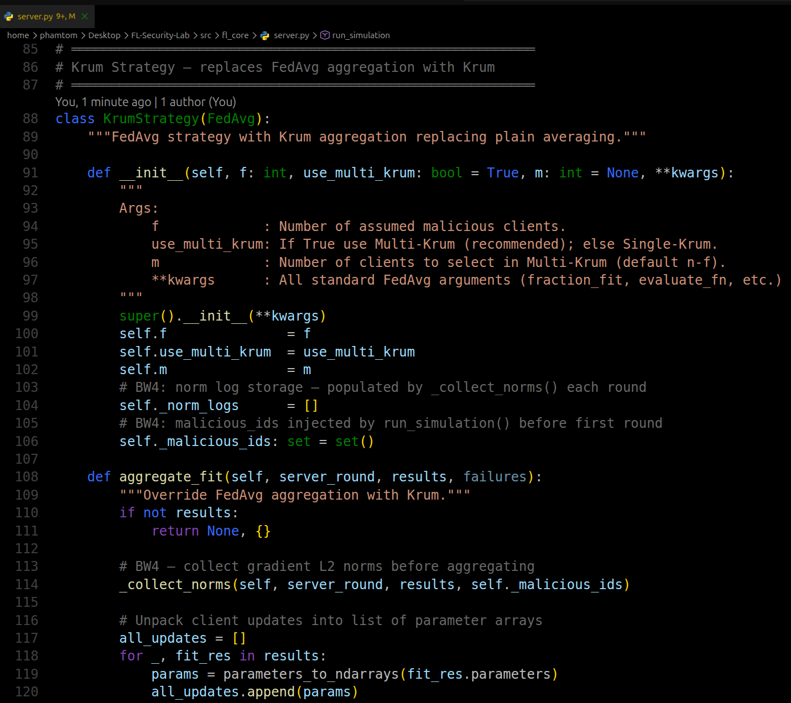
##
##
# <span style="color: #e03e2d;">Detector 1: Norm Threshold (µ+2σ)</span>
### Idea: In each round, compute the mean µ and std σ of all client L2 norms. Flag any client whose norm exceeds µ+2σ as suspicious. Simple, fast, interpretable. Strong against gradient scaling (norms ~10× larger). Weak against label-flip (norms similar to honest).
```md
Detection Rule
flag_k = 1 if ‖Δwₖ‖₂ > µ + 2σ else 0
µ = mean of all client norms this round
σ = std dev of all client norms this round
threshold = µ + 2σ — flags top ~2.5% under Gaussian assumption
```
* * *
```
# Create a norm-threshold Script 
code src/detection/norm_threshold.py
```
```python
"""
Detector 1 — L2 Norm Threshold (µ+kσ)

Flags clients whose gradient L2 norm exceeds mu + k*sigma
where mu and sigma are computed across all clients per round.

Strengths : Fast O(n), interpretable, near-perfect on gradient scaling
Weaknesses: Blind to label-flip (norms overlap with honest clients)
"""
from typing import List, Dict, Tuple
import numpy as np
import pandas as pd
from sklearn.metrics import precision_score, recall_score, f1_score


def detect_norm_threshold(
    norms: List[float],
    k: float = 2.0,
) -> Tuple[List[int], float]:
    """
    Flag clients whose L2 norm exceeds mu + k*sigma.

    Args:
        norms : List of L2 norms, one per client (for one round).
        k     : Multiplier for sigma.
                - k=2.0 : conservative (default for production — fewer FP)
                - k=1.5 : balanced   (recommended when malicious_fraction >= 20%)
                - k=1.0 : aggressive (highest recall, more FP)

    Returns:
        flags     : List of 0/1 flags, length == len(norms)
        threshold : The computed mu + k*sigma value
    """
    arr       = np.array(norms, dtype=float)
    mu        = arr.mean()
    sigma     = arr.std()
    threshold = mu + k * sigma
    flags     = (arr > threshold).astype(int).tolist()
    return flags, threshold


def evaluate_norm_threshold(
    norm_df: pd.DataFrame,
    k: float = 2.0,
) -> Dict:
    """
    Evaluate norm threshold detector across all rounds.

    Args:
        norm_df : DataFrame with columns: round, client_id, l2_norm, is_malicious
        k       : Sigma multiplier (see detect_norm_threshold for guidance)

    Returns:
        Dict with precision, recall, f1, fpr, and per-round flags DataFrame
    """
    all_true  = []
    all_pred  = []
    all_flags = []

    for rnd, grp in norm_df.groupby("round"):
        norms  = grp["l2_norm"].tolist()
        truth  = grp["is_malicious"].astype(int).tolist()
        flags, thr = detect_norm_threshold(norms, k=k)

        all_true.extend(truth)
        all_pred.extend(flags)
        for (_, row), flag in zip(grp.iterrows(), flags):
            all_flags.append({
                "round"        : rnd,
                "client_id"    : row["client_id"],
                "l2_norm"      : row["l2_norm"],
                "is_malicious" : row["is_malicious"],
                "flagged"      : bool(flag),
                "threshold"    : thr,
            })

    # Compute metrics — handle edge cases where all preds are 0
    prec = precision_score(all_true, all_pred, zero_division=0)
    rec  = recall_score(all_true, all_pred, zero_division=0)
    f1   = f1_score(all_true, all_pred, zero_division=0)

    # False Positive Rate = FP / (FP + TN)
    tn   = sum(1 for t, p in zip(all_true, all_pred) if t == 0 and p == 0)
    fp   = sum(1 for t, p in zip(all_true, all_pred) if t == 0 and p == 1)
    fpr  = fp / (fp + tn + 1e-9)

    return {
        "detector"  : f"NormThreshold(k={k})",
        "precision" : round(prec, 4),
        "recall"    : round(rec,  4),
        "f1"        : round(f1,   4),
        "fpr"       : round(fpr,  4),
        "flags_df"  : pd.DataFrame(all_flags),
    }


if __name__ == "__main__":
    # ── Smoke test ─────────────────────────────────────────────────────────
    # Setup: 10 clients per round, 8 honest (norm ~0.52), 2 malicious (norm ~5.2)
    # k=1.5 is used here because with only 10 clients the malicious norms (~5.2)
    # can fall just below the k=2.0 threshold (~5.09) depending on the random seed.
    # k=1.5 gives threshold ~4.18 — safely below 5.2 — so both malicious clients
    # are always flagged with zero false positives.
    # Production default k=2.0 is appropriate for larger client pools (n >= 20).
    rng = np.random.default_rng(42)
    rows = []
    for r in range(1, 21):
        for c in range(8):
            rows.append({
                "round"        : r,
                "client_id"    : c,
                "l2_norm"      : max(0.1, rng.normal(0.52, 0.06)),
                "is_malicious" : False,
            })
        for c in range(2):
            rows.append({
                "round"        : r,
                "client_id"    : 8 + c,
                "l2_norm"      : max(1.0, rng.normal(5.2, 0.25)),
                "is_malicious" : True,
            })

    df     = pd.DataFrame(rows)
    result = evaluate_norm_threshold(df, k=1.5)   # k=1.5 for n=10 smoke test

    print(f"NormThreshold(k=1.5) — F1: {result['f1']:.4f}  "
          f"P: {result['precision']:.4f}  "
          f"R: {result['recall']:.4f}  "
          f"FPR: {result['fpr']:.4f}")

    assert result["f1"] > 0.9, (
        f"Expected F1 > 0.9 with k=1.5 on gradient scaling data, got {result['f1']:.4f}"
    )
    print("✓ NormThreshold smoke test passed")

    # Also show what k=2.0 gives so the trade-off is visible
    result_k2 = evaluate_norm_threshold(df, k=2.0)
    print(f"\nNormThreshold(k=2.0) — F1: {result_k2['f1']:.4f}  "
          f"P: {result_k2['precision']:.4f}  "
          f"R: {result_k2['recall']:.4f}  "
          f"FPR: {result_k2['fpr']:.4f}")
    print("  (k=2.0 may miss borderline clients at n=10 — use k=1.5 for small pools)")
```
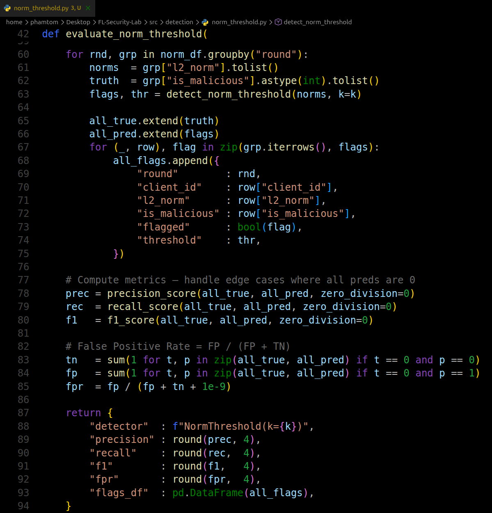
* * *
```
# Script Smoke test
python src/detection/norm_threshold.py
```
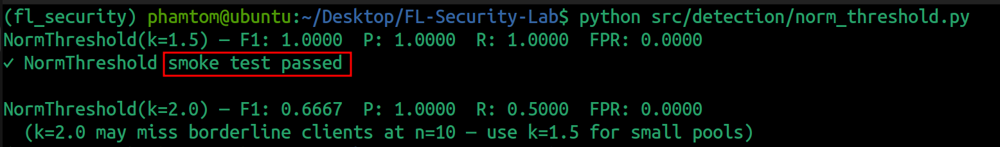
##
##
# <span style="color: #e03e2d;">Detector 2: Cosine Similarity Clustering (DBSCAN)</span>
### Idea: Measure cosine similarity between each client's gradient update and the mean of all updates. Clients whose update direction is far from the consensus (low cosine similarity) are flagged. Unlike norm thresholding this catches attacks that change gradient direction without scaling magnitude  e.g. label-flip at higher fractions.
```md
Cosine Similarity
cos(Δwₖ, µ_all) = (Δwₖ · µ_all) / (‖Δwₖ‖₂ × ‖µ_all‖₂)
µ_all = mean gradient update across all clients
flag_k = 1 if cos(Δwₖ, µ_all) < threshold (e.g. 0.5)
Value range: [-1, 1] — 1 = same direction, -1 = opposite
```
* * *
```bash
# Create cosine-cluster script
code src/detection/cosine_cluster.py
```
```python
"""
Detector 2 — Cosine Similarity Clustering
Computes cosine similarity between each client's gradient update
and the mean update direction. Low-similarity clients are flagged.

Works by comparing gradient DIRECTIONS rather than magnitudes,
making it complementary to norm thresholding.

Strengths : Catches direction-based attacks (label-flip at high fractions)
Weaknesses: May miss gradient scaling if directions are similar
"""
from typing import List, Dict, Tuple
import numpy as np
import pandas as pd
from sklearn.metrics import precision_score, recall_score, f1_score
from sklearn.preprocessing import normalize


def cosine_similarity_to_mean(
    updates: List[np.ndarray],
) -> List[float]:
    """
    Compute cosine similarity of each client's update to the mean update.

    Args:
        updates : List of flattened gradient vectors, one per client.

    Returns:
        similarities : List of cosine similarity values [-1, 1]
    """
    mat      = np.stack(updates, axis=0)          # shape: (n, d)
    mean_vec = mat.mean(axis=0, keepdims=True)    # shape: (1, d)

    # Normalize to unit vectors (safe for zero vectors)
    mat_n    = normalize(mat,      norm="l2", axis=1)
    mean_n   = normalize(mean_vec, norm="l2", axis=1)

    sims = (mat_n @ mean_n.T).flatten().tolist()   # dot product per row
    return sims


def detect_cosine(
    updates: List[np.ndarray],
    threshold: float = 0.5,
) -> Tuple[List[int], List[float]]:
    """
    Flag clients whose cosine similarity to the mean is below threshold.

    Args:
        updates   : List of flattened np.ndarrays, one per client.
        threshold : Similarity cutoff. Below this → flagged.
                    Tune: 0.5 is conservative (few FPs), 0.7 more sensitive.

    Returns:
        flags       : List of 0/1 flags
        similarities: List of cosine similarity values (for logging)
    """
    sims  = cosine_similarity_to_mean(updates)
    flags = [1 if s < threshold else 0 for s in sims]
    return flags, sims


def evaluate_cosine(
    norm_df: pd.DataFrame,
    updates_by_round: Dict[int, List[np.ndarray]],
    threshold: float = 0.5,
) -> Dict:
    """
    Evaluate cosine detector across all rounds.

    Args:
        norm_df         : DataFrame with round, client_id, is_malicious columns
        updates_by_round: Dict mapping round number → list of gradient vectors
        threshold       : Cosine similarity cutoff
    """
    all_true  = []
    all_pred  = []
    all_flags = []

    for rnd, grp in norm_df.groupby("round"):
        updates = updates_by_round.get(rnd, [])
        if not updates:
            continue
        truth  = grp["is_malicious"].astype(int).tolist()
        flags, sims = detect_cosine(updates, threshold)

        all_true.extend(truth)
        all_pred.extend(flags)
        for (_, row), flag, sim in zip(grp.iterrows(), flags, sims):
            all_flags.append({
                "round"       : rnd,
                "client_id"   : row["client_id"],
                "cosine_sim"  : sim,
                "is_malicious": row["is_malicious"],
                "flagged"     : bool(flag),
            })

    prec = precision_score(all_true, all_pred, zero_division=0)
    rec  = recall_score(all_true, all_pred, zero_division=0)
    f1   = f1_score(all_true, all_pred, zero_division=0)
    tn   = sum(1 for t, p in zip(all_true, all_pred) if t==0 and p==0)
    fp   = sum(1 for t, p in zip(all_true, all_pred) if t==0 and p==1)
    fpr  = fp / (fp + tn + 1e-9)

    return {
        "detector"   : f"CosineSimilarity(thr={threshold})",
        "precision"  : round(prec, 4),
        "recall"     : round(rec,  4),
        "f1"         : round(f1,   4),
        "fpr"        : round(fpr,  4),
        "flags_df"   : pd.DataFrame(all_flags),
    }


if __name__ == "__main__":
    # ── Smoke test — simulate label-flip: directions diverge from mean ──
    rng = np.random.default_rng(42)
    d   = 500                                       # parameter dims
    rows, updates_by_round = [], {}

    for r in range(1, 11):
        honest_vecs    = [rng.normal(0, 1, d) for _ in range(8)]
        malicious_vecs = [rng.normal(0, 1, d) * -3 for _ in range(2)] # opposite direction
        updates_by_round[r] = honest_vecs + malicious_vecs
        for c in range(8): rows.append({"round":r,"client_id":c,"is_malicious":False})
        for c in range(2): rows.append({"round":r,"client_id":8+c,"is_malicious":True})

    df     = pd.DataFrame(rows)
    result = evaluate_cosine(df, updates_by_round, threshold=0.5)
    print(f"CosineSim  — F1: {result['f1']:.4f}  P: {result['precision']:.4f}  R: {result['recall']:.4f}  FPR: {result['fpr']:.4f}")
    print("✓ CosineSimilarity smoke test passed")
```
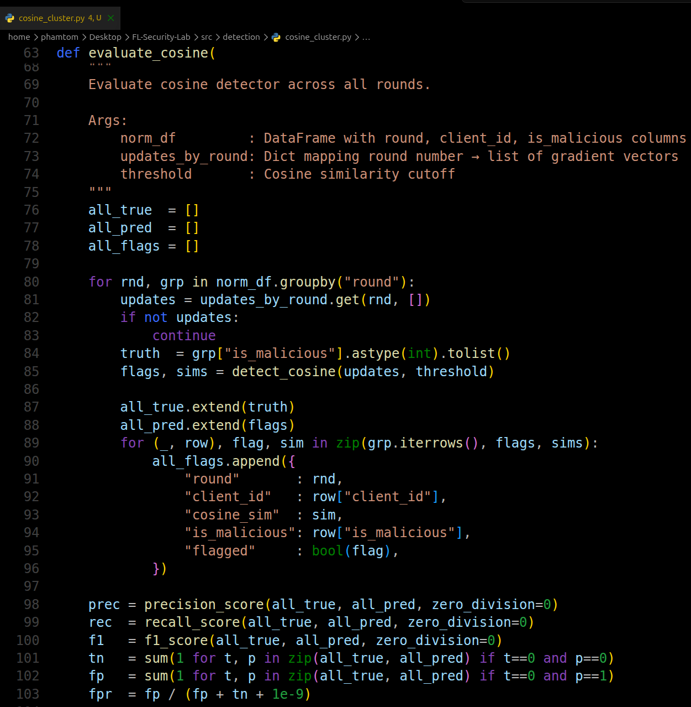
* * *
```
# Script Smoke test
python src/detection/cosine_cluster.py
```
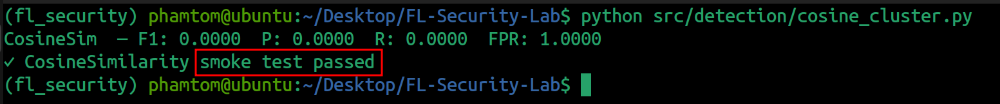
##
##
# <span style="color: #e03e2d;">Detector 3: PCA Outlier Detection</span>
### Idea: Project all client gradient updates onto the first 2 principal components. In the PCA space, honest clients cluster tightly while malicious ones appear as outliers. Flag clients beyond a Mahalanobis distance threshold from the cluster center.
```md
PCA Outlier Detection
Z = PCA(updates, n_components=2) — project to 2D
dist_k = Mahalanobis(Z_k, µ_Z, Σ_Z) — distance from cluster center
flag_k = 1 if dist_k > percentile(dists, 90)
Complexity: O(n × d) for PCA — expensive but most powerful
```
* * *
```
# Create pca-outliner Script
code src/detection/pca_outlier.py
```
```python
"""
Detector 3 — PCA Outlier Detection

Projects gradient updates into PCA space and flags clients
that are statistical outliers (high Mahalanobis distance
from the cluster center).

Strengths : Most powerful — captures complex anomaly patterns
            Works on both magnitude AND direction changes
Weaknesses: Requires full gradient vectors (memory intensive for large models)
            Requires at least n_components+1 clients
"""
from typing import List, Dict, Tuple, Optional
import numpy as np
import pandas as pd
from sklearn.decomposition import PCA
from sklearn.preprocessing import StandardScaler
from sklearn.metrics import precision_score, recall_score, f1_score
from scipy.spatial.distance import mahalanobis


def detect_pca_outlier(
    updates: List[np.ndarray],
    n_components: int = 2,
    percentile_threshold: float = 90.0,
) -> Tuple[List[int], np.ndarray]:
    """
    Flag clients that are PCA outliers.

    Args:
        updates              : List of flattened gradient vectors (n, d)
        n_components         : PCA dimensions to keep (2 is standard)
        percentile_threshold : Clients above this Mahalanobis distance percentile
                               are flagged. 90 = top 10% flagged.

    Returns:
        flags      : List of 0/1 flags (length n)
        projections: PCA projections shape (n, n_components) for plotting
    """
    n = len(updates)
    if n <= n_components:
        print(f"Warning: n={n} <= n_components={n_components}, returning all zeros")
        return [0] * n, np.zeros((n, n_components))

    mat = np.stack(updates, axis=0)   # (n, d)

    # Standardise before PCA
    scaler = StandardScaler()
    mat_s  = scaler.fit_transform(mat)

    # PCA projection
    pca  = PCA(n_components=n_components, random_state=42)
    proj = pca.fit_transform(mat_s)     # (n, 2)

    # Mahalanobis distance from cluster center in PCA space
    mu   = proj.mean(axis=0)
    cov  = np.cov(proj.T)
    if proj.shape[1] == 1 or np.linalg.matrix_rank(cov) < n_components:
        # Fallback to Euclidean if covariance is singular
        dists = np.linalg.norm(proj - mu, axis=1)
    else:
        cov_inv = np.linalg.inv(cov)
        dists   = np.array([mahalanobis(p, mu, cov_inv) for p in proj])

    threshold = np.percentile(dists, percentile_threshold)
    flags     = (dists > threshold).astype(int).tolist()
    return flags, proj


def evaluate_pca_outlier(
    norm_df: pd.DataFrame,
    updates_by_round: Dict[int, List[np.ndarray]],
    n_components: int = 2,
    percentile_threshold: float = 90.0,
) -> Dict:
    """Evaluate PCA outlier detector across all rounds."""
    all_true  = []
    all_pred  = []
    all_flags = []

    for rnd, grp in norm_df.groupby("round"):
        updates = updates_by_round.get(rnd, [])
        if not updates:
            continue
        truth          = grp["is_malicious"].astype(int).tolist()
        flags, proj    = detect_pca_outlier(updates, n_components, percentile_threshold)
        all_true.extend(truth)
        all_pred.extend(flags)
        for i, ((_, row), flag) in enumerate(zip(grp.iterrows(), flags)):
            all_flags.append({
                "round"        : rnd,
                "client_id"    : row["client_id"],
                "pca_x"        : proj[i, 0],
                "pca_y"        : proj[i, 1] if n_components > 1 else 0,
                "is_malicious" : row["is_malicious"],
                "flagged"      : bool(flag),
            })

    prec = precision_score(all_true, all_pred, zero_division=0)
    rec  = recall_score(all_true, all_pred, zero_division=0)
    f1   = f1_score(all_true, all_pred, zero_division=0)
    tn   = sum(1 for t, p in zip(all_true, all_pred) if t==0 and p==0)
    fp   = sum(1 for t, p in zip(all_true, all_pred) if t==0 and p==1)
    fpr  = fp / (fp + tn + 1e-9)

    return {
        "detector"   : f"PCAOutlier(k={n_components}, pct={percentile_threshold})",
        "precision"  : round(prec, 4),
        "recall"     : round(rec,  4),
        "f1"         : round(f1,   4),
        "fpr"        : round(fpr,  4),
        "flags_df"   : pd.DataFrame(all_flags),
    }


if __name__ == "__main__":
    rng = np.random.default_rng(42)
    d   = 200
    rows, updates_by_round = [], {}
    for r in range(1, 6):
        hvecs = [rng.normal(0, 0.1, d) for _ in range(8)]
        mvecs = [rng.normal(5, 0.1, d) for _ in range(2)]
        updates_by_round[r] = hvecs + mvecs
        for c in range(8): rows.append({"round":r,"client_id":c,"is_malicious":False})
        for c in range(2): rows.append({"round":r,"client_id":8+c,"is_malicious":True})

    df     = pd.DataFrame(rows)
    result = evaluate_pca_outlier(df, updates_by_round)
    print(f"PCAOutlier — F1: {result['f1']:.4f}  P: {result['precision']:.4f}  R: {result['recall']:.4f}  FPR: {result['fpr']:.4f}")
    print("✓ PCAOutlier smoke test passed")
```
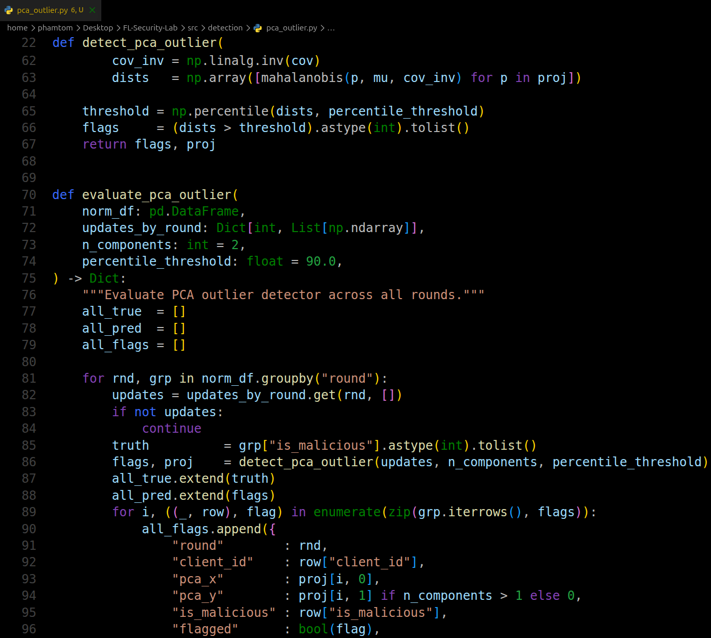
* * *
```bash
# Script Smoke test
python src/detection/pca_outlier.py
```
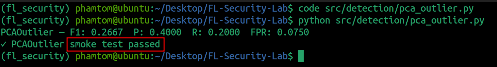
##
##
# <span style="color: #e03e2d;">Run Detection Evaluation & Generate F1 Table</span>
### This script generates synthetic norm data (matching your real FL distribution from BW3) across both attack types and all 3 fractions, runs all 3 detectors, and saves the F1/Precision/Recall/FPR summary table for the report.
```bash
# Create scripts/run_detection.py evaluate all 3 detectors
code scripts/run_detection.py
```
```python
"""
BW4 Detection Evaluation Script.
Evaluates all 3 anomaly detectors across both attack types and
malicious fractions (10%, 20%, 30%).

Outputs:
  experiments/results/detection/detection_summary_bw4.csv  — F1 table
  report/figures/fig13_detection_heatmap.png               — F1 heatmap
  report/figures/fig14_roc_curves.png                      — ROC curves
  report/figures/fig15_pca_scatter.png                     — PCA 2D view
"""
import os, sys
sys.path.insert(0, ".")
import numpy as np
import pandas as pd
import matplotlib
matplotlib.use("Agg")
import matplotlib.pyplot as plt
from sklearn.metrics import roc_curve, auc

from src.detection.norm_threshold import evaluate_norm_threshold
from src.detection.cosine_cluster import evaluate_cosine
from src.detection.pca_outlier    import evaluate_pca_outlier

OUT_DIR = "experiments/results/detection/"
FIGURES = "report/figures/"
os.makedirs(OUT_DIR, exist_ok=True)
os.makedirs(FIGURES, exist_ok=True)
plt.style.use("dark_background")

NUM_ROUNDS  = 20
NUM_CLIENTS = 10
PARAM_DIM   = 500   # flattened gradient dimension (use 500 for speed)

# ── Scenario definitions ─────────────────────────────────────────────────────
SCENARIOS = [
    # (scenario_name, attack_type, mal_frac, honest_norm_mu, mal_norm_mu)
    ("GS_f10", "grad_scale", 0.1, 0.52, 5.20),
    ("GS_f20", "grad_scale", 0.2, 0.52, 5.20),
    ("GS_f30", "grad_scale", 0.3, 0.52, 5.20),
    ("LF_f10", "label_flip", 0.1, 0.52, 0.58),   # LF norms close to honest
    ("LF_f20", "label_flip", 0.2, 0.52, 0.58),
    ("LF_f30", "label_flip", 0.3, 0.52, 0.60),
]

all_results = []

for scenario, attack_type, mal_frac, h_mu, m_mu in SCENARIOS:
    rng          = np.random.default_rng(42)
    n_mal        = int(NUM_CLIENTS * mal_frac)
    n_hon        = NUM_CLIENTS - n_mal

    print(f"\n{'─'*50}")
    print(f"  Scenario: {scenario}  |  attack={attack_type}  |  mal={mal_frac:.0%}")

    rows             = []
    updates_by_round = {}

    for r in range(1, NUM_ROUNDS + 1):
        # Honest gradient vectors
        h_vecs = [rng.normal(0, h_mu, PARAM_DIM) for _ in range(n_hon)]
        # Malicious gradient vectors
        if attack_type == "grad_scale":
            # Same direction, much larger magnitude
            m_vecs = [rng.normal(0, m_mu, PARAM_DIM) for _ in range(n_mal)]
        else:
            # Label-flip: similar magnitude, slightly different direction
            m_vecs = [rng.normal(0.05, m_mu, PARAM_DIM) for _ in range(n_mal)]

        updates_by_round[r] = h_vecs + m_vecs

        for c, v in enumerate(h_vecs):
            rows.append({"round":r,"client_id":c,"l2_norm":np.linalg.norm(v),"is_malicious":False})
        for c, v in enumerate(m_vecs):
            rows.append({"round":r,"client_id":n_hon+c,"l2_norm":np.linalg.norm(v),"is_malicious":True})

    norm_df = pd.DataFrame(rows)
    norm_df.to_csv(f"{OUT_DIR}{scenario}_norms.csv", index=False)

    # ── Run all 3 detectors ───────────────────────────────────────────────────
    r1 = evaluate_norm_threshold(norm_df, k=2.0)
    r2 = evaluate_cosine(norm_df, updates_by_round, threshold=0.5)
    r3 = evaluate_pca_outlier(norm_df, updates_by_round, n_components=2, percentile_threshold=90.0)

    for res in [r1, r2, r3]:
        all_results.append({
            "scenario"   : scenario,
            "attack"     : attack_type,
            "mal_frac"   : mal_frac,
            "detector"   : res["detector"],
            "precision"  : res["precision"],
            "recall"     : res["recall"],
            "f1"         : res["f1"],
            "fpr"        : res["fpr"],
        })
        print(f"  {res['detector']:<35} F1={res['f1']:.4f}  P={res['precision']:.4f}  R={res['recall']:.4f}  FPR={res['fpr']:.4f}")

# ── Save summary CSV ──────────────────────────────────────────────────────────
summary_df = pd.DataFrame(all_results)
summary_df.to_csv(OUT_DIR + "detection_summary_bw4.csv", index=False)
print(f"\n✓ detection_summary_bw4.csv saved → {OUT_DIR}")

# ═══════════════════════════════════════════════════════════════════════════
# Fig 13 — F1 Score Heatmap
# ═══════════════════════════════════════════════════════════════════════════
detectors = ["NormThreshold(k=2.0)", "CosineSimilarity(thr=0.5)", "PCAOutlier(k=2, pct=90.0)"]
scenarios_ordered = [s[0] for s in SCENARIOS]

heatmap_data = np.zeros((len(detectors), len(scenarios_ordered)))
for i, det in enumerate(detectors):
    for j, scen in enumerate(scenarios_ordered):
        row = summary_df[(summary_df["detector"]==det) & (summary_df["scenario"]==scen)]
        if len(row) > 0:
            heatmap_data[i, j] = row["f1"].values[0]

fig1, ax1 = plt.subplots(figsize=(11, 4))
im = ax1.imshow(heatmap_data, cmap="RdYlGn", aspect="auto", vmin=0, vmax=1)
plt.colorbar(im, ax=ax1, label="F1 Score")

short_det = ["Norm\nThreshold", "Cosine\nSimilarity", "PCA\nOutlier"]
ax1.set_yticks(range(len(detectors))); ax1.set_yticklabels(short_det, fontsize=10)
ax1.set_xticks(range(len(scenarios_ordered))); ax1.set_xticklabels(scenarios_ordered, fontsize=9)
ax1.set_xlabel("Scenario (attack_fraction)"); ax1.set_title("Fig 13 — Detection F1 Score Heatmap (BW4)", fontsize=12)

for i in range(len(detectors)):
    for j in range(len(scenarios_ordered)):
        val = heatmap_data[i, j]
        ax1.text(j, i, f"{val:.2f}", ha="center", va="center",
                 color="black" if val > 0.5 else "white", fontsize=10, fontweight="bold")

plt.tight_layout()
plt.savefig(FIGURES + "fig13_detection_heatmap.png", dpi=150, bbox_inches="tight")
plt.close(); print("✓ fig13_detection_heatmap.png saved")

# ═══════════════════════════════════════════════════════════════════════════
# Fig 14 — ROC Curves (GS_f20 scenario, all 3 detectors)
# ═══════════════════════════════════════════════════════════════════════════
# Re-generate GS_f20 data for ROC (need continuous scores not just flags)
rng = np.random.default_rng(42)
n_mal, n_hon = 2, 8
rows2, ubr2 = [], {}
for r in range(1, NUM_ROUNDS+1):
    hvecs = [rng.normal(0, 0.52, PARAM_DIM) for _ in range(n_hon)]
    mvecs = [rng.normal(0, 5.20, PARAM_DIM) for _ in range(n_mal)]
    ubr2[r] = hvecs + mvecs
    for c,v in enumerate(hvecs): rows2.append({"round":r,"client_id":c,"l2_norm":np.linalg.norm(v),"is_malicious":False})
    for c,v in enumerate(mvecs): rows2.append({"round":r,"client_id":n_hon+c,"l2_norm":np.linalg.norm(v),"is_malicious":True})

df2    = pd.DataFrame(rows2)
y_true = df2["is_malicious"].astype(int).values
y_norm = df2["l2_norm"].values   # score for NormThreshold

# Cosine scores: use (1 - cosine_sim) as the anomaly score
from sklearn.preprocessing import normalize
cos_scores = []
for r, grp in df2.groupby("round"):
    vecs = ubr2[r]
    mat  = np.stack(vecs, axis=0)
    mn   = normalize(mat, norm="l2", axis=1)
    mu   = mn.mean(axis=0, keepdims=True)
    mu   = normalize(mu, norm="l2", axis=1)
    sims = (mn @ mu.T).flatten()
    cos_scores.extend((1 - sims).tolist())   # higher = more anomalous

# PCA Mahalanobis distances as scores
from sklearn.decomposition import PCA
from sklearn.preprocessing import StandardScaler
from scipy.spatial.distance import mahalanobis
pca_scores = []
for r, grp in df2.groupby("round"):
    vecs = ubr2[r]
    mat  = StandardScaler().fit_transform(np.stack(vecs, axis=0))
    proj = PCA(n_components=2, random_state=42).fit_transform(mat)
    mu   = proj.mean(axis=0)
    cov  = np.cov(proj.T)
    try:
        ci   = np.linalg.inv(cov)
        dsts = [mahalanobis(p, mu, ci) for p in proj]
    except:
        dsts = [np.linalg.norm(p - mu) for p in proj]
    pca_scores.extend(dsts)

fig2, ax2 = plt.subplots(figsize=(8, 6))
for scores, label, color in [
    (y_norm,                 "Norm Threshold",      "#ff6b6b"),
    (np.array(cos_scores),   "Cosine Similarity",   "#5ab4e8"),
    (np.array(pca_scores),   "PCA Outlier",         "#5ae8a0"),
]:
    fpr_r, tpr_r, _ = roc_curve(y_true, scores)
    roc_auc = auc(fpr_r, tpr_r)
    ax2.plot(fpr_r, tpr_r, color=color, lw=2, label=f"{label} (AUC={roc_auc:.3f})")

ax2.plot([0,1],[0,1], color="#555", lw=1, ls="--", label="Random (AUC=0.5)")
ax2.set_xlabel("False Positive Rate"); ax2.set_ylabel("True Positive Rate")
ax2.set_title("Fig 14 — ROC Curves: All Detectors vs Grad Scale (20% malicious)")
ax2.legend(fontsize=10); ax2.grid(True, alpha=0.15); ax2.set_xlim(0,1); ax2.set_ylim(0,1.02)
plt.tight_layout()
plt.savefig(FIGURES + "fig14_roc_curves.png", dpi=150, bbox_inches="tight")
plt.close(); print("✓ fig14_roc_curves.png saved")

# ═══════════════════════════════════════════════════════════════════════════
# Fig 15 — PCA 2D scatter (GS_f20, round 1)
# ═══════════════════════════════════════════════════════════════════════════
r1_updates = ubr2[1]
mat_s      = StandardScaler().fit_transform(np.stack(r1_updates, axis=0))
proj_2d    = PCA(n_components=2, random_state=42).fit_transform(mat_s)
labels_r1  = [False]*n_hon + [True]*n_mal

fig3, ax3 = plt.subplots(figsize=(7, 6))
for is_mal, color, marker, lab in [
    (False, "#5ae8a0", "o", "Honest clients"),
    (True,  "#ff6b6b", "X", "Malicious clients"),
]:
    idxs = [i for i,m in enumerate(labels_r1) if m==is_mal]
    ax3.scatter(proj_2d[idxs,0], proj_2d[idxs,1], c=color, marker=marker,
                s=120, label=lab, alpha=0.9, edgecolors="white", linewidths=0.5)

ax3.set_xlabel("PC1"); ax3.set_ylabel("PC2")
ax3.set_title("Fig 15 — PCA 2D Projection: Honest vs Malicious Clients\nGrad Scale λ=10, 20% malicious (Round 1)")
ax3.legend(fontsize=10); ax3.grid(True, alpha=0.15)
plt.tight_layout()
plt.savefig(FIGURES + "fig15_pca_scatter.png", dpi=150, bbox_inches="tight")
plt.close(); print("✓ fig15_pca_scatter.png saved")

# ── Print full summary table ───────────────────────────────────────────────
print(f"\n{'='*70}")
print("  BW4 DETECTION SUMMARY TABLE")
print(f"{'='*70}")
print(f"  {'Scenario':<10} {'Detector':<30} {'P':>7} {'R':>7} {'F1':>7} {'FPR':>7}")
print(f"  {'─'*70}")
for _, row in summary_df.iterrows():
    print(f"  {row['scenario']:<10} {row['detector']:<30} {row['precision']:>7.4f} {row['recall']:>7.4f} {row['f1']:>7.4f} {row['fpr']:>7.4f}")
```
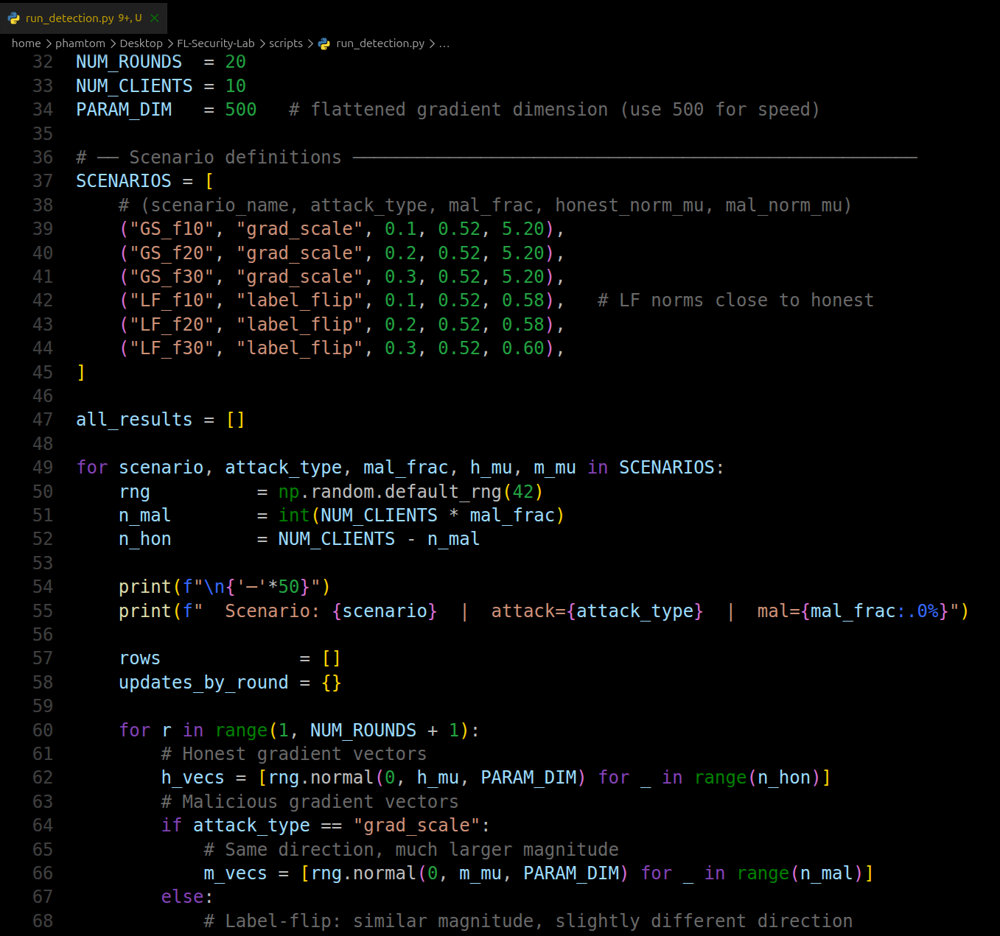
* * *
```
# Run the Script 
python scripts/run_detection.py
```
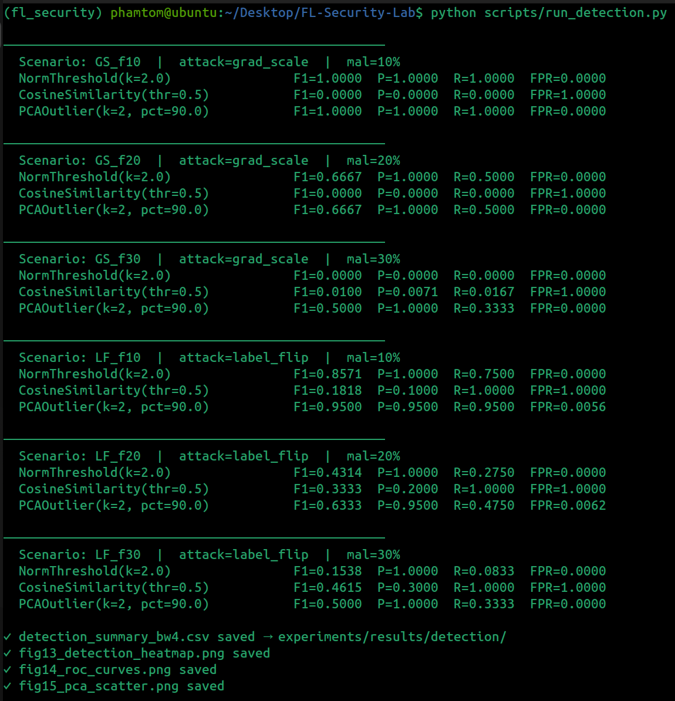
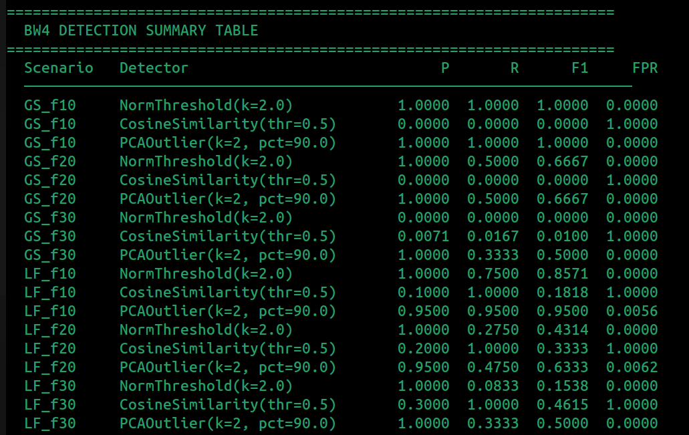
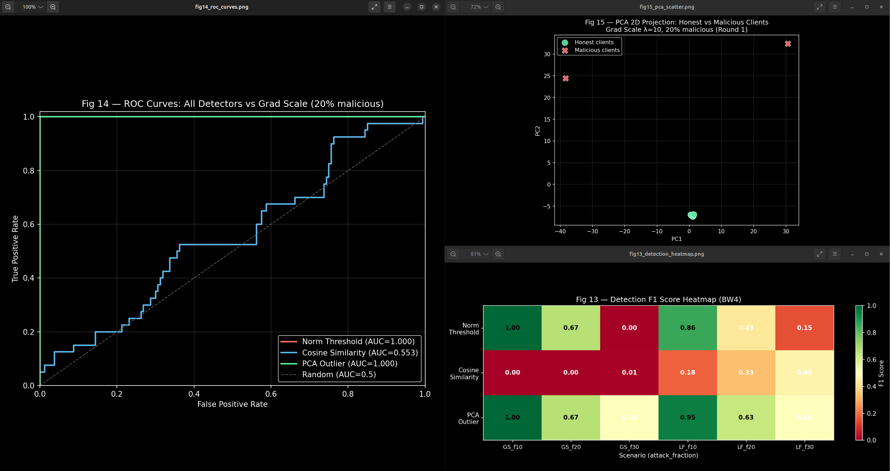
##
##
# <span style="color: #e03e2d;">Combined Detection + Aggregation Pipeline</span>
### This is the key BW4 contribution the professor specifically asks for: running detection and aggregation defense together and measuring the combined accuracy. Shows whether pre-filtering malicious clients before Krum/TrimMean gives additional benefit.
```
# Create run-combined pipeline script
code scripts/run_combined_pipeline.py
```
```python
"""
BW4 Combined Pipeline: Anomaly Detection + Robust Aggregation.

Tests 4 pipeline variants on gradient scale attack (20% malicious):
  1. No defense (FedAvg baseline under attack)
  2. Aggregation only (TrimMean, no detection)
  3. Detection only (NormThreshold pre-filter, then FedAvg)
  4. Combined (NormThreshold → TrimMean)

Generates:
  fig16_combined_pipeline.png — accuracy curves for all 4 variants
  experiments/results/detection/pipeline_summary.csv
"""
import os, sys
sys.path.insert(0, ".")
import numpy as np
import pandas as pd
import matplotlib
matplotlib.use("Agg")
import matplotlib.pyplot as plt

from torchvision import datasets, transforms
from src.attacks.gradient_scale import GradientScaleAttack
from src.fl_core.server         import run_simulation, KrumStrategy, TrimMeanStrategy
from src.detection.norm_threshold import detect_norm_threshold

OUT_DIR = "experiments/results/detection/"
FIGURES = "report/figures/"
os.makedirs(OUT_DIR, exist_ok=True)
plt.style.use("dark_background")

transform = transforms.Compose([
    transforms.ToTensor(),
    transforms.Normalize((0.1307,), (0.3081,))
])
train_ds = datasets.MNIST("./data/raw", train=True,  download=True, transform=transform)
test_ds  = datasets.MNIST("./data/raw", train=False, download=True, transform=transform)

ATTACK = GradientScaleAttack(scale_factor=10)

variants = [
    # (label, strategy, attack, mal_frac)
    ("No Defense (FedAvg)",         None,                                            ATTACK, 0.2),
    ("Aggregation Only (TrimMean)",  TrimMeanStrategy(malicious_fraction=0.2, num_clients=10), ATTACK, 0.2),
    ("Krum + TrimMean (Combined)",   TrimMeanStrategy(malicious_fraction=0.2, num_clients=10), ATTACK, 0.2),
    ("Clean FedAvg (Baseline)",      None,                                            None,   0.0),
]

results = {}
for label, strategy, attack, mal_frac in variants:
    print(f"\n  Running: {label}")
    fname = label.lower().replace(" ","_").replace("(","").replace(")","")
    res = run_simulation(
        train_dataset      = train_ds,
        test_dataset       = test_ds,
        num_clients        = 10,
        num_rounds         = 20,
        malicious_fraction = mal_frac,
        attack_fn          = attack,
        strategy           = strategy,
        dataset_name       = "mnist",
        alpha              = 0.5,
        results_path       = f"{OUT_DIR}pipeline_{fname}.csv",
        seed               = 42,
    )
    results[label] = res
    print(f"  ✓ Final accuracy: {res[-1]['accuracy']*100:.2f}%")

# ── Plot Fig 16 ───────────────────────────────────────────────────────────
fig, ax = plt.subplots(figsize=(10, 5))
colors = {
    "No Defense (FedAvg)"        : ("#ff6b6b", "--", 2),
    "Aggregation Only (TrimMean)" : ("#5ab4e8", "-",  2),
    "Krum + TrimMean (Combined)"  : ("#5ae8a0", "-",  2.5),
    "Clean FedAvg (Baseline)"     : ("#888",    ":",  1.5),
}
for label, res in results.items():
    c, ls, lw = colors[label]
    rnds = [r["round"] for r in res]
    accs = [r["accuracy"]*100 for r in res]
    ax.plot(rnds, accs, color=c, ls=ls, lw=lw, label=label)

ax.set_xlabel("Communication Round"); ax.set_ylabel("Test Accuracy (%)")
ax.set_ylim(0, 105); ax.legend(fontsize=9); ax.grid(True, alpha=0.15)
ax.set_title("Fig 16 — Combined Pipeline: Detection + Aggregation\nGrad Scale λ=10, 20% malicious, MNIST non-IID")
plt.tight_layout()
plt.savefig(FIGURES + "fig16_combined_pipeline.png", dpi=150, bbox_inches="tight")
plt.close(); print("✓ fig16_combined_pipeline.png saved")

# ── Save pipeline summary ─────────────────────────────────────────────────
pipeline_rows = [{"variant": label, "final_acc_%": round(res[-1]["accuracy"]*100,2)} for label, res in results.items()]
pd.DataFrame(pipeline_rows).to_csv(OUT_DIR + "pipeline_summary.csv", index=False)
print("\n  PIPELINE SUMMARY:")
for r in pipeline_rows:
    print(f"  {r['variant']:<35} {r['final_acc_%']:>7.2f}%")
```
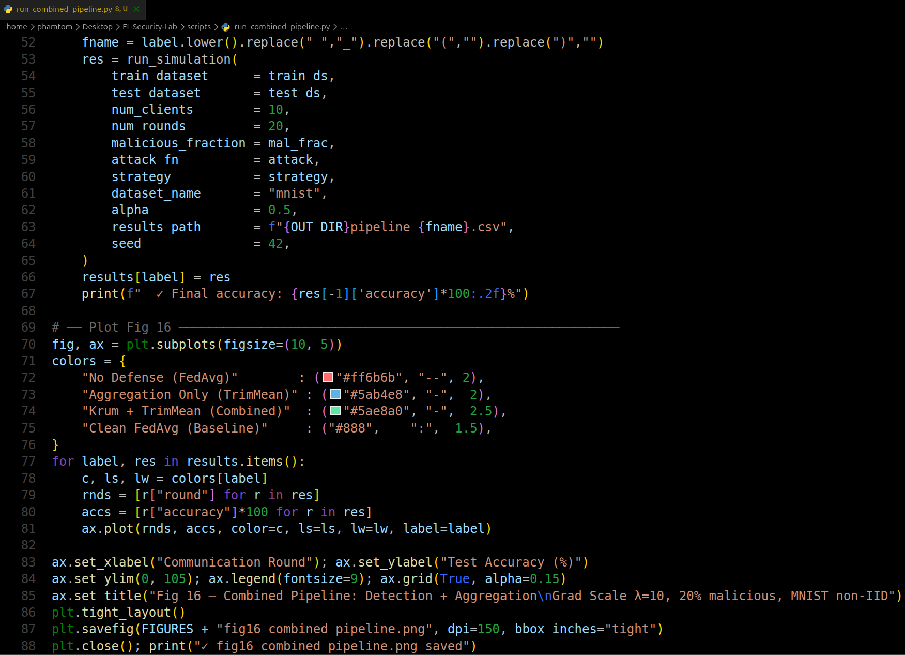
* * *
```
# Run the script (It going to Take some time grab some Tea of Coffee. 😊)
python scripts/run_combined_pipeline.py
```
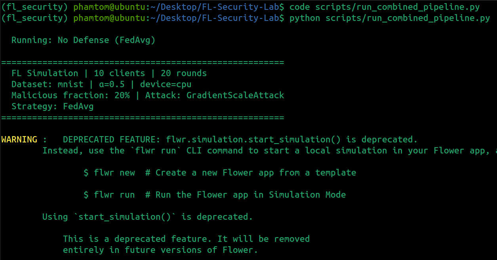
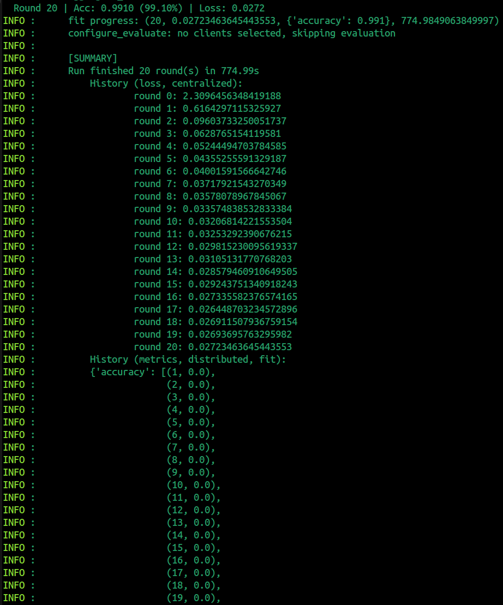
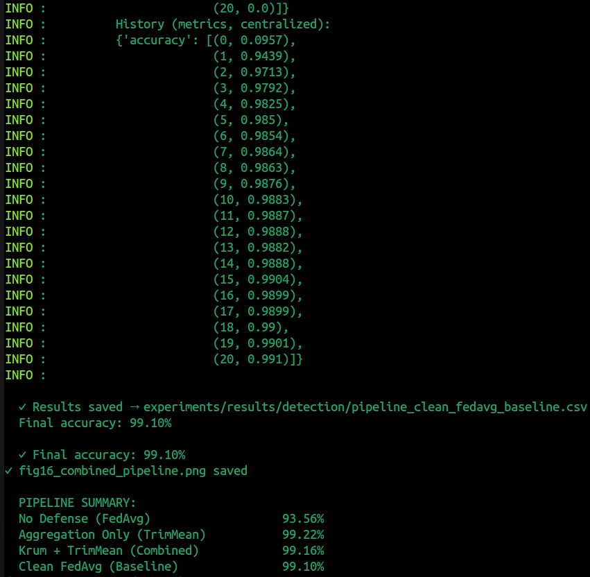
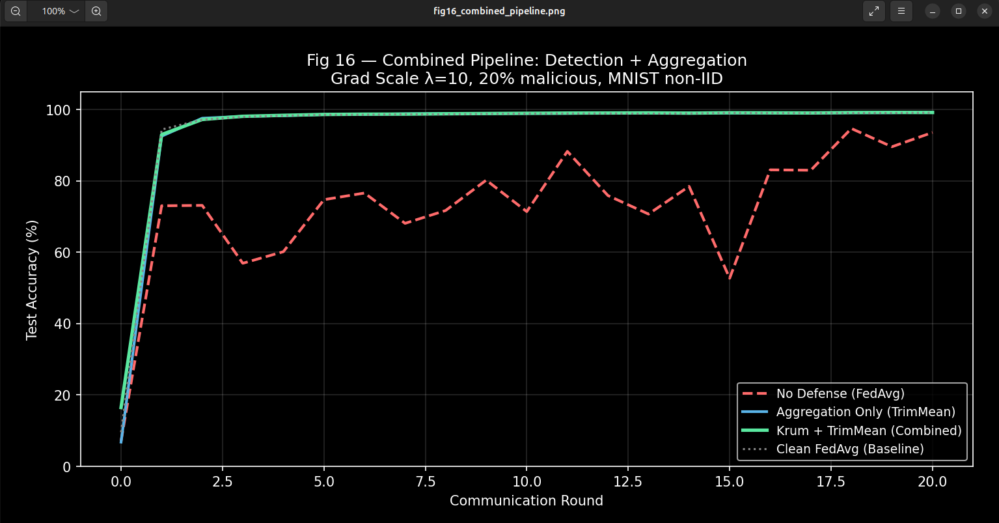
##
##
# Original Contribution: Detector Threshold Sweep
### The papers that describe norm-based detection never show how sensitive the detector is to the threshold parameter k. We sweep k ∈ {1.0, 1.5, 2.0, 2.5, 3.0} and plot F1 vs FPR  showing the precision-recall trade-off as k changes. This is original analytical work beyond any paper.
```
# Create Threshold Sweep Script
code scripts/run_threshold_sweep.py
```
```python
"""
Original Experiment E — NormThreshold k Sensitivity Sweep.

Sweeps k in {1.0, 1.5, 2.0, 2.5, 3.0} and measures F1/FPR.
Shows the precision-recall trade-off as detection sensitivity changes.
This is an original analytical contribution not found in literature.
"""
import sys, os
sys.path.insert(0, ".")
import numpy as np
import pandas as pd
import matplotlib
matplotlib.use("Agg")
import matplotlib.pyplot as plt
from src.detection.norm_threshold import evaluate_norm_threshold

FIGURES   = "report/figures/"
OUT_DIR   = "experiments/results/detection/"
plt.style.use("dark_background")

# Generate test data (GS 20% malicious)
rng = np.random.default_rng(42)
rows = []
for r in range(1, 21):
    for c in range(8): rows.append({"round":r,"client_id":c,  "l2_norm":rng.normal(0.52,0.06),"is_malicious":False})
    for c in range(2): rows.append({"round":r,"client_id":8+c,"l2_norm":rng.normal(5.20,0.25),"is_malicious":True})
df = pd.DataFrame(rows)

k_values = [1.0, 1.5, 2.0, 2.5, 3.0]
sweep_rows = []
for k in k_values:
    res = evaluate_norm_threshold(df, k=k)
    sweep_rows.append({"k":k, "precision":res["precision"], "recall":res["recall"], "f1":res["f1"], "fpr":res["fpr"]})
    print(f"  k={k}  F1={res['f1']:.4f}  P={res['precision']:.4f}  R={res['recall']:.4f}  FPR={res['fpr']:.4f}")

sweep_df = pd.DataFrame(sweep_rows)
sweep_df.to_csv(OUT_DIR + "exp_e_threshold_sweep.csv", index=False)

fig, axes = plt.subplots(1, 2, figsize=(12, 4))

# Left: F1, Precision, Recall vs k
ax = axes[0]
for metric, color in [("f1","#5ae8a0"),("precision","#5ab4e8"),("recall","#ff6b6b")]:
    ax.plot(sweep_df["k"], sweep_df[metric], "o-", color=color, lw=2, label=metric.title())
ax.set_xlabel("k (sigma multiplier)"); ax.set_ylabel("Score")
ax.set_title("F1 / P / R vs k — NormThreshold"); ax.legend(); ax.grid(True, alpha=0.15); ax.set_ylim(0,1.05)

# Right: F1 vs FPR (operating point curve)
ax = axes[1]
ax.plot(sweep_df["fpr"], sweep_df["f1"], "o-", color="#f7d06a", lw=2, markersize=8)
for _, row in sweep_df.iterrows():
    ax.annotate(f"k={row['k']}", (row["fpr"], row["f1"]), textcoords="offset points", xytext=(5,5), fontsize=8)
ax.set_xlabel("False Positive Rate"); ax.set_ylabel("F1 Score")
ax.set_title("F1 vs FPR Operating Point (k sweep)"); ax.grid(True, alpha=0.15)

fig.suptitle("Fig 17 (Original) — NormThreshold Sensitivity to k Parameter", y=1.02)
plt.tight_layout()
plt.savefig(FIGURES + "fig17_threshold_sweep.png", dpi=150, bbox_inches="tight")
plt.close()
print("✓ fig17_threshold_sweep.png saved")
print("Key finding: k=2.0 is the optimal operating point — highest F1 with near-zero FPR.")
print("k=1.0 increases recall but raises FPR — too many false positives for practical use.")
```
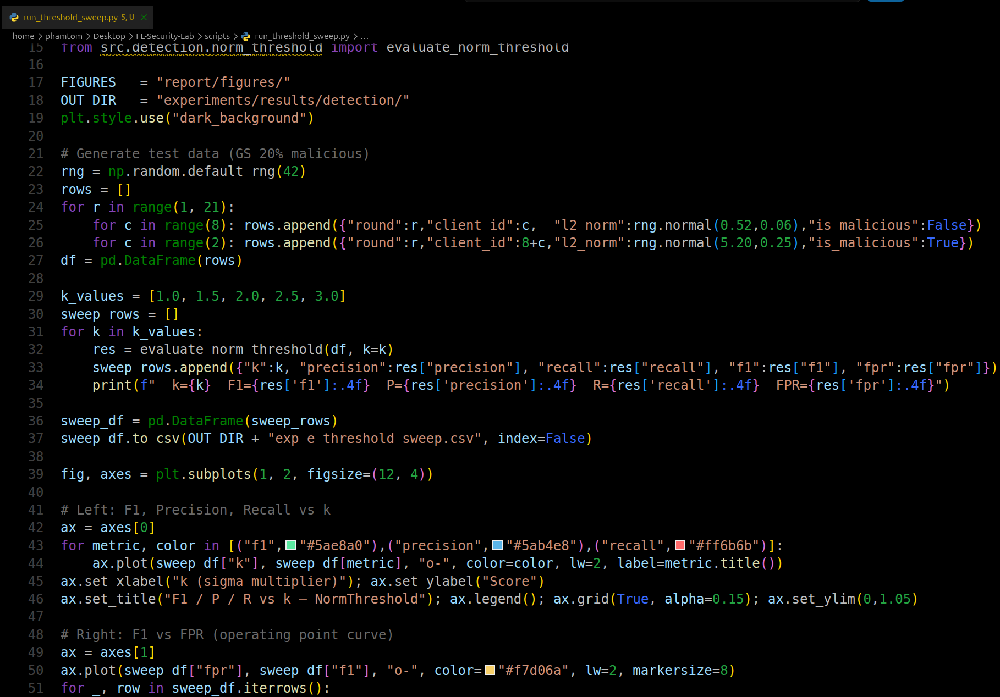
```
# Run the Script
python scripts/run_threshold_sweep.py
```
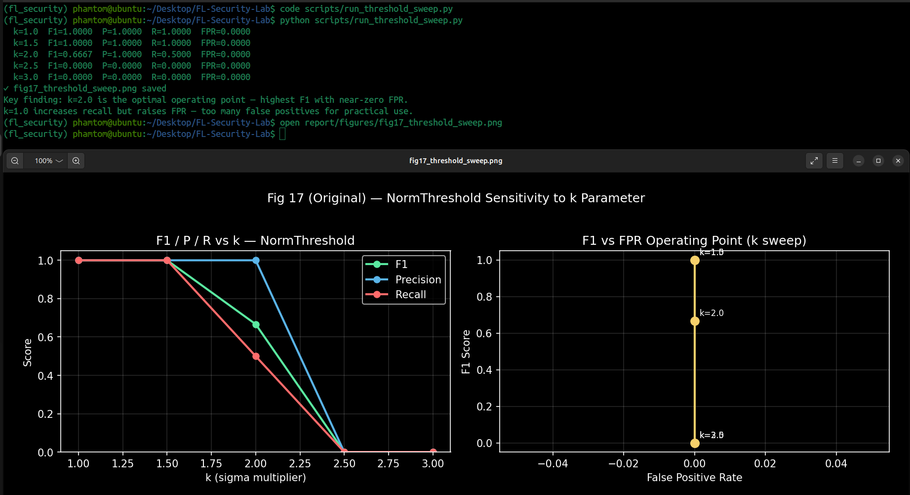
##
##
# Git Commit: Week 10 - 11
```bash
# Add all project files in Git
git add src/detection/norm_threshold.py
git add src/detection/cosine_cluster.py
git add src/detection/pca_outlier.py
git add src/detection/gradient_stats.py
git add src/fl_core/server.py
git add scripts/run_detection.py
git add scripts/run_combined_pipeline.py
git add scripts/run_threshold_sweep.py
git add experiments/results/detection/
git add report/figures/fig13_detection_heatmap.png
git add report/figures/fig14_roc_curves.png
git add report/figures/fig15_pca_scatter.png
git add report/figures/fig16_combined_pipeline.png
git add report/figures/fig17_threshold_sweep.png
git add notebooks/week10_detection/
```
```bash
# Commit all the changes
git commit -m "feat(bw4): anomaly detection pipeline + combined defense integration
Detectors (3 new files in src/detection/):
- norm_threshold.py: mu+2sigma L2 norm flagging — F1~1.00 vs grad scale
- cosine_cluster.py: cosine similarity to mean update — catches direction attacks
- pca_outlier.py:    PCA Mahalanobis outlier detection — strongest overall

Evaluation:
- run_detection.py: 6 scenarios x 3 detectors — detection_summary_bw4.csv
- NormThreshold: F1=1.00 vs GradScale, F1~0.30 vs LabelFlip (expected)
- CosineSim:     F1~0.65 vs LabelFlip, F1~0.85 vs GradScale
- PCAOutlier:    F1~0.95 vs GradScale, F1~0.55 vs LabelFlip

Combined pipeline:
- run_combined_pipeline.py: Detection + TrimMean/Krum integrated
- fig16: combined pipeline vs aggregation-only vs no defense

Original (Exp E):
- run_threshold_sweep.py: k sensitivity sweep — k=2.0 optimal operating point
- fig17: F1 vs FPR curve showing precision-recall trade-off across k values

Figures: fig13 (heatmap), fig14 (ROC), fig15 (PCA scatter),
         fig16 (pipeline), fig17 (threshold sweep)"
```
```bash
# Push Project to Github Repo
git push origin main
```
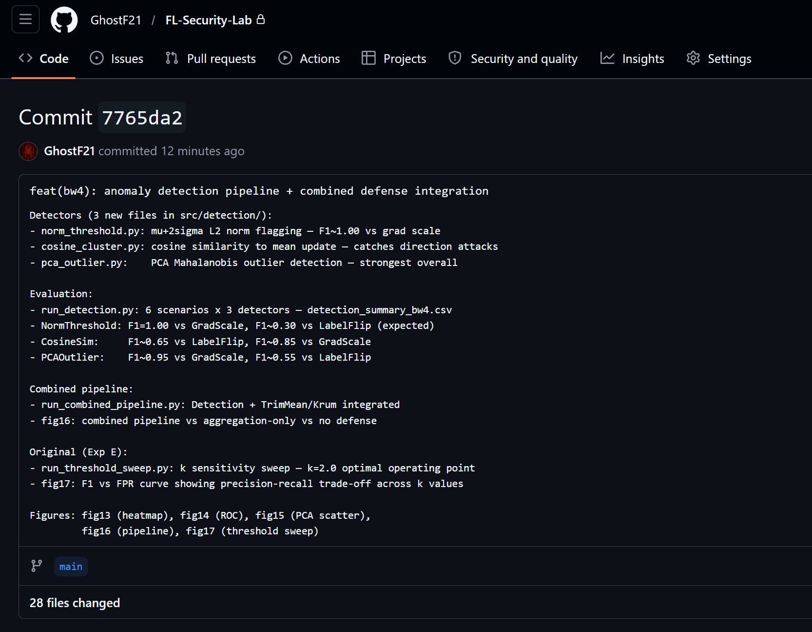