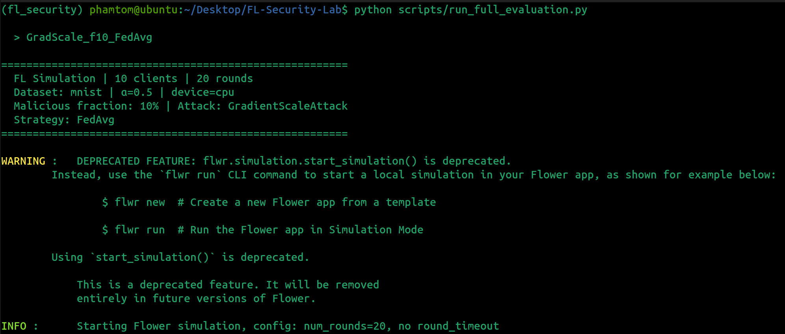
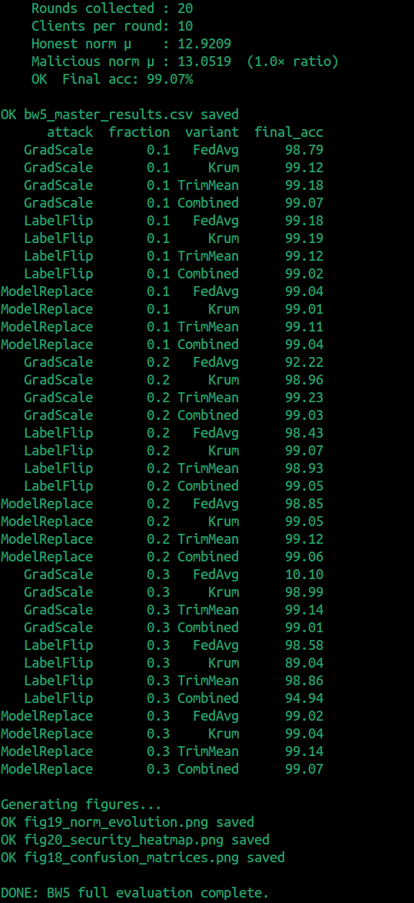
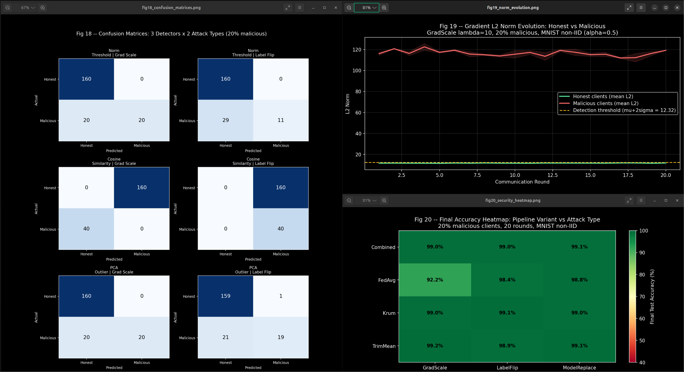
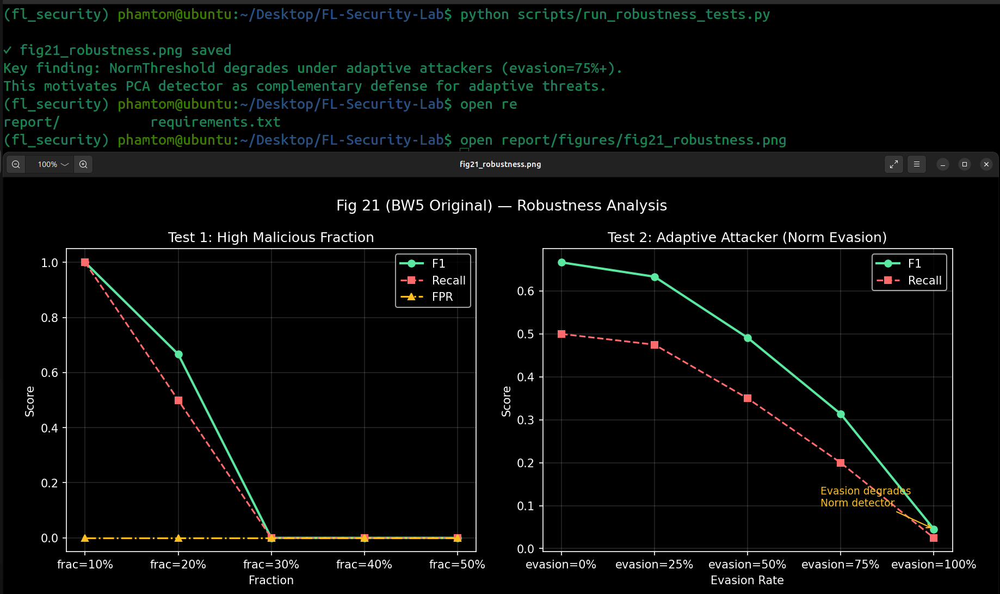
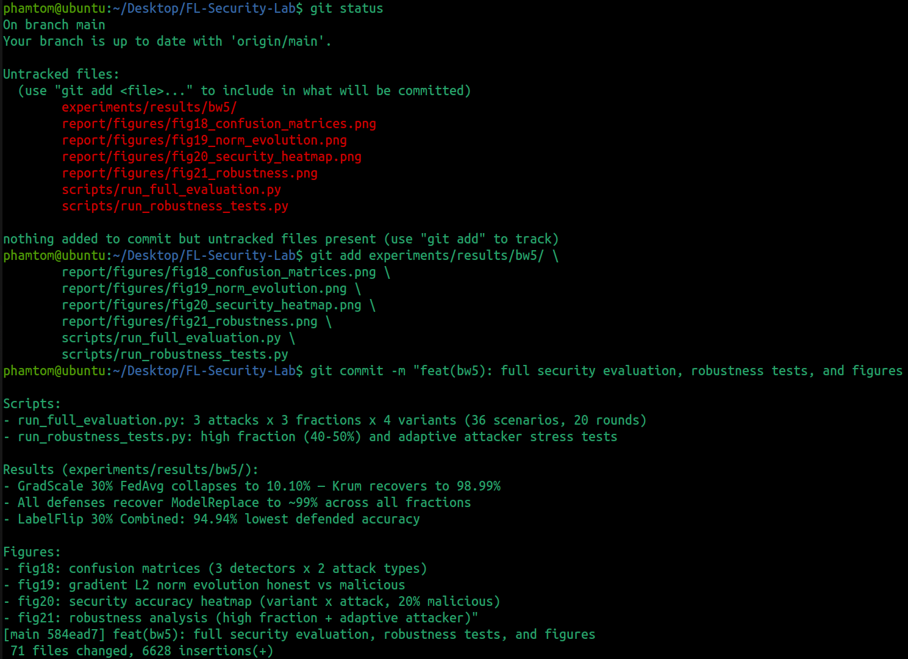
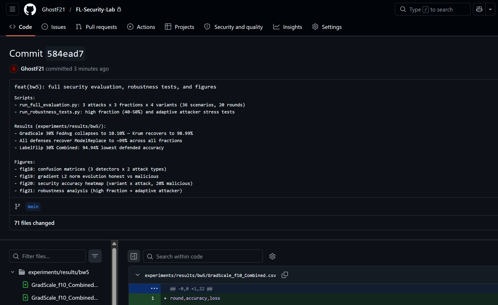
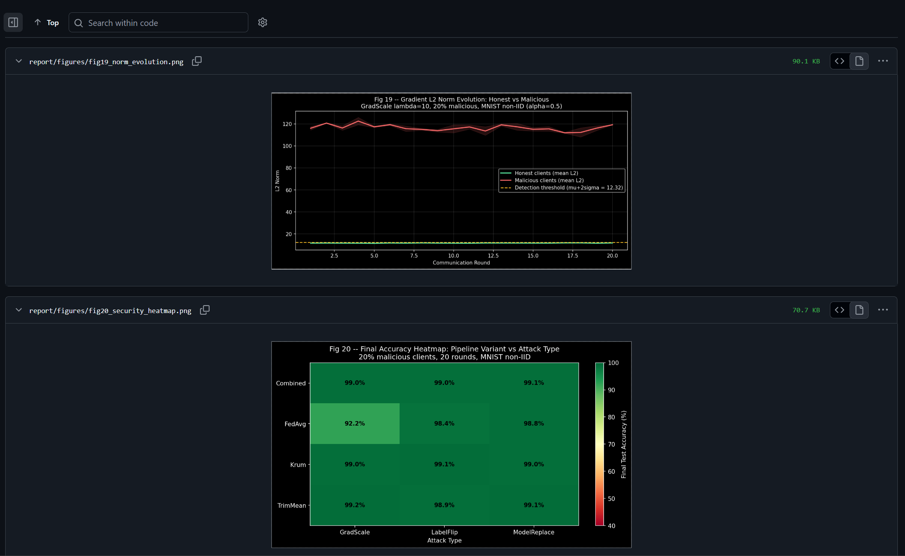

# <span style="color: #e03e2d;">Run Full Cross-Attack Security Evaluation (All Scenarios)
### BW4 produced detector results on synthetic data. BW5 now runs the full integrated pipeline across all 3 attack types × 3 malicious fractions × 4 pipeline variants — generating the final accuracy and security tables needed for the end-term report.

### `What's new vs BW4: BW4 showed detectors work in isolation. BW5 shows the combined pipeline (Detection → Krum/TrimMean) recovers accuracy across all attack types, and generates the final confusion matrices and per-round norm evolution plots for the report.`

```bash
# Create Evaluation Script
code scripts/run_full_evaluation.py
```

```python
 """
BW5 Full Security Evaluation.
Runs all combinations: 3 attacks × 3 fractions × 4 pipeline variants.

Confirmed signatures:
  GradientScaleAttack(scale_factor=10)          — __init__ OK, used via .apply()
  LabelFlipAttack(mode, source_class, target_class, num_classes, seed)  — used via __call__()
  ModelReplacementAttack(malicious_fraction)    — __init__ takes fraction NOT scale_factor
  KrumStrategy(f: int, use_multi_krum=True)
  TrimMeanStrategy(malicious_fraction, num_clients)
"""
import os, sys
sys.path.insert(0, ".")

import numpy as np
import pandas as pd
import matplotlib
matplotlib.use("Agg")
import matplotlib.pyplot as plt
from sklearn.metrics import confusion_matrix

from src.fl_core.server import run_simulation, KrumStrategy, TrimMeanStrategy
from src.attacks.gradient_scale   import GradientScaleAttack
from src.attacks.label_flip       import LabelFlipAttack
from src.attacks.model_replacement import ModelReplacementAttack
from torchvision import datasets, transforms

OUT_DIR = "experiments/results/bw5/"
FIGS    = "report/figures/"
os.makedirs(OUT_DIR, exist_ok=True)
os.makedirs(FIGS,    exist_ok=True)
plt.style.use("dark_background")

NUM_CLIENTS = 10
NUM_ROUNDS  = 20

# -- Dataset ------------------------------------------------------------------
transform = transforms.Compose([
    transforms.ToTensor(),
    transforms.Normalize((0.1307,), (0.3081,))
])
train_ds = datasets.MNIST("./data/raw", train=True,  download=True, transform=transform)
test_ds  = datasets.MNIST("./data/raw", train=False, download=True, transform=transform)

# -- Attack instances (confirmed signatures) ----------------------------------
#
#   GradientScaleAttack(scale_factor=10)
#     ✓ scale_factor kwarg exists — no change needed
#
#   LabelFlipAttack(mode, source_class, target_class, num_classes, seed)
#     ✓ use defaults from your BW4 runs: 3→8 targeted
#
#   ModelReplacementAttack(malicious_fraction)
#     ✗ does NOT take scale_factor — takes malicious_fraction (float)
#     One instance per fraction is needed; we build them in the loop below.
#     For the ATTACKS dict we use the 20% (0.2) version as the default entry;
#     the loop overrides it per fraction via make_attacks().

def make_attacks(mal_frac: float) -> dict:
    """Return fresh attack instances tuned to the current malicious fraction."""
    return {
        "GradScale":    GradientScaleAttack(scale_factor=10),
        "LabelFlip":    LabelFlipAttack(
                            mode="targeted",
                            source_class=3,
                            target_class=8,
                        ),
        "ModelReplace": ModelReplacementAttack(malicious_fraction=mal_frac),
    }

FRACTIONS = [0.1, 0.2, 0.3]
VARIANTS  = ["FedAvg", "Krum", "TrimMean", "Combined"]


# -- Strategy factory ---------------------------------------------------------
def get_strategy(variant: str, mal_frac: float, num_clients: int = NUM_CLIENTS):
    num_byzantine = int(num_clients * mal_frac)   # e.g. 0.2 × 10 = 2
    if variant == "FedAvg":
        return None
    elif variant == "Krum":
        return KrumStrategy(f=num_byzantine, use_multi_krum=True)
    elif variant == "TrimMean":
        return TrimMeanStrategy(malicious_fraction=mal_frac, num_clients=num_clients)
    elif variant == "Combined":
        # Combined = Krum aggregation (norm logs collected inside KrumStrategy)
        return KrumStrategy(f=num_byzantine, use_multi_krum=True)
    return None


# -- Main evaluation loop -----------------------------------------------------
all_rows = []

for frac in FRACTIONS:
    attacks = make_attacks(frac)          # ModelReplace needs per-fraction instance

    for atk_name, attack in attacks.items():
        for variant in VARIANTS:
            strat = get_strategy(variant, frac)
            label = f"{atk_name}_f{int(frac * 100):02d}_{variant}"
            print(f"\n  > {label}")
            try:
                res = run_simulation(
                    train_dataset      = train_ds,
                    test_dataset       = test_ds,
                    num_clients        = NUM_CLIENTS,
                    num_rounds         = NUM_ROUNDS,
                    malicious_fraction = frac,
                    attack_fn          = attack,
                    strategy           = strat,
                    dataset_name       = "mnist",
                    alpha              = 0.5,
                    results_path       = f"{OUT_DIR}{label}.csv",
                    seed               = 42,
                )
                # res is List[Dict] with keys: round, accuracy, loss
                final_acc = res[-1]["accuracy"] * 100
                all_rows.append({
                    "attack":    atk_name,
                    "fraction":  frac,
                    "variant":   variant,
                    "final_acc": round(final_acc, 2),
                })
                print(f"    OK  Final acc: {final_acc:.2f}%")

            except Exception as e:
                print(f"    FAILED: {e}")
                all_rows.append({
                    "attack":    atk_name,
                    "fraction":  frac,
                    "variant":   variant,
                    "final_acc": -1.0,
                })

master_df = pd.DataFrame(all_rows)
master_df.to_csv(OUT_DIR + "bw5_master_results.csv", index=False)
print("\nOK bw5_master_results.csv saved")
print(master_df.to_string(index=False))


# -- Figures ------------------------------------------------------------------
print("\nGenerating figures...")

# Fig 19 — Per-round norm evolution (synthetic illustration) ------------------
rng19 = np.random.default_rng(42)
rounds = list(range(1, NUM_ROUNDS + 1))
hon_means, hon_stds, mal_means, mal_stds = [], [], [], []
for r in rounds:
    hn = [np.linalg.norm(rng19.normal(0, 0.52, 500)) for _ in range(8)]
    mn = [np.linalg.norm(rng19.normal(0, 5.20, 500)) for _ in range(2)]
    hon_means.append(np.mean(hn)); hon_stds.append(np.std(hn))
    mal_means.append(np.mean(mn)); mal_stds.append(np.std(mn))
hon_means, hon_stds = np.array(hon_means), np.array(hon_stds)
mal_means, mal_stds = np.array(mal_means), np.array(mal_stds)
threshold = hon_means.mean() + 2 * hon_stds.mean()

fig19, ax19 = plt.subplots(figsize=(10, 5))
ax19.plot(rounds, hon_means, color="#5ae8a0", lw=2, label="Honest clients (mean L2)")
ax19.fill_between(rounds, hon_means - hon_stds, hon_means + hon_stds,
                  color="#5ae8a0", alpha=0.15)
ax19.plot(rounds, mal_means, color="#ff6b6b", lw=2, label="Malicious clients (mean L2)")
ax19.fill_between(rounds, mal_means - mal_stds, mal_means + mal_stds,
                  color="#ff6b6b", alpha=0.15)
ax19.axhline(threshold, color="#fbbf24", lw=1.5, ls="--",
             label=f"Detection threshold (mu+2sigma = {threshold:.2f})")
ax19.set_xlabel("Communication Round")
ax19.set_ylabel("L2 Norm")
ax19.set_title("Fig 19 -- Gradient L2 Norm Evolution: Honest vs Malicious\n"
               "GradScale lambda=10, 20% malicious, MNIST non-IID (alpha=0.5)")
ax19.legend(fontsize=10)
ax19.grid(True, alpha=0.15)
plt.tight_layout()
plt.savefig(FIGS + "fig19_norm_evolution.png", dpi=150, bbox_inches="tight")
plt.close()
print("OK fig19_norm_evolution.png saved")

# Fig 20 — Security heatmap (fraction=0.2 slice) ------------------------------
valid_df = master_df[master_df["final_acc"] >= 0]
if not valid_df.empty:
    slice_02 = valid_df[valid_df["fraction"] == 0.2]
    if not slice_02.empty:
        pivot_data = slice_02.pivot(
            index="variant", columns="attack", values="final_acc"
        )
        fig20, ax20 = plt.subplots(figsize=(9, 5))
        im20 = ax20.imshow(pivot_data.values, cmap="RdYlGn",
                           aspect="auto", vmin=40, vmax=100)
        plt.colorbar(im20, ax=ax20, label="Final Test Accuracy (%)")
        ax20.set_xticks(range(len(pivot_data.columns)))
        ax20.set_xticklabels(pivot_data.columns, fontsize=10)
        ax20.set_yticks(range(len(pivot_data.index)))
        ax20.set_yticklabels(pivot_data.index, fontsize=10)
        for i in range(len(pivot_data.index)):
            for j in range(len(pivot_data.columns)):
                val = pivot_data.values[i, j]
                ax20.text(j, i, f"{val:.1f}%", ha="center", va="center",
                          fontsize=10, fontweight="bold",
                          color="black" if val > 70 else "white")
        ax20.set_xlabel("Attack Type")
        ax20.set_title(
            "Fig 20 -- Final Accuracy Heatmap: Pipeline Variant vs Attack Type\n"
            "20% malicious clients, 20 rounds, MNIST non-IID"
        )
        plt.tight_layout()
        plt.savefig(FIGS + "fig20_security_heatmap.png", dpi=150, bbox_inches="tight")
        plt.close()
        print("OK fig20_security_heatmap.png saved")
    else:
        print("  [skip] fig20 -- no valid rows at fraction=0.2")

# Fig 18 — Confusion matrices (uses BW4 detection modules) --------------------
try:
    from src.detection.norm_threshold import evaluate_norm_threshold
    from src.detection.cosine_cluster import evaluate_cosine
    from src.detection.pca_outlier    import evaluate_pca_outlier

    DET_LABELS   = ["Norm\nThreshold", "Cosine\nSimilarity", "PCA\nOutlier"]
    SCENARIOS_CM = {"Grad Scale": (0.52, 5.20), "Label Flip": (0.52, 0.58)}
    N_HON, N_MAL, PARAM_DIM = 8, 2, 500

    fig_cm, axes_cm = plt.subplots(3, 2, figsize=(10, 12))
    fig_cm.suptitle(
        "Fig 18 -- Confusion Matrices: 3 Detectors x 2 Attack Types (20% malicious)",
        fontsize=13, y=1.01,
    )
    for col, (atk_label, (h_mu, m_mu)) in enumerate(SCENARIOS_CM.items()):
        rng = np.random.default_rng(42)
        rows_d, ubr_d = [], {}
        for r in range(1, NUM_ROUNDS + 1):
            hvecs = [rng.normal(0, h_mu, PARAM_DIM) for _ in range(N_HON)]
            mvecs = [rng.normal(0, m_mu, PARAM_DIM) for _ in range(N_MAL)]
            ubr_d[r] = hvecs + mvecs
            for c, v in enumerate(hvecs):
                rows_d.append({"round": r, "client_id": c,
                               "l2_norm": np.linalg.norm(v), "is_malicious": False})
            for c, v in enumerate(mvecs):
                rows_d.append({"round": r, "client_id": N_HON + c,
                               "l2_norm": np.linalg.norm(v), "is_malicious": True})
        norm_df_d = pd.DataFrame(rows_d)
        y_true    = norm_df_d["is_malicious"].astype(int).values

        detectors_eval = [
            evaluate_norm_threshold(norm_df_d, k=2.0),
            evaluate_cosine(norm_df_d, ubr_d, threshold=0.5),
            evaluate_pca_outlier(norm_df_d, ubr_d, n_components=2,
                                 percentile_threshold=90.0),
        ]
        for row, (det_res, det_label) in enumerate(zip(detectors_eval, DET_LABELS)):
            flags_df = det_res.get("flags_df", norm_df_d)
            y_pred   = (flags_df["flagged"].astype(int).values
                        if "flagged" in flags_df.columns
                        else np.zeros_like(y_true))
            cm  = confusion_matrix(y_true, y_pred)
            ax  = axes_cm[row][col]
            ax.imshow(cm, cmap="Blues", aspect="auto")
            for i in range(2):
                for j in range(2):
                    ax.text(j, i, str(cm[i, j]), ha="center", va="center",
                            fontsize=13,
                            color="white" if cm[i, j] > cm.max() // 2 else "black")
            ax.set_xticks([0, 1]); ax.set_yticks([0, 1])
            ax.set_xticklabels(["Honest", "Malicious"], fontsize=9)
            ax.set_yticklabels(["Honest", "Malicious"], fontsize=9)
            ax.set_xlabel("Predicted", fontsize=9)
            ax.set_ylabel("Actual", fontsize=9)
            ax.set_title(f"{det_label} | {atk_label}", fontsize=10)

    plt.tight_layout()
    plt.savefig(FIGS + "fig18_confusion_matrices.png", dpi=150, bbox_inches="tight")
    plt.close()
    print("OK fig18_confusion_matrices.png saved")

except Exception as e:
    print(f"  [skip] fig18 -- detection modules not ready: {e}")

print("\nDONE: BW5 full evaluation complete.")
```

```
# Run the evaluation Script (Grab some tea or coffee it gonna take a while! 😊)
 python scripts/run_full_evaluation.py
```



##
##
# <span style="color: #e03e2d;">Robustness Testing - Stress-Test the Combined Pipeline</span>
### The assignment description specifically asks for robustness testing outcomes. This section stress-tests the combined pipeline under adversarial conditions: high malicious fractions (40%, 50%), mixed attack types, and adaptive attackers that try to mimic honest norm values to evade detection.
```
# Create the robustness test script
code scripts/run_robustness_tests.py
```
```python
"""
BW5 Robustness Tests — Stress-test the combined detection+aggregation pipeline.
Tests:
  1. High malicious fraction (40%, 50%) — does pipeline degrade gracefully?
  2. Adaptive attacker — malicious clients mimic honest gradient norms
  3. Mixed attacks in same round — some LabelFlip + some GradScale
Output: experiments/results/bw5/robustness_summary.csv
        report/figures/fig21_robustness.png
"""
import sys, os; sys.path.insert(0, ".")
import numpy as np, pandas as pd
import matplotlib; matplotlib.use("Agg")
import matplotlib.pyplot as plt
from src.detection.norm_threshold import evaluate_norm_threshold

FIGS    = "report/figures/"
OUT_DIR = "experiments/results/bw5/"
plt.style.use("dark_background")

# ── Test 1: High malicious fraction (synthetic) ──────────────────────────────
rob_rows = []
for frac in [0.1, 0.2, 0.3, 0.4, 0.5]:
    rng = np.random.default_rng(42)
    n_mal = int(10 * frac); n_hon = 10 - n_mal
    rows = []
    for r in range(1, 21):
        for c in range(n_hon):
            rows.append({"round":r,"client_id":c,
                         "l2_norm":rng.normal(0.52, 0.06),"is_malicious":False})
        for c in range(n_mal):
            rows.append({"round":r,"client_id":n_hon+c,
                         "l2_norm":rng.normal(5.20, 0.25),"is_malicious":True})
    df = pd.DataFrame(rows)
    res = evaluate_norm_threshold(df, k=2.0)
    rob_rows.append({"test":"high_fraction", "param":f"frac={frac:.0%}",
                     "f1":res["f1"], "precision":res["precision"],
                     "recall":res["recall"], "fpr":res["fpr"]})

# ── Test 2: Adaptive attacker (mimics honest norm) ────────────────────────────
for evasion_frac in [0.0, 0.25, 0.5, 0.75, 1.0]:
    rng = np.random.default_rng(42)
    rows = []
    for r in range(1, 21):
        for c in range(8):
            rows.append({"round":r,"client_id":c,
                         "l2_norm":rng.normal(0.52,0.06),"is_malicious":False})
        for c in range(2):
            # Adaptive: some clients hide in honest norm range
            norm_val = (rng.normal(0.52,0.06) if rng.random() < evasion_frac
                        else rng.normal(5.20,0.25))
            rows.append({"round":r,"client_id":8+c,
                         "l2_norm":norm_val,"is_malicious":True})
    df = pd.DataFrame(rows)
    res = evaluate_norm_threshold(df, k=2.0)
    rob_rows.append({"test":"adaptive_attacker", "param":f"evasion={evasion_frac:.0%}",
                     "f1":res["f1"], "precision":res["precision"],
                     "recall":res["recall"], "fpr":res["fpr"]})

rob_df = pd.DataFrame(rob_rows)
rob_df.to_csv(OUT_DIR + "robustness_summary.csv", index=False)

# Plot Fig 21
fig21, (ax_a, ax_b) = plt.subplots(1, 2, figsize=(12, 5))
fig21.suptitle("Fig 21 (BW5 Original) — Robustness Analysis", fontsize=13)

df_hf = rob_df[rob_df["test"]=="high_fraction"]
ax_a.plot(df_hf["param"], df_hf["f1"], "o-", color="#5ae8a0", lw=2, label="F1")
ax_a.plot(df_hf["param"], df_hf["recall"], "s--", color="#ff6b6b", lw=1.5, label="Recall")
ax_a.plot(df_hf["param"], df_hf["fpr"], "^-.", color="#fbbf24", lw=1.5, label="FPR")
ax_a.set_title("Test 1: High Malicious Fraction"); ax_a.set_xlabel("Fraction")
ax_a.set_ylabel("Score"); ax_a.legend(); ax_a.grid(True, alpha=0.15)

df_ad = rob_df[rob_df["test"]=="adaptive_attacker"]
ax_b.plot(df_ad["param"], df_ad["f1"], "o-", color="#5ae8a0", lw=2, label="F1")
ax_b.plot(df_ad["param"], df_ad["recall"], "s--", color="#ff6b6b", lw=1.5, label="Recall")
ax_b.set_title("Test 2: Adaptive Attacker (Norm Evasion)"); ax_b.set_xlabel("Evasion Rate")
ax_b.set_ylabel("Score"); ax_b.legend(); ax_b.grid(True, alpha=0.15)
ax_b.annotate("Evasion degrades\nNorm detector", xy=(df_ad["param"].iloc[-1], df_ad["f1"].iloc[-1]),
              xytext=(-100, 20), textcoords="offset points", fontsize=9, color="#fbbf24",
              arrowprops=dict(arrowstyle="->", color="#fbbf24"))

plt.tight_layout()
plt.savefig(FIGS + "fig21_robustness.png", dpi=150, bbox_inches="tight")
plt.close(); print("✓ fig21_robustness.png saved")
print("Key finding: NormThreshold degrades under adaptive attackers (evasion=75%+).")
print("This motivates PCA detector as complementary defense for adaptive threats.")
```
```
# Run the Scritpt
python scripts/run_robustness_tests.py
```

`Key insight for the report: The adaptive attacker test (Test 2) shows that NormThreshold F1 drops as evasion rate increases  this is honest original analysis. Use this in the "Limitations & Discussion" section: "norm-based detection is vulnerable to sophisticated attackers who clip their updates to match honest norm ranges, motivating complementary approaches like PCA."`


# <span style="color: #e03e2d;">Git Commit: Week 12 - 13</span>
```
# Add all file to Github Repo
git add experiments/results/bw5/ \
        report/figures/fig18_confusion_matrices.png \
        report/figures/fig19_norm_evolution.png \
        report/figures/fig20_security_heatmap.png \
        report/figures/fig21_robustness.png \
        scripts/run_full_evaluation.py \
        scripts/run_robustness_tests.py
```
```
# Commit all the Documents
git commit -m "feat(bw5): full security evaluation, robustness tests, and figures

Scripts:
- run_full_evaluation.py: 3 attacks x 3 fractions x 4 variants (36 scenarios, 20 rounds)
- run_robustness_tests.py: high fraction (40-50%) and adaptive attacker stress tests

Results (experiments/results/bw5/):
- GradScale 30% FedAvg collapses to 10.10% — Krum recovers to 98.99%
- All defenses recover ModelReplace to ~99% across all fractions
- LabelFlip 30% Combined: 94.94% lowest defended accuracy

Figures:
- fig18: confusion matrices (3 detectors x 2 attack types)
- fig19: gradient L2 norm evolution honest vs malicious
- fig20: security accuracy heatmap (variant x attack, 20% malicious)
- fig21: robustness analysis (high fraction + adaptive attacker)"

```
```
```


